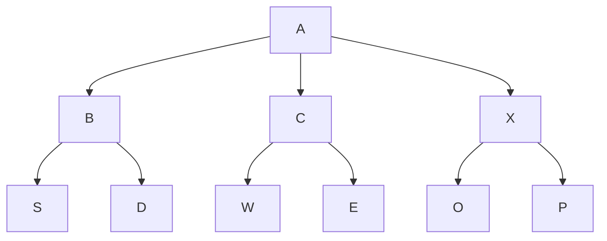
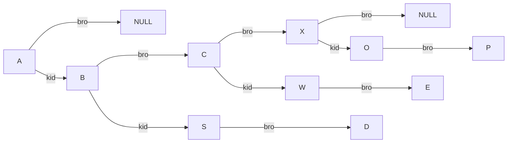
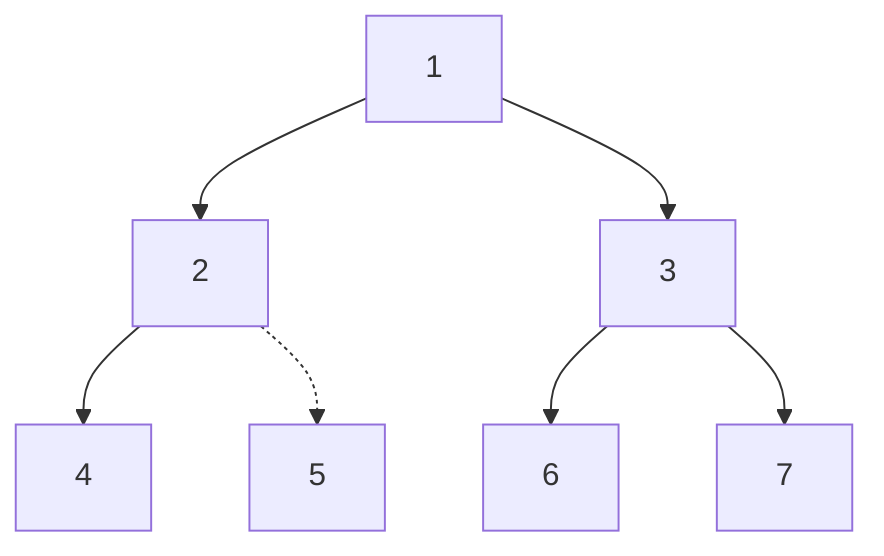
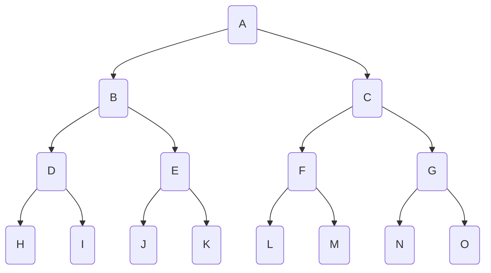

# 緒論

**Define by wiki** 
1. 每個節點都只有有限個子節點或無子節點；
2. 沒有父節點的節點稱為根節點；
2. 每一個非根節點有且只有一個父節點；
2. 除了根節點外，每個子節點可以分為多個不相交的子樹；
2. 樹裡面沒有環路(cycle)

**define by book**
1. 每個 tree 只有一個root
2. 除了 root 以外，可以分為 n(>0) 的沒有交集(disjoint)的子集合(也可以稱做子樹 subtree)


## tree 的表示法

### 串列(link list)表示法
使用簡單的 link list 方式去完成 tree 的建立。
example : A(B(S,D),C(W,E),X(O,P)

#### *BUT* 使用這種表示法，分支度是很嚴重的問題，若是在不清楚目前節點的分支數量時，程式碼難以設計

### 使用 left-brother & right-kid tree
如同其名，該節點設計方式，將node 的分支簡化為兩個，使node 的設計難度大幅下降
example 同上

  
## 一顆樹的空鏈接(link)數
danger
定理:
設有一個 tree 分支度為(k,即每個 node 最多可有 k 個子節點)，並且共有 n 個節點(包含 root)，那麼在所有 node 中必有 $n(k-1)+1$ 個空欄位(即所有 node 中的指向 NULL 的欄位數量)


### 證明(非常不嚴謹)
code [模擬程式碼](https://github.com/baiyanchen8/code/blob/main/data_structure/chap5/tree_NULL.py)
1. 一顆樹最多 n-1 個 節點包含 k-1 個 子節點
2. $(n-1)(k-1)+(1)k=n(k-1)+1$

### 應用
可以用這個定理證明使用二元樹(left-brother & right-kid )一定是最佳解
#### **for normal tree**
空 link : n(k-1)+1
#### **for 二元樹**
空 link: 2k-1
**$\Rightarrow$** 2k-1 $\le$ n(k-1)+1
故若只有用空間複雜度這個單一指標，使用**二元**必定較佳


# 二元樹
*由以上的內容可以得知，無論什麼內容的樹皆可使用 binary tree 表示*

## DEFINE
S : 為由一顆二元樹所有節點組成的集合
而 S 必是**一個 root 與兩個互斥的 binary subtree 組成**或**空集合**

*tips :* 兩個subtree也可以由空集合組成

## Data Structure 
### array [code](https://github.com/baiyanchen8/code/blob/main/data_structure/chap5/array_tree.c)
以固定的規則給所有 node 作編號，並使用 array 紀錄


| 1   | 2   | 3   | 4   | 5(不存在) | 6   | 7   |
| --- | --- | --- | --- | ------ | --- | --- |


*tips :* 就算在圖中是不存在的 node 在 array 中還是必須要紀錄，以免順序混亂
### link list
```c=
struct node{
    int data;
    struct node * left;
    struct node * right;
}
```
## 二元樹的特性

### 每層數量
{$2^k$\|$0 \le k\le H$}

### 最大節點數
success
*在給定特定的深度(高度)的情況下計算出能有的最大節點數*


### 推導
**SET**
1. 可以觀察到每一層都是上一層兩倍的 node 數
2. 可用 Sum= $\Sigma^H_02^{k}=2^{H+1}-1$

# 二元樹的走訪
## 走訪順序
二元樹可以有很多種不同的走訪方式，取決於你的需要，基本有前、中、後序，接下來，也有許多不同的版本介紹並以code 實作。

### pre order (前序)
```c=
void pre_order(struct node* A){
    if(A){
        printf("%d",A->data);
        pre_order(A->left); 
        pre_order(A->right);
    }
}
```

### in-order 
1. 遞迴
    ```c=
    void in_order(struct node* A){
        if(A){
            in_order(A->left); 
            printf("%d",A->data);
            in_order(A->right);
        }
    }
    ```
1. 迭代
    ```c=
       // 中序遍歷(迭代)
    void in_order_iterative(struct node *A){
        struct node *stack[100];
        int top = -1;
        struct node *current = A;

        while (current != NULL || top != -1) {
            while (current != NULL) {
                stack[++top] = current;
                current = current->left;
            }
            current = stack[top--];
            printf("%d ", current->data);
            current = current->right;
        }
    }
    ```
### post order 
```c=
void post_order(struct node* A){
    if(A){
        post_order(A->left); 
        printf("%d",A->data);
        post_order(A->right);
    }
}
```

### level order 
```c=
void levelorder(struct node * A){
    struct node *Queue[100];
    int front=0,rear=0;
    if (A)
        addq(Queue,A);
    for(;;){
        A=deq(Queue);
        if (!A) break;
        printf("%d",A->data);
        if (A->left){
            addq(Queue,A->left);
        }
        if (A->right){
            addq(Queue,A->right);
        }
    }
}
```
# 更多二元樹運算
## copy tree 
```c=
struct node * copy_tree(struct node *original){
    if (!original) return NULL;
    struct node * head=(struct node * )malloc(sizeof(struct node *));
    head->data= original->data;
    head -> left = copy_tree(original->left);
    head -> right = copy_tree(original->right);
    return head;
}
```
## equal tree(確認兩顆樹是否相等)
```c=
int equal_tree(struct node *A,struct node * B){
    return (!A&&!B)||(A->data==B->data
    &&equal_tree(A->left,B->left)
    &&equal_tree(A->right,B->right));
}
```
## 滿足性問題(Boolean satisfiability problem)
### explain 
將一個包含變數、邏輯運算子(AND、OR、NOT)的boolean運算式求解便是滿足性問題。
### struct node
```c=1
typedef enum{and,or,not,true,false}logic;
struct logic_tree{
    struct logic_tree *left;
    struct logic_tree *right;
    logic data;
};
```
### create_tree
success
實現輸入boolean 運算式然後建立該運算式的二元樹

**pass too hard**
[code](https://github.com/baiyanchen8/code/blob/main/data_structure/chap5/boolean_tree.c)

### 滿足性演算法
```c=
void postorderEval(struct node* head){
    if (!head) return ;
    postorderEval(head ->left);
    postorderEval(head ->right);
    switch (head -> type){
        case NOT:
            head->value = !head-> right->value;
            break;
        case OR:
            head->value =head->left->value || head -> right ->value;
            break;
        case AND:
            head->value =head->left->value && head -> right ->value;
            break; 
        case VAR:
            break;
        default:
            break;
    }
}
```
# 引線二元樹


## def
引線二元樹 的定義如下:

>「一個二元樹通過如下的方法「穿起來」：所有原本為空的右子節點指針改為指向該節點在中序序列中的後繼，所有原本為空的左子節點指針改為指向該節點的中序序列的前驅。」
>from [wiki](https://zh.wikipedia.org/zh-tw/%E7%BA%BF%E7%B4%A2%E4%BA%8C%E5%8F%89%E6%A0%91)

通俗來說，就是將每個 node 原本空著的指標指向鄰近的 node，並以此加速中序遍歷速度。
## struct 
```c=

typedef enum {True, False}bool;
struct node {
    char data;
    struct node * pointer_left;
    bool bool_left;
    struct node * pointer_right;
    bool bool_right;
};
```

## inorder 
```c=
// 找出中序遍歷的下一個節點
struct node *inorder_next(struct node *A){
    struct node * tmp = A->pointer_right;
    if(A->bool_right ==False){
        while (tmp->bool_left == False){
            tmp = tmp->pointer_left;
        }
    }
    return tmp;
}

// 中序遍歷並印出結果
void inorder_thread(struct node *A){
    struct node *tmp = A;
    while (tmp->bool_left=False)
        tmp=tmp->pointer_left;
    printf("%c ", tmp->data);
    do{
        tmp = inorder_next(tmp);
        printf("%c ", tmp->data);
    } while(A != tmp);
}
```

## root init
```c=
void root_init(struct node * root){
    struct node * tmp = c_node(' ');
    tmp->pointer_right=tmp;
    tmp ->pointer_right =root;
    root->bool_left=True;
    root->bool_right=True;
    root->pointer_left=tmp;
    root->pointer_right=tmp;
    
}
```
## insert left and right
```c=
void insetleft(struct node * root,char data){
    // 可能有問題
    struct node * left =c_node(data);
    struct node * original_left=root->pointer_left;
    // 左指
    left->bool_left=root->bool_left;
    left->pointer_left=root->pointer_left;
    root->pointer_left=left;
    // 右指      
    left->bool_right=True;
    left->pointer_right=root;
    if (root->bool_left==False){
        // orginal left 的處理
        while (original_left->bool_right==True)
            original_left=original_left->pointer_right;
        original_left->pointer_right=left;
    }
    root->bool_left=False;
}
void insetright(struct node * root , char data){
    struct node * right = c_node(data);
    right->pointer_right=root->pointer_right;
    right->bool_right=root -> bool_right;
    right->pointer_left=root;
    right->bool_left=True;
    root->bool_right=False;
    root->pointer_right=right;
    if(right->bool_right==False){
        struct node * tmp= inorder_next(right);
        tmp->pointer_left=tmp;
    }

}
```
# 堆積(heap)
## def 
堆積（Heap）是電腦科學中的一種特別的完全二元樹。若是滿足以下特性，即可稱為堆積：「*給定堆積中任意節點P和C，若P是C的母節點，那麼P的值會小於等於（或大於等於）C的值*」。若母節點的值恆小於等於子節點的值，此堆積稱為最小堆積（min heap）；反之，**若母節點的值恆大於等於子節點的值，此堆積稱為最大堆積（max heap）**。在堆積中最頂端的那一個節點，稱作根節點（root node），根節點本身沒有母節點（parent node）。
## struct
這裡使用arr tree 的方式建立
```c=
typedef struct {
    int heap[MAX_HEAP_SIZE];
    int size;
} MaxHeap;
```
## insert
```clike=
// 上移操作（向上調整堆）
void heapifyUp(MaxHeap *maxHeap, int i) {
    int temp = maxHeap->heap[i];
    while (i > 0 && temp > maxHeap->heap[parent(i)]) {
        maxHeap->heap[i] = maxHeap->heap[parent(i)];
        i = parent(i);
    }
    maxHeap->heap[i] = temp;
}
// 插入操作
void insert(MaxHeap *maxHeap, int value) {
    if (maxHeap->size >= MAX_HEAP_SIZE) {
        printf("Heap is full, insertion failed.\n");
        return;
    }
    maxHeap->heap[maxHeap->size++] = value;
    heapifyUp(maxHeap, maxHeap->size - 1);
}
```
## get Max
```c=
// 下移操作（向下調整堆）
void heapifyDown(MaxHeap *maxHeap, int i) {
    int maxIndex = i;
    int left = leftChild(i);
    int right = rightChild(i);

    if (left < maxHeap->size && maxHeap->heap[left] > maxHeap->heap[maxIndex]) {
        maxIndex = left;
    }
    if (right < maxHeap->size && maxHeap->heap[right] > maxHeap->heap[maxIndex]) {
        maxIndex = right;
    }

    if (i != maxIndex) {
        int temp = maxHeap->heap[i];
        maxHeap->heap[i] = maxHeap->heap[maxIndex];
        maxHeap->heap[maxIndex] = temp;
        heapifyDown(maxHeap, maxIndex);
    }
}
// 提取最大值操作
int extractMax(MaxHeap *maxHeap) {
    if (maxHeap->size <= 0) {
        printf("Heap is empty, extraction failed.\n");
        return -1;
    }
    int max = maxHeap->heap[0];
    maxHeap->heap[0] = maxHeap->heap[maxHeap->size - 1];
    maxHeap->size--;
    heapifyDown(maxHeap, 0);
    return max;
}

```
## bigO
insert 1 point : $O(logn)$
pop i point : $O(logn)$
heap sort: $O(2nlogn)$

# 二元搜尋樹
## DEFINE
1. 每個元素都有一個 key,且 key 不重複 (假設並沒有重複的 element)
2. left key < root key < right key (假設存在)
3. left subtree & right sub tree 也是 binary search tree

## search
### 遞迴
```c=
struct node * search (struct node *head,int key){
    // time : O(h) h=logn
    // space : O(h) 因為遞迴的記憶體結構(os的東西)
    if (!head) return NULL;
    if (head->key==key) return head;
    if  (head->key<key) return search(head->right,key);
    else return search(head->left,key); 
}
```
### 迴圈
```c=
struct node * inter_search (struct node *head,int key){
    // O(h) h=logn 
    // space : O(1)
    struct node * tmp=head;
    while(tmp){
        if (tmp->key==key) return tmp;
        if  (tmp->key<key) tmp=tmp->right; 
        else tmp=tmp->left;
    }
    return NULL;
}
```
## insert
```c=
struct node * modify_search (struct node *head,int key){
    struct node * tmp=head;
    struct node * past=NULL;
    while(tmp){
        if (tmp->key==key) return NULL;
        if  (tmp->key>key){
            past=tmp;
            tmp=tmp->left; 
        }else {
            past=tmp;
            tmp=tmp->right;
        }
    }
    return past;
}

void insert (struct node **head,int key){
    // O(N)+O(1)
    struct node * target=modify_search(*head,key);
    struct node * tmp=(struct node *)malloc(sizeof(struct node *));
    tmp->key=key;
    tmp->left=NULL;
    tmp->right=NULL;
    if (target||!*head){
        if(*head){
            if(key<target->key) target->left=tmp;
            else target->right=tmp; 
        }else{
            *head =tmp;
        }
    }
}
```
## delete
```cpp=
void delete(struct node **head, int key) {
    struct node *past = NULL;
    struct node *target = *head;
    
    // 找到要刪除的節點
    while (target) {
        if (target->key == key) {
            struct node *s = target->left;
            struct node *b = target->right;
            if (!past) {
                // 如果目標節點是樹的根節點
                *head = twoWayJoin(s, b);
            } else {
                // 更新目標節點的父節點的指向
                if (past->left == target) {
                    past->left = twoWayJoin(s, b);
                } else {
                    past->right = twoWayJoin(s, b);
                }
            }
            free(target);
            break;
        }
        // 移動 past 和 target 指針以繼續搜索目標節點
        past = target;
        if (target->key > key) {
            target = target->left;
        } else {
            target = target->right;
        }
    }
}


```
## Join
```cpp=
void threeWayJoin(struct node *s,struct node *m,struct node *b){
    if (!s&&!b&&!m)
        return;
    m->left=s;
    m->right=b;
}

struct node * twoWayJoin(struct node *s,struct node *b){
    if (!s && !b)
        return NULL;
    struct node * m=s;
    struct node * p=s;
    while(m->right){
        p=m;
        m=m->right;
    }
    if (s!=m){
        p->right=NULL;
        threeWayJoin(s,m,b);
        return m;
    }else{
        struct node * m=b;
        while(m->left){
            m=m->left;
        }
        m->left=s;
        return b;
    }
}
```
###### [code](https://github.com/baiyanchen8/code/blob/main/data_structure/chap5/binsearch_tree.c)
# 選擇樹(selection tree)[refer](https://dreamisadream97.pixnet.net/blog/post/178829577-winner-tree-%26%26-loser)
## winner & loser tree
> 這是一種常用於 external sort 的方法，由一個 tree 及多個 queue 組成


## 方法 winner tree
### bulit
先選取資料建立多個 queue ，從 queue 中提取1個節點作為 **leaf**，然後相鄰的 node 比較，比**較小**(假設獲勝條件為較小)的節點*copy* 到 parent ，重複直到頂點
### 提取
從頂點向下清空與頂點**相連的相同內容的**節點，直到 queue，然後將 queue 取出一個作為leaf ，並向旁比較並向上複製。
## 方法 loser tree
就是贏的放winner 輸的放 loser .....
可以看這個 $\rightarrow$[viedo](https://youtu.be/8d-rn6ZQy6U?si=S98V-BRcuJCbf9Zv&t=301)

# 樹林
## DEFINE
由 $\ge$ 0個沒有交集的 tree 所組成的集合。


# 互斥集合表示法(union)


## sample version Union
```c=
int simplefind(int i){
    for (; parent[i] >= 0; i = parent[i]) {}
    // 這裡使用 -1 作為 root 的終點
    return i;
}

void simpleUnion(int i, int j){
    parent[i] = j;
}
```
success
因為使用這種方法可能會產生大量的 overhead (根據樹高)


## Weight Union 
```c=
void weightUnion(int i, int j){
    i = simplefind(i);
    j = simplefind(j);
    int tmp = parent[i] + parent[j];
    if (parent[i] > parent[j]){  // 使用絕對值比較集合大小
        parent[i] = j;
        parent[j] = tmp;  // 更新集合大小
    }else{
        parent[j] = i;
        parent[i] = tmp;  // 更新集合大小
    }
}
```
##  collpasefind
```c=
int collpasefind(int i){
//     透過將經過的所有點都指向 root 來減小樹高
    int root,lead,tail;
    for (root=i;parent[root]>=0;root=parent[root]);
    
    for (tail=i;tail!=root;tail=lead){
        lead=parent[tail];
        parent[tail]=root;
    }
    
    return root;
}
```
