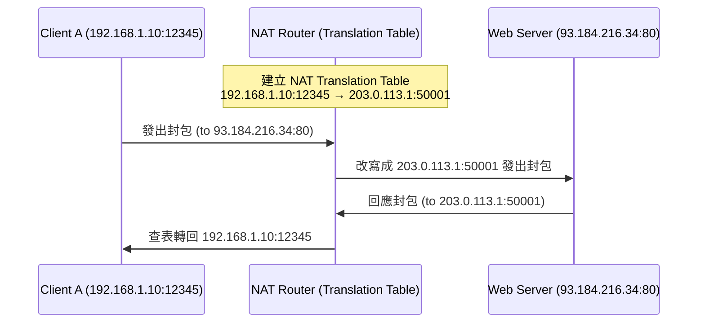

# Introduction
- IP address, or Internet Address
	- 32-bit long
	- Uniquely and universally defines an network interface
# Classful addressing
- IP address space is divided into five classes: A, B, C, D, E 
	- Classful Addressing 是早期 IP 位址的編排方式，**根據位址的開頭幾個 bit 來劃分不同的類別（Class A、B、C、D、E）**，每一類位址都有固定的網路位元（network bits）與主機位元（host bits）比例。
![[Pasted image 20250531190851.png]]
- **Class A** 的 127.x.x.x 保留作為 **loopback（環迴測試,localhost）**，例如：127.0.0.1
-   分辨方法使用順序連續判斷   
		![[Pasted image 20250531191038.png]]

## Netid and Hostid
- **Netid（網路位元）**：用來識別是哪個網路（Network）
- **Hostid（主機位元）**：用來識別該網路中的哪一台主機（Device）
![[Pasted image 20250531194758.png]]

![[Pasted image 20250531195447.png]]
![[Pasted image 20250531195642.png]]
![[Pasted image 20250531195647.png]]
![[Pasted image 20250531195654.png]]
![[Pasted image 20250531195700.png]]
![[Pasted image 20250531195506.png]]
![[Pasted image 20250531195521.png]]
## Network mask
> [!question]-  why we care about network addresses?
> 因為 Router 要溝通不同的 Local NET

> [!question]- 如上題, 如何從封包的destination IP address得知目的網路的network address?
> 透過 Network mask

# Classless addressing

## Solutions to Address Depletion(減少)

| 解法                        | 說明                                                         | 特性         | 優缺點簡述                                        |
| ------------------------- | ---------------------------------------------------------- | ---------- | -------------------------------------------- |
| 1️⃣ Private Address + NAT | 使用私有 IP 搭配 NAT（Network Address Translation）將內部 IP 映射成外部 IP | 短期解法（實用中）  | ✅ 減少公有 IP 使用量⛔ 有些應用（如 P2P、VoIP）難以運作或需額外配置    |
| 2️⃣ Classless Addressing  | 使用 CIDR 表示法，精確分配子網（/23、/26…）                               | 短期解法（仍在使用） | ✅ 提高位址利用率 ⛔ 並未從根本上解決 IPv4 位址總量不足          |
| 3️⃣ IPv6                  | 使用 128 位元位址空間，提供幾乎無限的 IP 位址                                | 長期解法（最終目標） | ✅ 解決位址耗盡、支援更多設備、支援自動組態、安全性更高 ⛔ 需硬體與軟體全面支援 |
## Classless address 方法

![[Pasted image 20250531211821.png]]
簡單而言就是將原本只有A~E的classsful address 分配改為 1bit 1 class

| 項目     | 說明                                                                              |
| ------ | ------------------------------------------------------------------------------- |
| 🌐 定義  | 不再使用固定的 A、B、C 類別，而是以「位元數量」來決定網路與主機位元（prefix）                                    |
| 🧠 精神  | 用 CIDR（Classless Inter-Domain Routing）表示法，例如 `192.168.1.0/24`，斜線後的數字表示「網路位元」數   |
| 🎯 優點  | 更彈性的 IP 分配，可以根據實際需求分配更大或更小的網段（提高使用率）                                            |
| 🔁 範例  | - `192.168.1.0/25` → 可用 126 個 host（不是傳統 C 類 254） - `10.0.0.0/8` → 可用 16M 個 host |
| ❌ 不再依靠 | 類別 (A/B/C/D/E)，而是靠 prefix 決定網路部分（可切 /27、/30、/13 等）                              |
| ❓問題    | 如果只給 address **無法辨認**是 /n ?                                                     |
# Special Address
|特殊位址類型|範圍／位址|用途說明|
|---|---|---|
|All-zeros|`0.0.0.0`|尚未指定 IP、代表本機|
|Limited Broadcast|`255.255.255.255`|廣播至本地網路所有裝置|
|Loopback|`127.0.0.0/8`|測試本機網路堆疊|
|Private Address|`10.x.x.x`、`172.16~31.x.x`、`192.168.x.x`|局域網內部專用，不可用於公開網路|
# NAT(Network Address Translation,From private net To Clobal Net)
![[Pasted image 20250601014816.png]]
![[Pasted image 20250601014856.png]]

![[Pasted image 20250601020041.png]]
對內的 private address 可以有很多個，而對外的 global address 只有一個， 所以要加入 port number 做辨認， 又因為 port number 可能相同，所以 又要加入 translation port 。