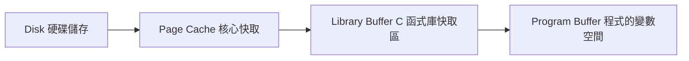
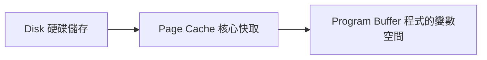

# I/O Hardware
## I/O Hardware
- Variety of I/O device
	- Storage
		- HDD、SSD
	- Transmission
		- internet interface
	- Human-interface
		- keyboard
- ***Common concept***
	- **Port**
		- connection point for device
		- ex: thunderbolt、usb port、SATA、HDMI...
	- **Bus**
		- A set of *wire* and define *protocol*
		- Can be *daisy chain* 、p2p、or hub(1-多) 
			- *daisy chain*:通常是指將多個裝置依序串接在一起，形成一個鏈狀結構。
				- ![[Pasted image 20241008223914.png|example]]
		- PCIe bus(system bus)、expansion bus(I/O bus)
			- ![[Pasted image 20241008224625.png|example]]
	- **Device Controller**
		- A collection of ***electronics***  and can operate a port ,a bus or a device
			- 電子設備的集合，可操作連接埠、匯流排或設備
		- ![[Pasted image 20241008225941.png]]
### Internal Structure of a  Device
- Simple: have a few or one hardware chips
	- keyboard
- Complex: include CPU,memory,some device-specific chip(可以執行一些軟體)
	- frimware running on CPU
	- SSD controller,無線網路晶片
![[Pasted image 20241008231602.png]]
### Hardware Interface
> [!question] How to give commands and data to controller ?
> - by register

![[Pasted image 20241008231802.png]]
## A Simplified I/O Hardware

![[Pasted image 20241009092917.png]]
![[Pasted image 20241009092904.png]]
![[Pasted image 20241009093734.png]]
![[Pasted image 20241009095122.png]]
- polling -> busy waiting
- programmed i/o(pio/cpu io)
	- 使用 cpu transfer data (沒效率cpu)
	- 正常而言使用 DMA 效率更高
### sol for polling
![[Pasted image 20241009101302.png]]
![[12.OS 2024-10-09 10.16.39.excalidraw]]
### sol for programmed i/o [[DMA]]
![[Pasted image 20241009102145.png]]
![[Pasted image 20241009102634.png]]
 
## Method of Device Interaction
> [!question] How to communicate with devices？
> ＝ how to read/write these device registers？

> [!sol] **sol：** assign each device reg a num,id or address

> [!question] address 如何決定？

![[Pasted image 20241009104617.png]]
- Port-mapped(isolated i/o)
![[Pasted image 20241009105205.png]]
- memory mapp
![[Pasted image 20241009133706.png]]
![[Pasted image 20241009133717.png]]
## Polling
- **busy waiting** or **polling**
	- 大部份情況下皆 *不 ok*
- if 不使用 polling, 使用 interrupt 處理 
	- 由 device *notify* CPU
- **忙碌等待（Busy-wait）適合的環境**：在高吞吐量的系統中，I/O 可能非常頻繁，且處理器無法承受因處理中斷造成的性能開銷。Polling 在這種情況下可以避免 interrupt 引發的 overhead 。
## Interrupt
- How CPU knows an interrupt occurs ?
	-  CPU has a wire called ***interrupt-request line***
	- if it is set to 1 , CPU senses interrupt.
![[Pasted image 20241009211639.png]]
![[Pasted image 20241009212658.png]]

> [!bug] ***BUT*** Interrupt is not free!!
> interrupt has overhead,並且有可能超過之前的好處
>![[Pasted image 20241009213148.png]]
>![[Pasted image 20241011093115.png]]
>![[Pasted image 20241011093220.png]]

### FLIH(first level interrupt handler) ＆ SLIH(second level interrupt handler)
- FLIH 
	- 必須被立即執行,當 interrupt 發生
- SLIH 
	- SLIH 是由 FLIH 觸發或調用的次級中斷處理程序，負責處理更多細節和複雜的工作。
	- **主要功能**：它通常負責完成 FLIH 來不及處理的耗時操作，例如數據緩存、資料傳輸或者與驅動程式和應用程式的溝通。
	- **運行速度**：相較於 FLIH，SLIH 可以運行得稍慢一些，因為它不需要立即回應中斷信號，而是完成後續的處理。
	- **特性**：SLIH 可以處理較多的背景工作，像是更新內部狀態、啟動裝置驅動程式、或者為應用程式準備資料等。
- in Linux
	- FLIH is called upper half
	- SLIH is called lower half or bottom half

### trap & innterrupt [[1.OS]]
- interrupt
	- 處理 asynchronous(非同步) 的 event
- trap(Exception)
	- 處理 synchronous(同步) 的 event
	- system call & error

## Direct Memory Acess[[DMA]]
# Application I/O interface
## intro

![[Pasted image 20241017163350.png]]
- 如何決定 system call for vary device(依靠以下dimensions)
	- **Charater**-**stream** or **block**
		- Charater-stream : 連續傳送 like dht11
		- block : 當需要時使用 block 作為傳輸單位 like disk
	- **Sequential access** or **random** access
		- disk vs ssd
	- **sharable** or **dedicated(不能共享的)**
	- **Speed** or **operation**
	- **R.W.** or **R** or **W** (read,write)
![[Pasted image 20241017165043.png]]
- i/o device 可以分成四類,對於不同 device 使用不同 system call
	- Block i/o
	- Charater-stream i/o
	- Clock and timer
	- Network sockets
	- other ,(back door/escape)
		- 對於一些特殊的 device (功能),os 使用特殊方法
		- ![[Pasted image 20241017165251.png]]
## Block device
### File-System System Call Interface
> [!example]
> - HDD
> - SSD

- Command include **read** **write** **seek**
![[Pasted image 20241023094206.png]]
 - Block device access indirectly(間接) via **file**
	 - **file system interface**
		 - read write (system call)
		 - fread fwrite (libary →system call)
	 - **memory-mapped file**
		 - 將 data map 到記憶體內 (demand paging vitural memory)
		 - 所以可以直接透過 memory 存取 HDD
		 - ![[Pasted image 20241023113631.png]]
		 - 優點
			 - convenient
 - file access way
	 - File base i/o (使用 File system 的 I/O)
		 - Buffered i/o
			 - access data go through **page cache** (都會經過 page cache)
				 - page cacahe 可以用於 prefetch (預測需要的file並取出)
			 - ![[Pasted image 20241023102755.png]]
			 - 也可通過先將 data 放到 page cache 再寫入 HDD 
				 - 放到 page cache 對 process 而言就算完成寫入
		 - Direct i/o 
			 - 不使用 Page cache 直接使用 HDD 儲存 File
	 - block base i/o(Logical Block Number)
		 - Raw i/o 
			 - accesss an array of **logical blocks**(直接使用 Block 而不是 File )
			 - bypass all OS service
			 - disallow application(不允許User mode做這種事) 
### C Standard Library Interface
#### Buffering in stdio Library
•Four cases
- read a file character by character
- write a file character by character
- read a file block by block
- write a file block by block
##### case 1 read a file character by character
- Use C stdio library
	- 作業系統會從儲存裝置（如硬碟）**讀取一整塊資料到 page cache**（頁面快取）。
	- 接著把資料再複製到 **C 函式庫的 buffer（通常是 FILE 結構內部 buffer）**
	- 之後每次呼叫 `fgetc()`,資料會從 C 的函式庫 buffer 傳到你的程式變數中，這些動作**只涉及一般函式呼叫（procedure call）**，不需要每次都做系統呼叫（system call）。
##### case 2 write a file character by character
- use  `fwrite`
	- 將 data 寫入 C libary buffer 就算完成 (只有 lib call ❌ sys call)
- use `write` (sys call)
	- •Copy data from **program buffer** to the kernel **page cache**
##### case 3 read a file block by block
- use `fread`

- use `read`

- Time of Command
	- T(3 copy) > T(2 copy) 
	- T(2 copy+lib call) > T(1 copy + sys call)
	- T(`fread`)>T(`read`)
##### Case 4: write a file block by block

### Buffered I/O, Direct I/O, and RAW I/O

### Memory-mapped Files

### Charater Devices
- Include keyboards, mice, serial ports
- basic sys calll:
		![[Pasted image 20250410214558.png]]
- 標準函式庫（像是 C 的 stdio.h）會在系統呼叫上加一層「緩衝區（buffering）」與「編輯支援」，例如：
	- 一行行地緩衝輸入資料（Line Buffering）
	- 處理特殊按鍵，像是：
	    - **Backspace**：使用者按退格鍵時，實際上會移除前一個輸入字元
	    - **Enter**：按下後才送出整行資料給程式使用
	- 這些功能**系統呼叫本身是沒有的**，但函式庫會幫你做到，讓程式更好寫、也更友善。
![[Pasted image 20250410214910.png]]

### Nonblocking and Asynchronous I/O
- Block & non-Block
	- Block : 指的是 if the program need some data but it didn't release ,the following program will be block 
	-  non-Block: 相反
- Asynchronous
	- 非同步 I/O（Asynchronous I/O）
		- 程式呼叫 I/O 後，**不等它完成就馬上繼續做其他事情**，等作業系統或裝置完成 I/O 後，再透過「通知機制」告訴程式。
	- 同步 I/O（Synchronous I/O）
		- 程式在呼叫 I/O 操作時，**會等待操作完成後，才繼續執行後面的程式碼**。
		- -**阻塞式（Blocking）**：完全卡住，直到 I/O 完成。
		- **非阻塞式（Nonblocking）**：主程式不會卡住，但還是**主動去檢查** I/O 是否完成。

| 類型                           | 是否同步  | 是否阻塞  | 特性與說明                                                                                             |
| ---------------------------- | ----- | ----- | ------------------------------------------------------------------------------------------------- |
| ① Synchronous + Blocking     | ✅ 同步  | ✅ 阻塞  | 呼叫像 `read()` 或 `write()`，程式會**停住等資料完成**才繼續。簡單但效能差。                                                |
| ② Synchronous + Nonblocking  | ✅ 同步  | ❌ 非阻塞 | 呼叫 `read()` / `write()` 加上 `O_NONBLOCK`，如果資料沒準備好會馬上回傳（可能回傳 0 或錯誤）。程式**自己要輪詢資料狀態**。                |
| ③ Asynchronous + Blocking    | ❌ 非同步 | ✅ 阻塞  | 使用 `aio_read()` / `aio_write()` 發出 I/O 請求，但之後可能使用 `aio_suspend()` 來等待完成（程式會被暫停，但非立即操作）。           |
| ④ Asynchronous + Nonblocking | ❌ 非同步 | ❌ 非阻塞 | 使用 `aio_read()` / `aio_write()` 發出請求後，程式馬上繼續執行其他計算，之後透過 callback、signal、poll 等機制處理完成事件。最有效率，但最難寫。 |

### Vectored I/O
Vector I/O 指的是一次性地讀取或寫入**多個資料區塊（buffer）**，比起傳統的 `read()` / `write()` 每次處理一個 buffer vector I/O 可以用一個系統呼叫處理多個區塊。
這種方式稱為：
- **Scatter/Gather I/O**
#### 🔸Vector I/O 是「作業系統層級」的技術
- **由程式設計師主動呼叫**（如：`readv()` / `writev()`）
- 目的：讓多個 buffer 一次性傳給 OS，**減少系統呼叫開銷**，提升效能
- 主要發生在：**使用者空間 ⇄ OS kernel 空間**
    

---

#### 🔸 Scatter/Gather DMA 是「硬體層級」的技術

- 由硬體的 DMA 控制器（Direct Memory Access）來處理資料搬運
- 可從記憶體中**非連續區塊**搬資料到裝置，或反之
- 可減少 CPU 參與、加速大資料傳輸
- 主要發生在：**主記憶體 ⇄ I/O 裝置（像磁碟、網卡）**
# Kernel I/O Subsystem 
- Improve performance
	- I/O Scheduling
	- Buffering
	- Caching
	- Spooling and Device Reservation
- Error handling
- Protection
- Power management
## I/O Scheduling (See [[11.OS]])

## Buffering
- **Buffering** - a memory area store data being transferred between devices
	- Ex: C library buffer or page cache
- Why
	- 為匹配兩個 device 的 **speed mismatch**
		- 先把大量資料放入 buffer 在一次性放入 storage 以減少 i/o 次數
		- also use double buffer
	- 為匹配兩個 device 的 **data transfer size**
		- 例如 : A send B a large message with 少量多次, 就可以在buffer 重建 msg
	- To maintain **Copy sematics**

```c
char buf[100] = "Hello, world!";
write(fd, buf, 13);
strcpy(buf, "HACKED!");
```
在以上 code 中的情況中,**2** 時要把 buf write into disk ,但**3** 時要修改 buf,為了不造成 data 衝突(because code 重排),而先將 buf 寫入 kernal buffer
## Caching
- **Caching** – a region of fast memory holding copy of data
	- just a **COPY**
	- for performance

### Buffer V.S. Cache
##### ✅ Buffer（緩衝區）

|項目|說明|
|---|---|
|📌 定義|暫時儲存資料用的區域，用來**調節資料流動速度不一致的兩端**（例如程式與磁碟）|
|📍 資料位置|緩衝區內的資料**可能是唯一的 copy**，也就是**目前只存在這裡**|
|🎯 用途|常用於 **write() 作業時暫存資料**，直到實際寫入磁碟|
|🛠️ 特性|寫資料前先進入 buffer，等資料夠多或 I/O 空閒時再真正送出|

##### ✅ 實際例子：
```
write() → 資料先放進 write buffer（緩衝區）           → 等等再寫入磁碟
```

---

##### ✅ Cache（快取）

|項目|說明|
|---|---|
|📌 定義|用來**加速存取頻繁使用資料**的區域，存放的是**原始資料的副本**|
|📍 資料位置|資料**原本存在別處**（例如：磁碟），cache 只是**暫時存一份在比較快的地方（RAM）**|
|🎯 用途|常用於 **read() 作業時避免重新存取磁碟**|
|🛠️ 特性|若資料已存在快取中，可省去磁碟存取時間，**效能更好**|

##### ✅ 實際例子：

```
read() → 檢查 page cache 中是否有資料（cache hit）        → 有的話直接從 cache 讀，沒有再去磁碟讀（cache miss）
```

## Spooling and Device Reservation
- Simultaneous Peripheral Operation On-Line
### ✅ 定義：
> **SPOOLING 是一種作業系統技巧，用來將資料先寫入磁碟等暫存媒介，然後再由背景程序逐一送給慢速的周邊設備（像是印表機）。**

換句話說，就是：
- 程式不直接跟慢速的裝置（像印表機、打孔卡機）打交道
- 而是先「丟資料到磁碟上的暫存檔」
- 之後由背景處理程式慢慢把它交給裝置執行
## Error Handling(Skip)

## I/O Protection

## Kernel Data Structures (Skip)

## Power Management(Skip)
- Power management not only save power but also help reducing the heat
- OS can help power manage
	- Cloud environments move VM between servers
		- Migrating VMs from some computers and shutting these computers down
	- CPU cores can also be suspended when the load is low
- Mobile computing has power management as first class OS aspect
# Transforming I/O Requests to Hardware Operations
![[Pasted image 20250411045141.png]]

# Streams(Skip)

# Performance
![[Pasted image 20250411050029.png]]