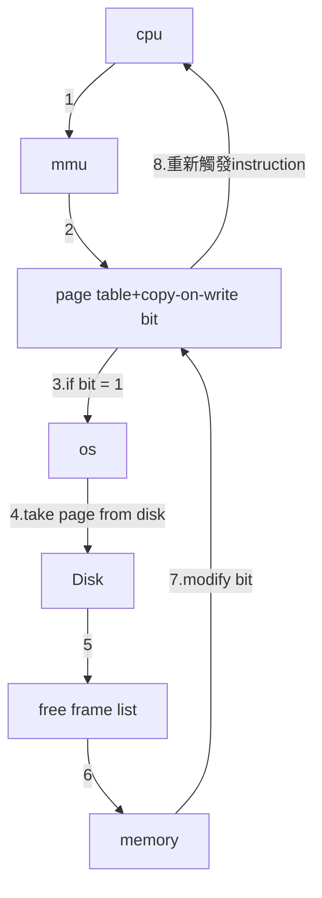

# background 
## Motivation 動機
- 在第9章，我們學了如何記憶體管理
	- 通常，我們需要將整個 program 載入到記憶體中
- BUT!! 在實際應用中，我們並不需要將 program 載入到記憶體中
	- 因為在實際application 中，不是每個功能都會用到(或至少不常用)
	- 或者是一些處理錯誤訊息的 method (unusual)
	- 又或者是一些分配**過多**的記憶體(array ,list ,table)
- 更甚者,也許是真的需要整個 program ，但也不會**同時需要**

> how to address this problem
> 如何去解決以上提到的問題 ?

## Vitural Memory
- idea
	- 將部分會執行的程式載入
- Solution : Virtual Memory
	- 只會有一部分需要執行的 program 在記憶體


>可以看到只有部分在記憶體(3page)
>剩下 page 在 Disk

## Benefit
- program 可以變得不用考慮記憶體大小
	- 因為虛擬記憶體很大
- Less memory caused by each program
	- 因為有部分存在 disk 中
- less i/o needed and faster response
	- 因為每個 program 要載入的 page ↓ ，所以使用的 i/o 也下降

> But, how to implement virtual memory?
> 但，如何去實現虛擬記憶體 

# Demand Paging
## Basic concept
- Virtual Memory 可以透過 Demand Paging 實現
	- [[chap 9 for os]]] 學過
	- 一個 paging 的大優點
- Demand Paging
	- 如字面上意義，需要時才 Paging
	- 當需要時才從 disk 中取出做 Paging


>
>
>1. cpu 要執行 B page 時，發現 page B 不在物理記憶體中 (page fault)
>2. OS收到 page fault(Demand)，從 disk 中將 page 搬入 (page in)
>


### compare with swap
- Swapper
	- manipulate(搬移) entire processes
- Pager(==or lazy Swapper==)
	- 用於擴充虛擬記憶體大小
	- 只將部分 Page (物體)記憶體放入
	- 剩下的放入 Disk


### Swap Space

> where to put the pages that are paged out ?
> 要將 page out 的 page 放在哪? (Swap Space)
> Note: if physical memory is full, we must select a victim for page out
> Note: 假如，實體記憶體已滿，要選擇個受害者 page out


被換出的頁面通常會被儲存在次要儲存(Secondary Memory)中，這個區域被稱為「置換空間」(Swap Space)或「後援儲存」(Backing Store)。

### Free Frame List
>where to put the pages that are paged in ?
>搬入的 page 要放在記憶體哪裡?
> Free-Frame List in [[chap 9 for os]]

- Free-frame lists 使用時機
	- 當 page fault 發生(page in)
	- 當 Stack or Heap **拓展**時
- 注意事項
	- 當 frame 從 進入 farme list 中時，必須清空其內容
		- 為避免 process 存取到其他記憶體資料
	

- Stack and Heap 之間的空間是沒有完全分配記憶體
- 只有當需要用到時，即當前分配的 Frame 已經用完時，才需要分配

### Hardware 
> upon execution, how do we know whether a page is in memory and by whom? 
> 當執行時，我們要如何知道哪個 page 在記憶體，由誰紀錄? page table( valid bit)os

- valid bit(hardware)
	- 在[[chap 9 for os]]
	- 用於控制當page table 中內容不多時，控制 process 不存取到其他記憶體空間
	- 現在加上虛擬記憶體管理功能
		- 1: valid
		- 0: invalid
- valid bit controlled by **OS**


### Page Fault Handling

1. check page table 
	- if valid bit = 0 (i)
		- 執行步驟2
	- if not 
		- 存取 memory
2. trap 
 	- 前往 os
 	- 請 os 處理記憶體搬運(memory copy)
 	- 由硬體偵測
3. os 決定如何處理 trap
	- 如果 process 存取不屬於他的記憶體
		- OS send signal to terminate process
	- 如果 process 要存取記憶體且該記憶體在 backing store
		- os 要做記憶體搬移(page in)
4. 從 free frame list 抓一個 frame，將 page 搬入
5. OS modify page table 
	- $page_i$ 的 valid bit = 1 (v)
	- $page_i$ 的 frame value 填入 physical memory 位置
6. 重啟指令

### Locality of reference

> demand paging 的缺點

> if page fault 眾多

> 會造成大量 overhead

> **BUT**

> 由於 Locality of reference 特性的存在不是大問題

"Locality of reference"（參考局部性）是指在計算機程序中，對記憶體的存取通常表現出一種*集中在相對較小的區域或區塊的趨勢*。這種局部性通常分為兩種主要類型：

1. **時間局部性（Temporal Locality）：** 如果一個資源在最近的過去被存取過，那麼它在短期內很可能會再次被存取。換句話說，如果某個資源被存取，那麼它在不久後可能會再次被使用。

2. **空間局部性（Spatial Locality）：** 如果某個資源被存取，附近的資源也很可能會被存取。換句話說，如果某個資源被使用，那麼它周圍的資源也可能會在近期被使用。


## Performance of Demand Paging

- Page fault Rate : $0\le P\le1.0$
	- $P=1$ Always Page Fault
	- $P=0$ Always Not Page Fault
- Effective Acess Time(EAT)
	- $EAT=P\times Page\_Fault\_Time + (1-P) \times Memory\_Acess\_Time$

- Example
	- Assume memory access time = 200 nanoseconds
 	- Average page-fault service time = 8 milliseconds
	- $EAT=(1-p)\times 200 + p\times (8,000,000)$
	- if p = 1/1000
	- $EAT=8,200$ nanoseconds Demand Paging 40 倍慢 (比直接記憶體存取而言)
- 因此, page fault rate 要非常低
	-  由於Locality of reference,所以沒問題
	-  複習：In [[chap 9 for os]]], TLB hit ratio 非常高，原因也在此

# Copy-on-Write (fork)
## Motivation 動機
- fork 將 parent spcae 複製到 child address space
- Problem
	- fork 需要將 memory 複製到指定位置(很花時間)
	- ==BUT== 有時候 fork 並不重要
		- 假如 copy 後 直接 execlp 那 copy 就沒有太大意義
- 解法 : copy-on-write
	
	Copy on Write（簡稱COW）是一種資料複製的技術，當多個程序或系統要存取相同的資料時，一開始它們共用同一份資料的副本。*當其中一個程序嘗試修改資料時，才會複製一份該資料的副本*，以確保修改只影響到該程序，而不影響其他共用該資料的程序。
	 

## Page Sharing
- condition
	- 當我的 child 沒有做修改時
	- 就用 Page Sharing (Page table 指向 Parent 的 Frame)

## 修改 Main Memory 
- 觀察 1：
	- 如果沒有呼叫 exec ，parent 和 child可以共享code
- 觀察 2：
	- 如果data, stack 和heap區沒有寫入動作，parent 和 child也可以共享
- 假如發生以上兩種情況，frame 裡面的內容也會被跟著修改
	- 為避免修改到 Parent 中的內容,就會建立一個新的 Page 給child 使用
	- if 1 , load new
	- if 2 , copy to a new page(frame) (copy on write)
	- if other , shared page

## Implement(copy-on-write bit on page table)

跟page fault 的處理基本上一樣。


3. Protection Exception


## Example


1. D 為什麼不用設為 1
	- 因為他是code space
	- 就算是 exec 也不是用 copy-on-write 
2. copy-on-write 在 Parent 或 child 都有作用


# Page Replacement
> upon page faults, how to do if physical memory is full (free frame list is empty) ? 
> 當 Page Fault 發生，如果實體記憶體已滿，如何處理?
> Ａ：Page Replacement

## Basic Concept
- Page Replacement
	- Find a page in Memory, Page it out 
	- Page in


1. 選擇一個 Page Victim 寫入硬碟 
	-	要先檢查 dirty bit(m) 是否為 1 
		-	if 1 
			-	已經被修改過， needed page out
		-	if 0
			-	未被修改過 (意味 backing store 中的 page 跟 memory 中的一樣)
			-	就不需要 Page out
	-	dirty bit
		-	因為做**兩次** disk tranfer 一定會很慢
		-	所以我們偉大的前輩，想出這個盡量減少 page out
		-	由硬體決定
2. 將原本的 page table (victim) 的 page number 修改為 (0,i)
	- (f,v) ⇒ (0,i)
3. 將要 new page 的 page in
4. 將 page table 設定
	- (0,i) ⇒ (f,v)

> Problem
>1. Page-replacement algorithm 
>    - Goal : 選擇最少 Page Fault 的 Page
>    - 因為 Page Fault 某種程度代表使用率

## Page-Replacement Algorithm 
### FIFO algorithm(First in First out )
>如題


total Page Fault : 15
####  Belady’s Anomaly
Belady's Anomaly通常在某些特殊的頁串列情況下才會發生，並不是所有的頁串列都會出現這種情況。


### Optimal algorithm (最佳解)
>Optimal algorithm，也稱為最佳頁置換算法，是一種理想情況下的頁置換算法，其核心思想是選擇未來最長時間內不再被使用的頁面進行替換。儘管這是一種理論上的最佳算法，**但實際上很難實現，因為需要預知未來的頁面訪問模式。**


NO Belady’s Anomaly
total Page Fault : 9

### LRU algorithm(Least Recently Used)
> 最近一段時間沒有被用到的就踢掉
> *假設*最近(過去)沒有存取，未來一段時間也不會被存取


total Page Fault : 12

#### Counter Implement
- Implement
	- 在 Page table 加上一個 time-of-use 的欄位
	- when Page used
		- 更新 Page table's time-of-use 為當前時間戳記
	- selec a victim : 選擇時間戳記最小的
- Problems
	- 每次啟動都需要搜尋整張 table $O(n)$
	- Write Memory 需要時間(更新時間戳記)
	- OverFlow Problem
#### Stack Implement
- Implement
	- 使用 Stack
	- when Page used
		- 放入(移動至)stack 頂部
	- selec a victim : stack 底部

#### Total Problem of LRU
> 硬體必須提供 **Stack 或 (time-of-use & Time)** 才能達到以上其中一種
> 但是現在硬體基本沒有支援
> 所以無法實現

總的來說，Least Recently Used (LRU) 置換演算法在實作上有一些困難和挑戰，主要涉及硬體支援的問題。 以下是你提到的問題的進一步解釋：

硬體提供 Stack 或 (time-of-use & Time)： 確實，實現LRU演算法需要硬體支援，特別是需要一個能夠追蹤頁面訪問順序的結構，可以是堆疊（Stack）或包含時間戳記的機制。 這樣的硬件結構可以確保在每次頁面訪問時，都能夠更新相應的信息，以便正確地選擇最近最少使用的頁面進行替換。

硬件目前基本上沒有支援： 確實，現實中的許多硬件並不直接提供對LRU演算法的原生支援。 這是因為實現LRU需要額外的硬件成本和復雜性，而且對於一些應用來說，其他簡單的頁面替換演算法可能已經足夠滿足效能需求。

無法實現： 由於缺乏硬件支援，某些情況下可能確實難以直接實現LRU演算法。 在這種情況下，系統可能會採用其他替代演算法，如FIFO（First-In-First-Out）或最近最不常使用（Least Frequently Used，LFU）等，這些演算法可能不需要太多的硬件 支援。

總的來說，LRU演算法在硬件實現上確實存在挑戰，而實現的難度取決於硬件的能力和成本考量。 在某些情況下，軟件層面的近似解決方案也可能被使用，以在不犧牲太多效能的情況下實現較簡單的頁面替換機制。


### Stack Algorithm(概念)
- 並不是只某種特殊的演算法
- 只要符合以下特徵，即為 stack algorithm
	- 假設有 n 個 frame 
	- if Physical Memory + 1 frame , 之前的 n 個 frame 還是會在其中
- Stack Algorithm 並不會 suffer from Belady’s Anomaly
	- optimal & LRU 都是 Stack Algorithm
	- FiFo is not
### LRU approximation algorithms(LRU逼近演算法)
- LRU need hardware support 
	- 但是很少 hardware 有 support
- 但是，hardware 通常有支援 reference bit at page table
	- 我們就可以通過特定手段逼近 LRU
<!--  -->
- Reference bit
	- Each page initial reference bit as 0
	- 當 page 被使用時 bit 設為 1
	- 當 page out 時，set reference bit as 0

#### Additional-reference-bits algorithm
-  Additional-reference-bits algorithm
	- get additional order information
	- maintain 一個 History 週期性紀錄 reference bit
		- History 右移，並將 new bit 放在最高位
		- When Replacement Occurred，選擇最小值 
			 example image
			
			


#### Second-chance algorithm
- FiFo + reference bit
- fifo
	- 用於選擇當前要替換的 page
	- 當某 page 被選中時 check reference bit
		- if 0
			- replacement
		- if 1
			- set reference bit as 1
			- next page
- 假設 page 能被頻繁使用就不會被替代

#### Enhanced second-chance algorithm
- reference bit + dirty bit(modify)
- (reference,dirty)
	- (0,0) is best choice
	- (0,1) 
		- 需要 page out，會浪費時間
	- (1,0)
		- set (1,0) as (0,0)
	- (1,1)
	  - set (1,1) as (0,1)
- 替換最低非空類中遇到的第一頁
### Counting algorithm
- 使用 counter 記錄每頁的引用次數
- LFU (least frequently used)
	- problem
		```python=
		for i in raneg(10):
			pass
		```
		- 在某些特定情況下，某變數會頻繁使用之後就不再存取
		- 會導致，某些變數會卡住，導致效率下降
-  MFU (Most frequently used)
	-  不知道來幹嘛的
-  Problem
	-  不好用
## Global vs Local Replacement
- Global Replacement
	- 選擇 Victim 時，是從所有的 Frame(Process) 中選擇一個 Frame
	- 缺點: process 之間會互相影響
- Local Replacement
	- 選擇 Victim 時，只能從自己的 Frame 中選擇
	- 缺點: 選擇較少
- Global replacement is more common
	- throughout 較高，且能降低 Page Fault Rate
# Page Buffering Algorithm
- keep a pool of Free Frame
	- 透過設定一個臨界值，當超過這個臨界值時就執行 Page out
	- 可以減少 Page fault 的數量
	- 不會真的到記憶體滿時才執行
		
		保持一組空閒框架是為了有效運作作業系統。當記憶體中的空閒空間低於某個臨界值時，才會啟動頁面替換機制，而非等到所有的記憶體都用完再開始替換。為什麼呢？

		這是因為在記憶體空間接近飽和的情況下，系統需要迅速做出反應，避免過多的頁面置換造成系統效能劇烈下降。提前維持一組空閒框架的好處在於，當需要進行頁面替換時，可以立即從這組空閒框架中取得一個，而不必等到全部都被使用後再進行替換。這有助於減少系統的停滯時間，允許相應的程序盡快重新啟動，提高整體效能。
		
- Dirty Page 的優化
	- 當 Dirty Page 沒有被存取時，可以先寫回硬碟
	- 當 Page 被選中為 Victim 時，就不用寫回硬碟
- Remember Free Frame 
	- 在執行 Page out 時，Os 會將 Memory 中的內容寫回 Disk 中，但並不會立即清除內容
	- 所以當有一個 Page 被選為 Victim 時且隨後變被使用的特殊情況
	- Os 可以直接將其指到 Free Frame List 中直接使用

## Summary
>前兩種做法是通過*利用空閒性能*保證一定程度的資源空閒，以確保在*極端情況下性能不會急劇下降*
>而第三種做法則是*確保容錯率。*

# Allocation of Frames
> How Many Frames Are Allocated To A Process?
> 一個 Process 需要幾個 Frames ?

## Global vs Local Replacement
- Global Replacement
	- 選擇 Victim 時，是從所有的 Frame(Process) 中選擇一個 Frame
	- 缺點: process 之間會互相影響
- Local Replacement
	- 選擇 Victim 時，只能從自己的 Frame 中選擇
	- 缺點: 選擇較少
- Global replacement is more common
	- throughout 較高，且能降低 Page Fault Rate

## Implement Strategy
- 通過高低*兩個臨界點*控制數量(free frame list)
	- 當低於低臨界點
		- 啟動 reaper(死神)
	- 當高於高臨界點
		- 暫停 reaper(死神)


> Ｑ：為什麼不可以用光全部的 free-frame list，反而要保留一定數量?
> Ａ：為了要避免當突然需要大量記憶體空間時，性能急劇下降。(因為完整的page fault 需要2次Disk存取，非常耗時)

# Thrashing(frame allocating algorithm)
- **DEFINE**
	- 當 process 在 paging 的時間多於執行的時間就是 Thrashing


## Cause of Thrashing
> 當 Process 沒有足夠的 Page 時
> Page Fault 的機會會急速上升

- **Leads to**
	- 低 CPU 利用率 
		- 太少記憶體空間 ⇒ 高 Page Fault ⇒ I/O bound ⇒ 低 CPU 利用率 
	- 低 CPU 利用率 ⇒OS 認為 process 太少 ⇒ add more process in

## Locality of Reference
> 通常 code 是有一個名為參考局部性(Locality of Reference)的特性
> 該特性導只在一段時間內會高度集中存取某些 Page
> 因此我們可以利用該特性，只要滿足部分 Page of Process 即能避免 Thrashing

 雖然我看不太懂這張圖，但我還是放上來了


## Working-Set Model
### idea
- working-set window $\Delta$
	- num of reference page
- working set
	- unique of reference pages
	 example image
	
	
- D 
	- num of set
- m
	- total frame in Memory
- Os Working-Set Model
	- if D << m(D遠小於m)
		- 增加 multi programing 的程度
	- if D > m (Thrashing)
		- Swap out Process

>**BUT**
>這種做法很難實現
>因為在執行的過程中(存取 Page table)，不會經過 Os 
>**解法:** 通過近似解

### Approximate
- reference bit + additional history + interval timer
	-  類似 LRU approximation algorithms(LRU逼近演算法)
- Implement
	 from gpt and ppt
	這是一種處理 "Thrashing" 的演算法，其中採用了工作集模型來判斷頁面是否屬於工作集。以下是演算法的步驟解釋：

	1. **參數設定：**
		 - 令Δ（Delta）為 10,000，表示在一段時間內的參考次數。
		 - 定期定時器中斷每 5000 單位時間發生一次。

	2. **記憶體中保留兩位元組（2 bits）用於每個頁面：**
		 - 在每個頁面的兩個位元組中，一般使用一個位元紀錄參考（Reference）情況，另一個位元紀錄其他資訊。

	3. **在定時器中斷時：**
		 - 複製頁面的參考位元到兩位元組中。
		 - 將所有頁面的參考位元設置為0。

	4. **在頁面缺失時進行處理：**
		 - 檢查該頁面的參考位元以及兩位元組中的其他位元。
		 - 如果三個位元中的任一位元為1，表示該頁面屬於工作集。

		這種方法的核心思想是通過週期性的定時器中斷來記錄頁面的參考情況，同時使用兩位元組來保存額外的信息。當發生頁面缺失時，根據參考位元和其他位元的值來判斷頁面是否屬於工作集。如果屬於工作集，則有助於避免 "Thrashing" 的發生，因為這表示該頁面在最近的一段時間內一直被參考。
	
## Page-Fault Frequency
- idea 
	- 因為 Trashing 發生一定伴隨 *high page-fault rate*
	- so ，我們只要將 page fault rate 控制在一定範圍即能解決 Thrashing
- Implement
	- if rate < lower bound
		-  可能分配過多資源 ⇒ Remove Frame
	- if rate > upper bound
		- 資源吃緊 ⇒ Allocate process more frame
 example image


# Mmeory Compression
-  用於取代 page replacement
	- iOS、Android、MacOs、Windows 10
- 通過將多個 page 壓縮到一個 page 來釋放記憶體空間
- 移動裝置通常不支援 swapping or paging
	- 因為 flash memory 有寫入(其實是清除)次數限制
	- 並且通常移動裝置上的 piping thoughput 不強
- ==Thus==
	- 優先釋放 read-only page
		- 因為不用寫入 flash
	- 一定不會 page out anonymous memory
		- anonymous memory(匿名內存):不與檔案相關聯的內存
		- like : stack、heap .etc
	- Memory Compression
		- 當目前需要記憶體空間且已經沒有 read-only page 可以釋放時，可以使用其減少寫入 flash 記憶體的次數

# Allocating Kernel Memory
> **為什麼kernel不用一般的page?**
> 1. kernel 通常要求的內容不超過 1 page
> 2. kernel 中有很多內容不能被 page out , ex : pager
> 3. kernel 需要連續物理記憶體

## Buddy system


- Drawback
	- internal Fragmentation(內部碎片化)
## Slab allocation

- Slab
	- 一個以上連續的 frame
- Cache
	- 一個以上連續的 Slab
	- 每一個 Cache 都用於存放特定的資料結構
	 example image
	
	
- ==優點==
	- 不會受碎片化影響
	- 高速的記憶體存取
		- object 早就已經分配完成
	  - 當一個 object free 時，直接 mark 為 free 即可
	  - 適用於較常 allocate and free 的物件類型

# Other Considerations
## Pre-paging 
- 在一個 process 啟動時，若是唯有將 page 事先準備很容易就產生大量 page fault
	- Pre-page 會先預測 process 要哪些 page 
		 example image
		
		
- ==BUT== 假如 page 沒有被用到
	- 浪費 I/O 和 Memory
- Prepaging an executable program may be difficult
	- 因為程式碼很常不是按照順序執行
		- goto (bad example)、function call .etc
- Data will be more easy
	- 因為許多類型的資料是具有連續性
		- video、text...
## Page size 
### affected factory
- Page table size(memory overhead)
	- 因為 page table 儲存在記憶體中
		- page table size ***⇑*** 所需記憶體 ***⇑***
	- 因此我們希望 Page Size ***⇑***
		- logical address space = Page Table Size + Page Size
		- [[chap 9 for os]] 中有提及以上公式 
- Inter Fragmentation(內部碎片化)
	- 如果 Page Size 太大 Page 內所剩的空間就會越大
	- So,Page Size **下降** 對解決 Inter Fragmentation 比較好
- I/O
	- 當 page size 比較大時可以減少 I/O 的次數，提高資料傳輸的效能。
- Better resolution (catching locality) ***⇒*** small page
	- 當一個 program 的 locality 只需要 100 k 時，Page size 若為 200 k
	- 會與不必要的資料分到同一個 Page，使其造成浪費
- Number of page faults ***⇒*** large page

### TREND
- 趨勢 :　Large
	- CPU 速度/Memory 容量劇增，Large Page 的缺點可以被接受
	- Memory, process, data sets have become larger
	- Page faults are more costly today
	- In Solaris, a page can be 8KB, 64KB, 512KB, and 4MB

## TLB Reach
- define
	- 意指 可以通過 TLB(Translation Lookaside Buffer) 存取的總記憶體容量
	- TLB Reach = TLB entry $\times$ Page Size
- How to make TLB Reach bigger?
	- 增加 entry 的數量
		- TLB cache 太貴了(不是好方法)
	- 增加 Page Size
		- 會導致 Fragmentation (也不是好方法)
	- 提供多種 Page Size 做選擇
		- 可以增加 TLB Reach 且不可以降低 Fragmentation (絕對是好方法:+1:)
	 		- Example: Solaris: a page can be 8KB, 64KB, 512KB, and 4MB
				- TLB reach is 512KB with 8KB pages or 256 MB with 4MB pages

## Inverted Page Tables
> In inverted Page Table(in [[chap 9 for os]]], How to know where the page which is not in Memory?
> 

- 在 IPT 中，是以 Frame 為主 key紀錄所有 Frame 所屬的 Process & Page Number
	- Frame 有多少，就紀錄多少
	- 並不會將 Frame 以外的 Page 一併紀錄
- Solution : External Page Table
	- 通過在 IPT 外，每個 Process 分配一個 Table 用於紀錄自身資訊的方式解決

<!--
問題:
Page dirty bit，if dirty 頁面就與內容不同
-->
- 補充
	- Page Table 如何紀錄 Page 在 Disk 中的位置
	1. 在 Page out 時，Os 會將 Page Table 中的 Vaild bit 設定為 invalid
	2. 這時，Page Table 中的 frame 值就空閒下來;因此可以通過 frame 值紀錄 Page 的位置
## Program Structure
> data Structure 存取順序會影響存取速率
>	[example code in github](https://github.com/baiyanchen8/hackmd-image/blob/479a1677e99efd16b46d061137ede81b07f94e18/os/chap10/row_unrow.py)

## Pending I/O Probelm
> 當 Page out and Page in 發生後，應該要給原 Page 的資料，因為發生 Page 交換而給到不屬於他的 Page 稱為 Pending I/O 問題。


### Solution 1 : Os 代收
- 不直接使用 User Memory 做 I/O 的接收
- 由 OS 先行接收，OS 再確認該資訊是否是給當前的 Page
	- if yes，將資訊 copy 到指定位置
	- if not，將資料暫存於 Os Memory，等到 Page 回歸後傳送

### Solution 2 : Page Lock  (I/O Inter Lock)
- 允許 Page 可以 lock in Memory (use Lock bit)
- Locked Page 不能被替代
