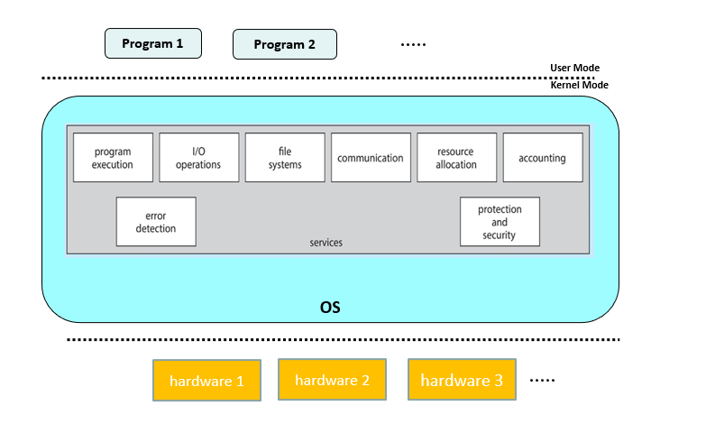
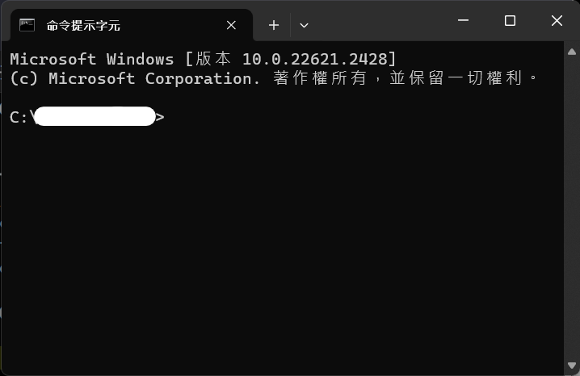
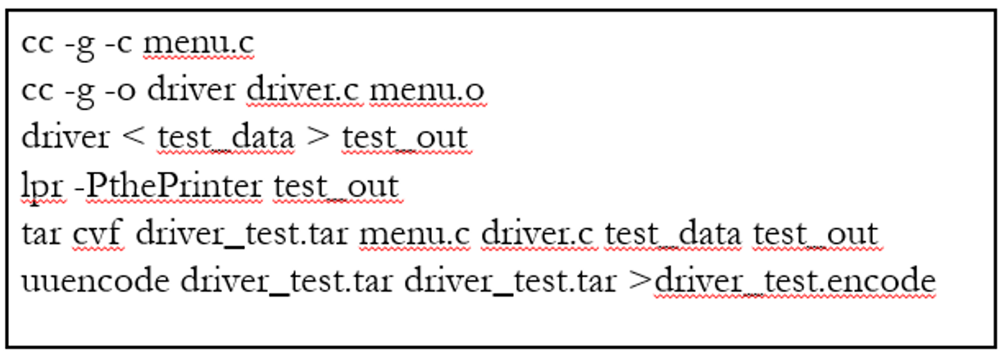
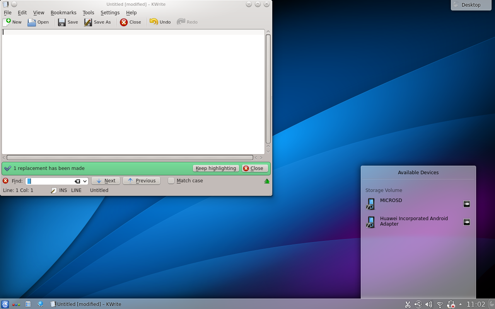

# CHAP2 Operation System Structure

## Operating System Service

作業系統提供了很多服務，舉例來說：User interface ( UI )、Program execution、I/O operation、File-system manipulation、Communications、Error detection、Resource allocation、Logging、Protection and security …

## User Operating System Interface

### CLI(command line interface/command interpreter)
- 從用戶獲取命令並執行
- 作為系統程式實現，不是作業系統的一部分
- Linux中實作了多種選擇－shell
	- Bourne shell (bash)、C shell (csh)、Korn shell (ksh)

### Batch interface
簡單來說，就是一次做很多的意思

在 Linux 裡面，這是一個 batch file ( 批次檔 )，使用 shell script 將想要執行的 command 都寫進來，然後交給 OS 執行，OS 就會把裡面的指令依序跑完，但從 user 的觀點來看，就是一次完成
example : k.sh

### GUI (圖形化介面)
圖形使用者介面（英語：Graphical User Interface，縮寫：GUI）是指採用圖形方式顯示的電腦操作使用者介面。與早期電腦使用的命令列介面相比，除了降低使用者的操作負擔之外，對於新使用者而言，圖形介面對於使用者來說在視覺上更易於接受，學習成本大幅下降，也讓電腦的大眾化得以實現。

雖然圖形使用者介面已經成為現代電腦的主要介面，然而這介面必定要透過在顯示器的特定位置，以「各種美觀、而不單調的視覺訊息」提示使用者「狀態的改變」，勢必得比簡單的文字訊息呈現，花上更多的電腦運算能力，計算「要改變顯示器哪些光點，變成哪些顏色」，功能命令的設計也比較複雜，現代作業系統的圖形複雜程度更遠超早期的GUI。

from[wiki](https://zh.wikipedia.org/zh-tw/%E5%9B%BE%E5%BD%A2%E7%94%A8%E6%88%B7%E7%95%8C%E9%9D%A2)

### TOUCH Screen Interface
你的手機

## System Call and API 
### System Call
- 由系統提供的指令集
- ex: open()、read()、write()、close()
- 即便是很簡單的 program 也會大量使用 syscall

>*Ｑ：* 為什麼我們常見的檔案處理，並非以上提供的system call?
>*Ａ：* 因為在不同系統中，所提供的指令集可能不同(細節or名稱...)，所以為了在不同系統之中提高**移植性**，所以平時使用的是APIs

### APIs
- 應用程式介面(application programming interface)
- a set of functions that can be called by the programs
- Supported by library
- Why use APIs rather than system calls?
	- Easier to use(可以讓使用者不用了解system call 的細節，大幅降低使用成本)
	- Portability
	
>*Ｑ：* system call如何傳遞參數?
>*Ａ：* 下面介紹

### System Call Parameter Passing
Three methods used to pass parameters to the OS
- registers
	- 優點: 快
	- 缺點: regs 的數量有限
- block in memory
	- 透過分配一個記憶體空間並使用regs紀錄實現
	- 優點: 空間大小不受限制
	- 缺點: 慢，由於記憶體本身設計的限制
- stack
	- Parameters pushed onto the stack by the program and popped off the stack by the OS

## operating system design and implementation
- design goal
- mechanism and policies
- implemetation
- Operating system structure
	- Monolithic (龐大的) structure
	- Layered approach
	- Microkernels
	- Modules
	- Hybrid systems
