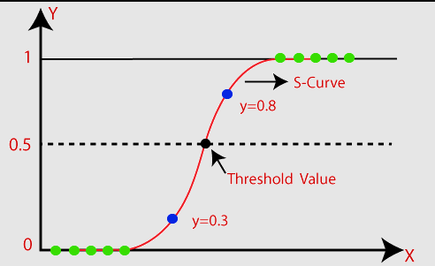
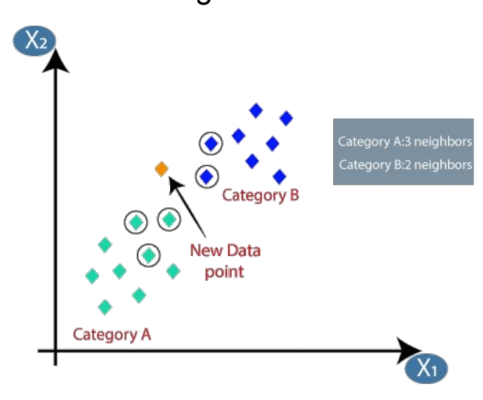
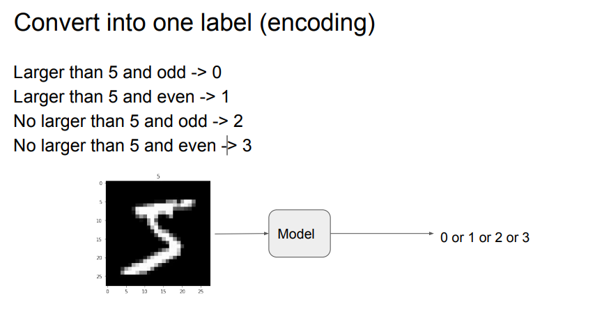
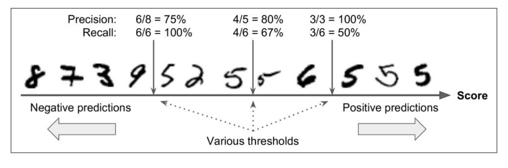
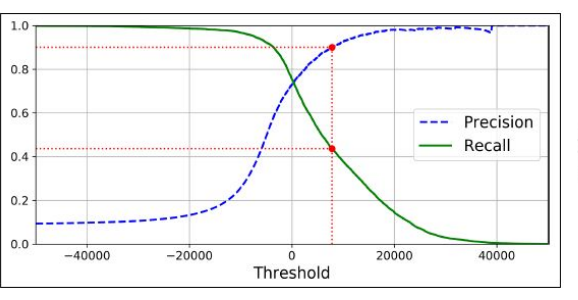
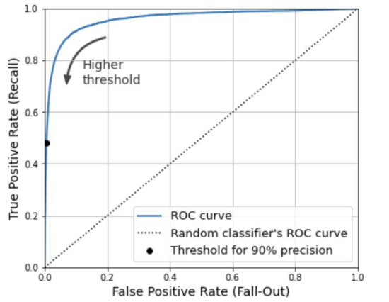

# Classification


## Split Dataset
- 將資料分為多個集合
    - training set
        訓練集（Training Set）：用於訓練機器學習模型，通常佔資料的大部分（例如70-80%）。
        - validation set 
          驗證集（Validation Set）：用於調整模型的超參數，偵測過擬合(overfit)或欠擬合(underfit)，通常佔資料的一小部分（如10-15%）。
    - testing set
        測試集（Testing Set）：用於最終評估模型效能，確保模型對未見過的資料的泛化能力，應該是與訓練和驗證資料獨立的一部分。
    
        ```mermaid
        %%{
        init: {
        'theme': 'base',
        'themeVariables': {
         'background':'#111111',
          'primaryColor': '#111',
          'primaryTextColor': '#fff',
          'lineColor': '#ffff',
          'tertiaryColor': '#ffffff'


        }
        }
        }%%
        graph TD;
        A[FULL DATA]--70~80%-->B[Training Set];
        A--20~50%--->C[Testing Set];
        B--80~90%-->D[Training Set];
        B--10~20%--> E[Validation Set];
        ```
    - fold method
        - one cut
        - Random sampling
            -  純隨機
        - stratified sampling
            - 考慮資料集合的Random Sampling
### k-fold validation 


## Binary Class Classification

1.  **Logistic Regression**\
    邏輯迴歸（英語：Logistic regression，又譯作邏輯斯迴歸、羅吉斯迴歸、邏輯迴歸、對數機率迴歸）是一種對數機率模型（英語：Logit model，又譯作邏輯模型、評定模型、分類評定模型），是離散選擇法模型之一，屬於多變量分析範疇，是社會學、生物統計學、臨床、數量心理學、計量經濟學、市場行銷等統計實證分析的常用方法。
    


2. **k-nearest neighbor**\
    以點（new point）為中心，選擇K個最近的node，計算其中最多點的集群，作為該點的集群
    

3. [Support Vector Machine](/ji56kq2dStmfxuxVg0jsYw)

4. [Decision Tree](/tgD5d8ziR3OBHMPubDHdZw)

5. **Naive bayes**\
    單純貝氏分類器（英語：Naive Bayes classifier，中國大陸稱為樸素貝葉斯分類器），在機器學習中是一系列以假設特徵之間強（樸素）獨立下運用貝氏定理為基礎的簡單機率分類器。

## Multiclass Classification
- **DEFINATION**\
    多類別分類器，在此分類器中，所有類別皆為互斥即一個物件只能被分到一個類別。(單選題)
- Using Method of  Multiclass
    - K-nearest neighbors
    - Decision trees
    - Naive bayes
    - Random Forest
    - Gradient Boosting
- one-rest (1對多)
    - 會需要sum of set(x)的model
    - $model_x$需要判斷是否為x的機率
    - 選擇p最大的作為結果
    - advantage 
        - 簡單，model數量需求少
        - 大量label時，比較方便
    - disadvantage
        - if A label在數據中有大量存在，會出現嚴重偏差
- one-one(1v1)
    - $\large{\{model_{x\ vs\ y}|x,y\in Set\ and\ x\neq y\}}$
    - 共需要$\frac {n\times (n-1)}{2}$ 個model
    - 預測時會產生vote，選擇vote最多的為結果
    - advantage 
        - high accuracy
        - 可以捕捉不同類之間的關係
    - disadvantage
        - 需要大量的model
        
### multilabel classification
- **DEFINATION**\
    多標籤分類器，在此分類器中，與多類別分類器不同，類別之間並不互斥即物件可以被分配到多個標籤。(複選題)
- Using Method of  multilabel
    - K-nearest neighbors
    - Decision tree
    - Random forest
- method of make Output is multiLabel
    - 利用將各種標籤進行編碼，之後再將output解碼還原為原本的label即可
    

### multioutput classification
- **DEFINATION**\
    多輸出分類（或多類多標籤分類），爲每個樣本分配一組目標值。這可以認爲是預測每一個樣本的多個屬性(其中可以有class&label)\
    ex: “狗”作為動物和“奔跑”作為動作(狗:class(只能有一個),奔跑:label(可以多個))
## confusion matrix
|---------------------| Real Positive | Real negative |
| ------------------- |:------------- |:------------- |
| Prediction Positive | TP            | FP            |
| Prediction negative | FN            | TN            |
- recall
    - 招回率
    - 找到所有Positive能力
    - 在所有實際為陽性的樣本中，被正確地判斷為陽性之比率。
    - $recall=\frac {TP}{TP+FN}$
- Precision
    - 準確率
    - 假陽性
    - 在所有實際為陰性的樣本中，被錯誤地判斷為陽性之比率。
    - $Precision=\frac {TP}{TP+FP}$
- Accuracy
    - $Accuracy=\frac {TP+TN}{TP+TN+FP+FN}$
- $\large{F1 \\=\frac{2}{\frac{1}{recall}+\frac{1}{Precision}}\\=\frac{TP}{TP+\frac{FN+FP}{2}}}$
- why use F1:
    - 平衡精確度和召回率
    - 處理不平衡數據
    - 調和平均值

## Tradoff between precision and recall
在機器器學習中，精確度和召回率之間的權衡是非常之重要的。\
在實際應用中，招回率和精準度成反關係，如果硬要提升某項，在實際預測中就會達成反效果。

因此我們在預測時，要在招回率和精準度的平衡設下臨界點，以此達到最好的效果

### ROC Curve (Receiver operating characteristic curve)
- define 
    - TPR(True Positive Rate)(縱軸)
        - Recall
        - $\frac{TP}{TP+FN}$
    - FPP(False Positive Rate)(橫軸)
        - Precise
        - $\frac{TP}{TP+FP}$
    - 由tpr and fpr 組成的曲線便是 [roc](https://zh.wikipedia.org/zh-tw/ROC)

- 點與隨機猜測線的距離，是預測力的指標,離左上角越近的點預測準確率越高
- AUC(area under curve)
    - AUC →1 ⇒ perfect
    - AUC →0.5 ⇒ bad 

