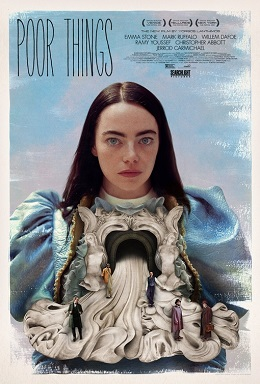

# 電影評分：Poor thing

**發行商：** 	元素影業

**導演：** 尤格·藍西莫

**演員：** 艾瑪·史東

**上映日期：** 2024/02/08

**片長：** 141 min 

## 簡介
故事發生在19世紀的 London ，有名的科學家兼醫生 Godwin撿到一位懷有身孕的自殺女子，將其中胎兒的腦袋替換母親的腦袋，一副具有嬰兒頭腦合大人身軀的實驗品--Bella·Bester 誕生了，而這(電影)便是關於Bella·Bester的成長故事。

>  嚴重劇透
## 嬰兒期(黑白期):
嬰兒時期的 *Bella* 被造物主 *Godwin* 限制在家中不得出門，*Godwin* 像是父親般照顧她，而 *Bella* 就像是海綿(sponge)快速吸收周圍的一切。
某天 *Godwin* 帶著他的學生 *麥斯·麥坎德利斯*來到家中為*Bella* 做紀錄(就像真的嚴謹的科學實驗)，同時在為 *Bella* 的監護人，而 *麥斯* 在這期間對 *Bella* 的天真浪漫吸引暗生情愫，但後來得知了*Bella*改造人的真相，原本想揭發教授*Godwin*的惡行，可卻在教授的威逼利誘下屈服。在這段時間中，*Bella*對外面世界的嚮往越來越強烈，而教授*Godwin*看準了*麥斯*對*Bella*的情愫，要求他與*Bella*訂婚並且利用婚約將*Bella*永遠困於家中，而這時來家中與教授擬定婚約的律師*鄧肯·韋德伯恩*看中了這個少女對性的好奇與對世界的嚮望，帶走*Bella*與其私奔。

## 性啟蒙
*貝拉*和*鄧肯*踏上了一段偉大的旅程，兩者的旅途從里斯本開始，他們在那裡頻繁地交歡，然而當*貝拉*變得難以控制時，將其帶往船上以方便控制*貝拉*。

## 知識啟蒙
*Bella* 被帶往船上之後遇見*瑪莎*和*哈利*，並與他們成爲了朋友，*瑪莎*教會*Bella*閱讀透過語言以及思考認識這個世界，*Bella* 被帶往船上之後遇見*瑪莎*和*哈利*，並與他們成爲了朋友，*瑪莎*教會*Bella*閱讀透過語言以及思考認識這個世界，而*哈利*則是帶領*Bella*看到這個世界的殘酷，而*Bella*在見到貧民區的死嬰後將*鄧肯*的錢都捐了出去，以至於他們在*Bella* 被帶往船上之後遇見*瑪莎*和*哈利*，並與他們成爲了朋友，*瑪莎*教會*Bella*閱讀透過語言以及思考認識這個世界，*Bella* 被帶往船上之後遇見*瑪莎*和*哈利*，並與他們成爲了朋友，*瑪莎*教會*Bella*閱讀透過語言以及思考認識這個世界，而*哈利*則是帶領*Bella*看到這個世界的殘酷，而*Bella*在見到貧民區的死嬰後將*鄧肯*的錢都捐了出去，以至於他們在馬賽的時候被趕下了船。

## 親身成長
為了賺取旅費和求得住宿，*Bella*開始在妓院賣身工作，這讓*鄧肯*精神崩潰，更被貝拉拋棄，而*Bella*則是在妓院賺錢期間不斷向不同人吸收知識(其中*斯威尼夫人*的「人活在世，不能指體驗好的事情，還要體驗壞的事情」更是使*Bella*發生劇烈轉變)，逐漸完善自己的價值觀直到*Godwin*的惡耗傳來。

## End 
這時期的 *Bella* 有了在妓院的學習，已經成長成為一個完人，她已有對自己清晰的認知，並且向*Godwin*問出了自己的身世，雖然她對這麼多的隱瞞(包括已經知道這件事的*麥斯*)感到生氣，但是她還是選擇了原諒，並且重申了與*麥斯*的婚姻。

在結婚儀式中，*鄧肯*和*維多利亞*的丈夫*阿爾菲·布萊辛頓*將軍闖入會場打斷婚禮，*阿爾菲*認出眼前的「*Bella*」其實是*維多莉亞*，並要求將*Bella*帶回，而*Bella*也答應了。

在*阿爾菲*的豪宅中，*Bella*逐漸了解了母親自殺的真相，阿爾菲將貝拉限制在他的豪宅裡，他用槍威脅她接受生殖器切割，甚至還要求她喝下鎮定劑，不願屈服的貝拉轉而將鎮定劑潑到阿爾菲的臉上，慌亂中阿爾菲朝自己的腳開槍並陷入昏迷，貝拉則逃出了阿爾菲的宅邸。

## 我的評價
**評分[標準](/標準md)：** 9.7/10(人生必看)

**觀影建議：** 很吃感覺、不一定每個人都會喜歡

**記憶點：** more and more Sex and Philosophy

**評論：** 

對社會化(我願稱之為 Bella(科學怪人) 的社會化之旅)的精彩解構，又或者說是對整個社會的解構，讓我們看到了整個社會的荒誕，其中也包含不少哲學性的思考，而其標題《Poor Things》估計指的根本不只是*Bella*而是在這個社會中的所有人吧!!

## 連結
**IMDb頁面：** [link](https://www.bing.com/ck/a?!&&p=c3345eeaab3c595dJmltdHM9MTcwODY0NjQwMCZpZ3VpZD0zMmIxYjM2NC1jYzgxLTY1MDktMDc4My1hNzc4Y2Q5MTY0NTcmaW5zaWQ9NTIyMA&ptn=3&ver=2&hsh=3&fclid=32b1b364-cc81-6509-0783-a778cd916457&psq=poor+thing+imbd&u=a1aHR0cHM6Ly93d3cuaW1kYi5jb20vdGl0bGUvdHQxNDIzMDQ1OC8&ntb=1)

**海報：** 

