# Regression task 
## why we need regression
因為我們會需要處理continuous的Predict like 房地產
## Linear Regression
1. **Defination**

    簡易來說，Linear Regression 定義的是一種模型變量與自變量之間的關係

    而這關係是$y=\theta x$，其中$\theta$為常數
2. Evaluate Model Method (計算誤差的方法)
    1. MSE(方均)

        $\large{\Sigma\frac{YR_i-YP_i}{n}}$，其中YR為Real data，YPh為model Predict
    2. RMSE(方均根）

        $\large{\sqrt{\Sigma\frac{YR_i-YP_i}{n}}}$，其中YR為Real data，YPh為model Predict
    3. MAE（絕對值平均）

        $\large{\Sigma\frac{|YR_i-YP_i|}{n}}$，
        其中YR為Real data，YPh為model Predict
## Polynomial Regression
1. **Defination**

    簡易來說，Polynomial Regression 定義的是一種模型變量與自變量之間的關係

    而這關係是$y=\Sigma\theta_nx^n$，其中$\theta_n$皆為常數
2. how to choose complexity of model
    >  慎選指數
    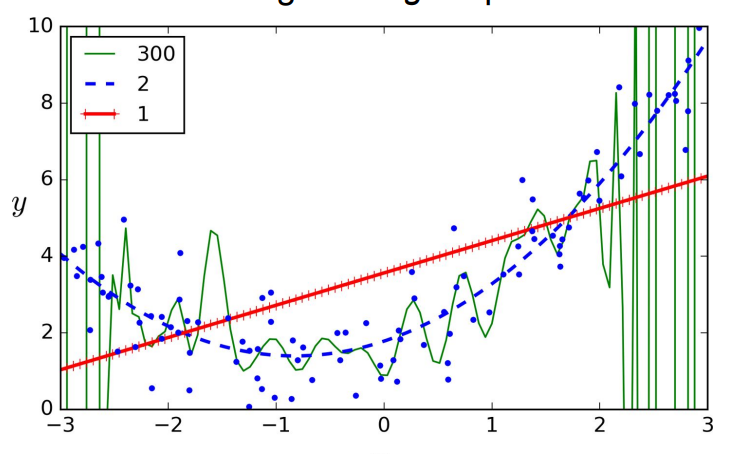
    
    1. 透過使用**交叉驗證**(k-fold)來檢測 overfit & underfit 
        ```mermaid
        %%{
            init: {
            'theme': 'base',
            'themeVariables': {
             'background':'#111111',
              'primaryColor': '#111',
              'primaryTextColor': '#fff',
              'lineColor': '#ffff',
              'tertiaryColor': '#ffffff'
            }
            }
            }%%
        graph LR;
        D[training]-->Z[k-fold];
        Z-->A[overfit]-->降低指數級;
        Z-->B[underfit]-->提升指數級;
        ```
    2. 透過畫**learning Curve**判斷
        >  未擬合
        
        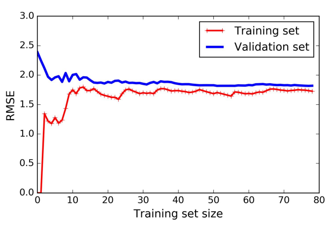
        驗證集合訓練集效果都很糟
        
        ---
        >  過擬合
        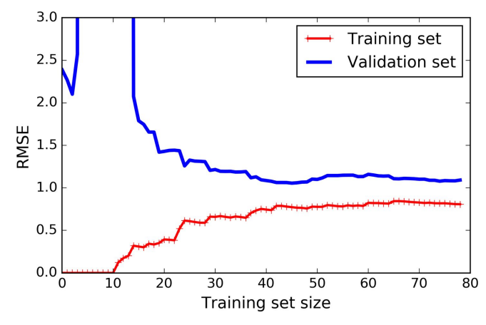
        雖然訓練集效果不錯，RMSE很小，但驗證級效果很差
        
    
## Calculating Gradient
梯度下降是一种迭代優化算法，用于最小化損失函数，以找到模型参数的最佳值。

在每次迭代中，梯度下降计算損失函数的梯度（變化率），然后沿着負梯度（相對低谷）的方向更新参数，以减小損失函数的值。

1. BGD（批次梯度下降）
    - BGD使用整个训练数据集来计算每次迭代中的梯度。也就是说，它一次性处理整个数据集，计算平均梯度，然后更新参数。
    - 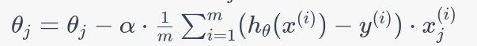
    - 其中$\large{\alpha}$只的是learning rate，用於控制每次下降的幅度
    - **优点：**
        - 穩定：BGD通常有穩定的收斂性，因為它使用整個資料集的資訊來計算梯度，<font color ="ffff">不容易受到雜訊的干擾</font>。
        - 準確：梯度估計相對準確，有助於在參數空間中找到全域最小值。
    - **缺点：**
        - 计算成本高：处理整个数据集需要更多的计算资源和时间，尤其是在大型数据集上。
        - 内存占用大：需要在内存中加载整个数据集，可能导致内存不足的问题。
2. SGD(隨機梯度下降)
    >  SGD 的路線圖&presudo code
    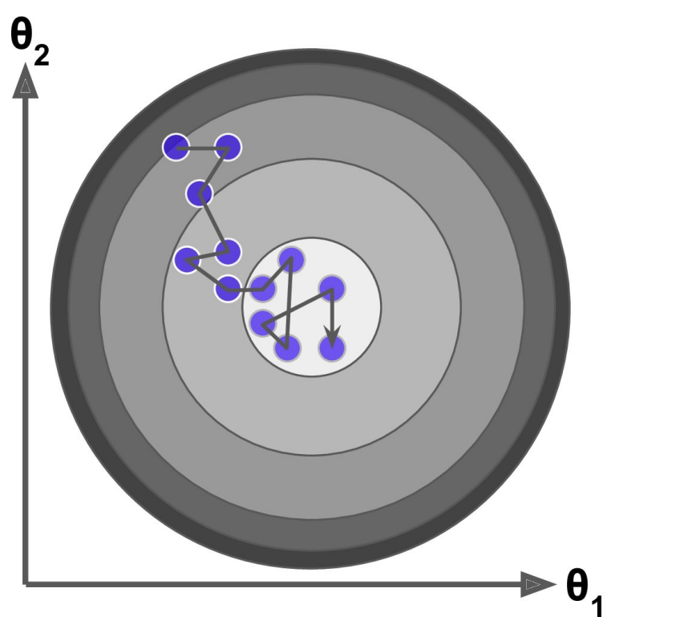
    ~~~python=1
    model = initialization(...)
    n_epochs = ...
    train_data = ...
    for i in n_epochs:
        #隨機選擇data去做GD
        train_data = shuffle(train_data)
        X, y = split(train_data)
        predictions = predict(X, model)
        error = calculate_error(y, predictions)
        model = update_model(model, error)
    ~~~
    
    - work:
        - SGD使用<font color ="#ffff">單一訓練樣本</font>来计算每次迭代中的梯度。
            - If we have 100 samples, SGD will randomly select one sample at each step → 100 epoch (one step at each epoch)

        - 对于每个参数 θ ，更新规则如下：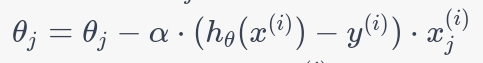
    - **優點：**
        - 因為不需要用全部的data計算，所以計算較快⇒<font color ="ffff">可以用於計算大量的DataBase</font>
        - 因為其隨機性，容易脫離局部山谷
        >  山谷
        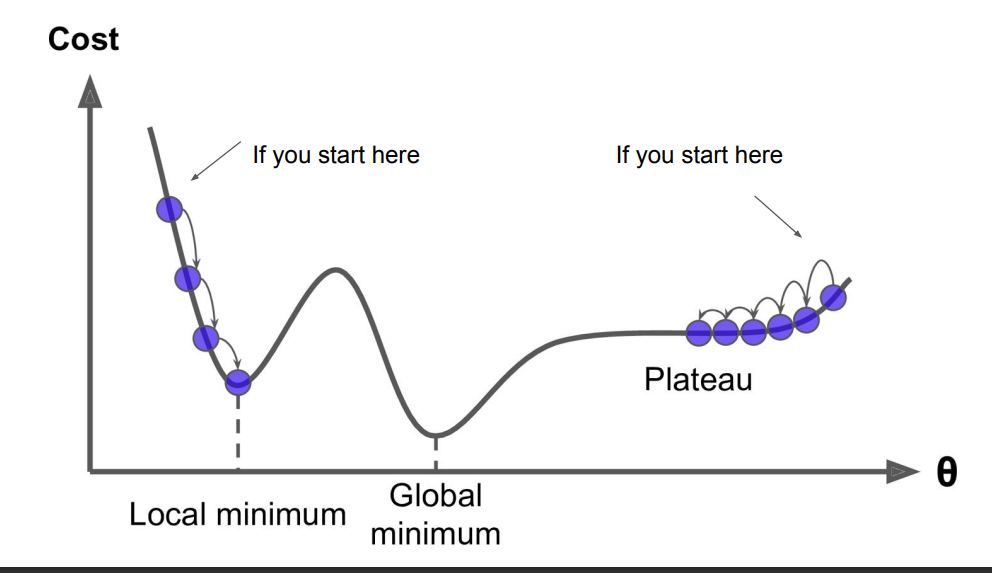
        
    - **缺點：**
        - 不穩定，容易發生震盪
        - 在接近最優值時會在附近震盪 ⇒會達不到最優解，只會是不錯而已
3. MBGD(小批次下降)
    >  presudo code
    ```python=1
    function MiniBatchGradientDescent(X, y, alpha, num_iters, batch_size):
        m = length(y)
        n = size(X, 2)  # 特征数量
        theta = zeros(n, 1)  # 初始化模型参数

        for iter in range(num_iters):
            shuffled_indices = randperm(m)
            X_shuffled = X[shuffled_indices, :]
            y_shuffled = y[shuffled_indices]

            for j in range(0, m, batch_size):
                # 选择小批量训练数据
                X_batch = X_shuffled[j:j+batch_size-1, :]
                y_batch = y_shuffled[j:j+batch_size-1]

                # 计算小批量的梯度
                grad = ComputeGradient(X_batch, y_batch, theta)

                # 更新模型参数
                theta -= alpha * grad
                
        return theta
    ```
    
    - work :
        - mBGD使用<font color ="#ffff">一小批樣本</font>来计算每次迭代中的梯度。
        - **優點:**
            - 因為其算法皆為少量運算，所以可以用到<font color ="#ffff">GPU加速</font>
4. **学习率α**
    
    - 学习率α是控制每次参数更新步长的超参数。选择适当的学习率对于BGD的性能至关重要。过大的学习率可能导致算法不稳定，而过小的学习率可能导致收敛速度过慢。
5. 總結 (自己看)
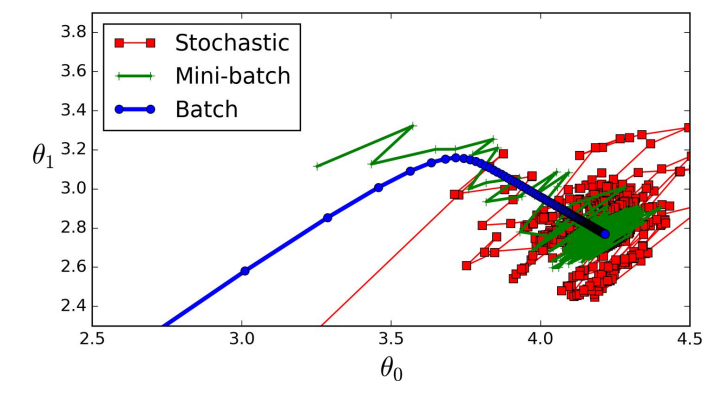
## Bias nad Variance
- Total error = Bias + Variance
- **Bias**
    - 偏差代表的是一次試驗中的準確率
- **Variance**
    - 方差代表的是以不同試驗集中的準確率
    - if model對於某訓練集產生overfit，那麼就會有很大的方差
 >  bias vs Variance 圖片
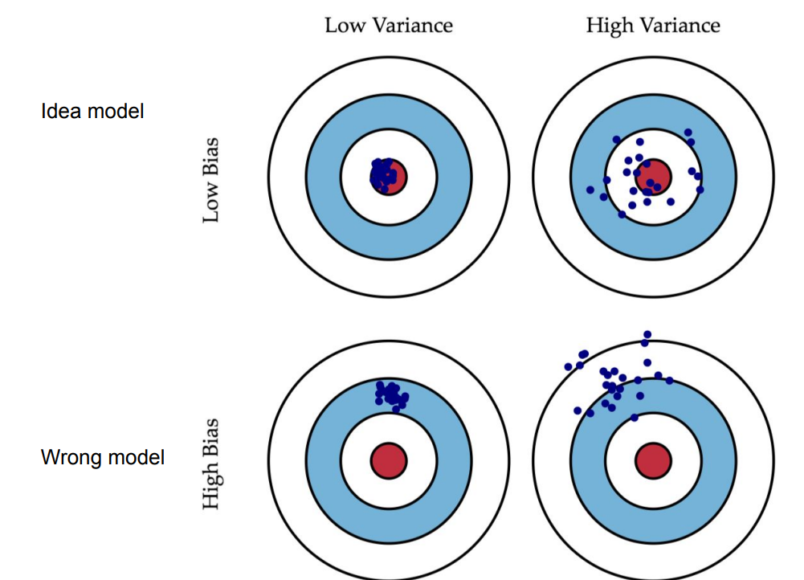

## Overfit Fixing (Regularization)
- Why we need **Regularization**?
    - 當訓練資料越少自由度(越少雜訊)，訓練出的模型就越不容易過擬合
    - Ex:一個簡易正規化多項式的方法，便是只要降低指數級
- the way to Regularization
    - Polynomial
        - 操縱指數
    - linear 
        - **Ridge+L2**
            - 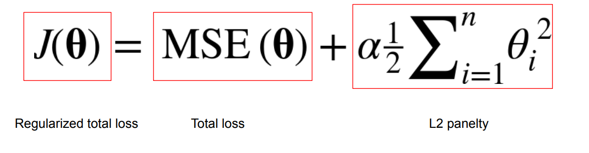
            - Ridge迴歸使用L2正規化項，透過加入係數的平方和來約束模型參數。 這有助於防止係數過大，減少模型的複雜度。
            - L2會嘗試最小化([特徵縮放](/Qxp5CAO1QXqQKqRFcUwenA))不重要係數，但不會使之歸0，因此不會進行特徵選擇。
                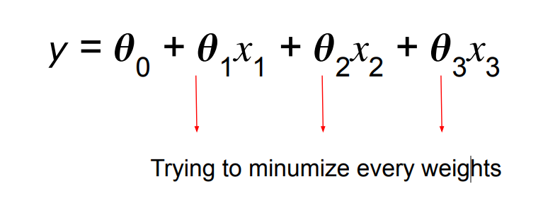

        - **Lasso+L1**
            - 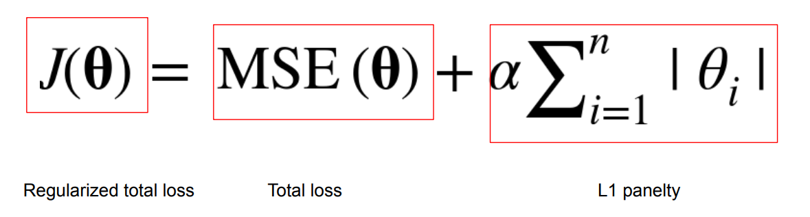
            - 關於變化$\alpha$
                - $\alpha = 0$
                    - 不會產生約束
                - $0<\alpha < \infty$
                    - 產生約束
                - $\alpha = \infty$
                    - 產生大量約束 ，all factor limit to 0
            - L1透過加入係數的絕對值和來約束模型參數。 這有助於推動一些係數變為零，實現特徵選擇，因此可以用於自動<font color ="#ffff">特徵選擇。</font>
                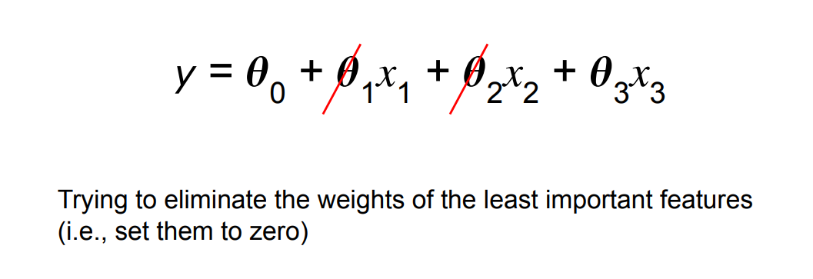
        - **Elastic net綜合**
            - Elastic Net迴歸是L1和L2正規化的綜合，透過同時添加L1和L2正規化項，可以在某種程度上綜合Ridge和Lasso的效果。
            - 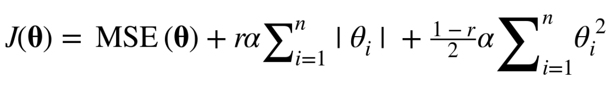
                - $r=0$
                    -  same as Lasso
                - $r=1$
                    - same as Ridge
- Which regularization should I use?
    - 如果你不確定哪種正規化適合你的數據，可以從Ridge迴歸開始。 Ridge使用L2正規化，對所有特徵都有約束，有助於避免過度擬合。

    - 如果你知道只有少數幾個特徵對問題很重要，可以考慮使用Lasso回歸。 Lasso使用L1正規化，可以將某些特徵的係數壓縮為零，實現特徵選擇。

    - 如果特徵之間有相關性，或者你不確定是否應該使用L1或L2正規化，可以考慮Elastic Net迴歸。 它結合了L1和L2正則化的優點，提供了更大的彈性。
