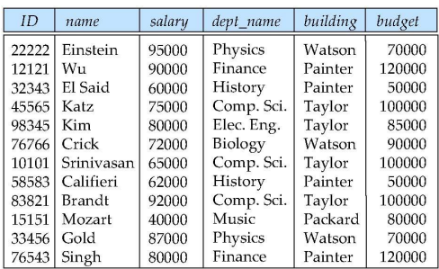
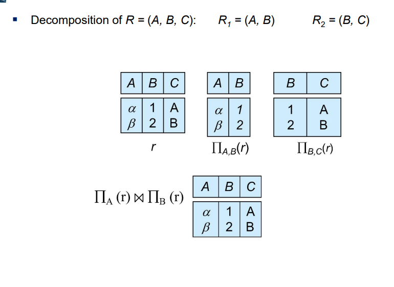
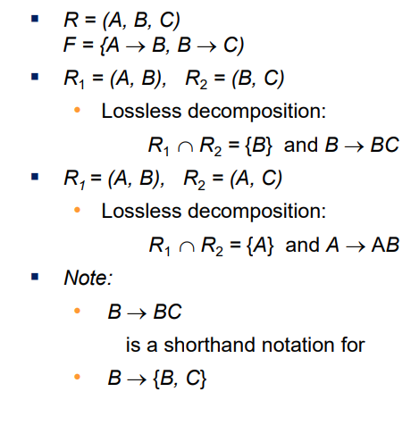

# chap 7 for 資料庫
### Features of Good Relational Designs
假設我們將`instructor`和`department`組合成一個名為`in_dep`的關聯，代表對`instructor`和`department`進行自然連接（natural join）。

- 存在信息的重複，即某些屬性在原來的`instructor`和`department`兩者之間可能存在相同的值，導致冗余。
- 需要使用空值（null values）來表示新添加的部門中沒有教師的情況，這可能導致數據表中的空值增加，增加了處理和查詢的複雜性。

這種合併的方式可能會導致數據的冗余和不一致，並增加了處理空值的複雜性。在資料庫設計中，應該謹慎考慮合併和正規化的過程，以確保資料庫結構的簡潔性和一致性。如果有冗余的情況，可能需要重新設計資料庫結構，使用正規化等技術來最小化信息重複並提高數據庫的效能。
### Decomposition
在`in_dep`模式中避免信息重複問題的唯一方法是將其分解為兩個模式 - `instructor` 和 `department` 模式。

然而，需要注意的是，並非所有的分解都是理想的。例如，如果我們將`employee`（ID，name，street，city，salary）分解為 `employee1`（ID，name）和 `employee2`（name，street，city，salary），當有兩個擁有相同名稱的員工時，就會出現問題。

這樣的分解會導致信息丟失，尤其是當有多個員工具有相同名稱時，我們無法完全重構原始的`employee`關係。因此，這種分解是有損失的。

在資料庫設計中，選擇正確的分解方法是至關重要的，以確保結構的正確性和數據的完整性。適當的正規化和分解可以減少信息重複，提高數據庫的一致性。
### A Lossy Decomposition

### Lossless Decomposition

在資料庫設計中，對於一個關聯模式 R，如果將其分解為兩個子關聯模式 R1 和 R2，即 R = R1 ∪ R2，我們希望這個分解是無損的。

- **無損分解（Lossless Decomposition）：**
  - 如果將 R 替換為 R1 ∪ R2 不會丟失任何信息，則我們稱這個分解是無損的。
  - 此無損性質可用以下等式表示：
    - 如果對於 R 中的所有實例 r，投影到 R1 的屬性的結果和投影到 R2 的屬性的結果的結合等於 r，即，$(\Pi_{R1}(r) \bowtie \Pi_{R2}(r) = r)$，那麼這個分解是無損的。

- **有損分解（Lossy Decomposition）：**
  - 如果存在實例 r，使得 r 不等於 $(\Pi_{R1}(r) \bowtie \Pi_{R2}(r))$，那麼這個分解是有損的。

簡而言之，無損分解確保我們可以通過合併子關聯模式的投影來還原原始關聯模式，而有損分解則可能會導致信息的損失。在設計資料庫時，通常優先考慮無損分解以保持資料完整性。
### Example of Lossless Decomposition 

### Normalization Theory
判斷一個特定的關聯 R 是否處於「良好」的形式中。在這種情況下，如果一個關聯 R 不處於「良好」的形式中，則需要進行分解，形成一組關聯 {R1, R2, ..., Rn}，滿足以下條件：

1. 每個關聯都處於「良好」的形式中。
2. 分解是無損的，即能夠通過合併子關聯的投影來還原原始關聯。

這個理論基於以下概念：
- **功能相依性（Functional Dependencies）：** 用於分析關聯中屬性之間的相依性，指導正規化的過程。
- **多值相依性（Multivalued Dependencies）：** 額外的相依性概念，用於處理多值相依性的情況。

換句話說，通過分析功能相依性和多值相依性，可以確定關聯是否處於「良好」的形式，並進行必要的分解以滿足正規化的要求。這有助於保持資料庫結構的一致性、完整性和效能。
### Functional Dependencies
滿足所有現實世界約束的關聯實例被稱為該關聯的合法實例；
一個資料庫的合法實例是指其中所有關聯實例都是合法實例。
對於合法關聯的約束包括：
- 要求一組屬性的值唯一確定另一組屬性的值。

一個功能相依性是鍵概念的一般化，它描述了一個屬性集的值決定另一個屬性集的值。在資料庫中，這些約束和功能相依性有助於確保數據的一致性和完整性。通過定義這樣的約束，我們可以確保數據庫中的實例都符合特定的業務邏輯和需求。

### Functional Dependencies Definition 

設 R 為一個關聯模式，且 $( \alpha \subseteq R )$ 和 $( \beta \subseteq R )$。

對於 R 上的任何合法關聯 r(R)，當任意兩個元組 t1 和 t2 在屬性 $( \alpha )$ 上的值相同時，它們在屬性 $( \beta )$ 上的值也相同，我們稱 $( \alpha \rightarrow \beta )$ 在 R 上成立。換句話說，如果 $( t1[\alpha] = t2[\alpha] )$，則必須有 $( t1[\beta] = t2[\beta] )$。

舉例來說，考慮一個具有 r(A,B) 的關聯實例，其實例如下：

| A   | B   |
|:--- | --- |
| 1   | 10  |
| 2   | 20  |
| 3   | 10  |

在這個實例中，B → A 成立，因為每個 B 的值對應唯一的 A 的值。然而，A → B 不成立，因為相同的 A 值（例如，A=1 和 A=3）對應不同的 B 值。

### Keys and Functional Dependencies

一個函數依賴集合 F 的閉包（closure）是指 F 集合所邏輯導致的其他某些函數依賴。

舉例來說，如果 A → B 且 B → C，那麼我們可以推斷 A → C。閉包的概念反映了函數依賴之間的推論或邏輯推斷。如果 F 集合包含這樣的函數依賴 A → B 和 B → C，那麼 F 的閉包將包含 A → C。

形式上，我們將 F 的閉包表示為 $F^+$。

閉包的計算通常使用一種稱為 Armstrong's Axioms（阿姆斯壯公理）的方法。這些公理是用於推斷新的函數依賴，從而擴展現有的函數依賴集合。

簡而言之，函數依賴的閉包是指由原始函數依賴推導出的所有可能的函數依賴集合。
### Armstrong's Axioms（阿姆斯壯公理）
阿姆斯壯公理是用於推導關聯模式中的函數依賴的一組規則。以下是阿姆斯壯公理的中文描述：

1. **反身性（Reflexivity）：**
   - 如果 $(Y)$ 包含在 $(X)$ 中，則 $(X \rightarrow Y)$。

2. **推移性（Transitivity）：**
   - 如果 $(X \rightarrow Y)$ 且 $(Y \rightarrow Z)$，則 $(X \rightarrow Z$)。

3. **擴展性（Augmentation）：**
   - 如果 $(X \rightarrow Y)$，則對於任意的 $(Z)$，都有 $(XZ \rightarrow YZ)$。

4. **合併性（Union）：**
   - 如果 $(X \rightarrow Y)$ 且 $(X \rightarrow Z)$，則 $(X \rightarrow YZ$)。

5. **分解性（Decomposition）：**
   - 如果 $(X \rightarrow YZ)$，則 $(X \rightarrow Y)$ 且 $(X \rightarrow Z)$。

這些公理是用於計算函數依賴閉包的基本規則。通過應用這些公理，可以擴展現有的函數依賴集合，並找到所有可能的函數依賴。這在正規化和數據庫設計的過程中非常有用。

### Keys and Functional Dependencies
在關聯模式 R 中，如果 $( K \rightarrow R )$ 成立，則 K 是 R 的超鍵（super-key）。

如果 K 是 R 的候選鍵（candidate key），則需要滿足以下兩個條件：
1. $( K \rightarrow R )$
2. 對於任何 $( \alpha \subset K )$，都不應該有 $( \alpha \rightarrow R )$ 成立。(不可分割性)

換句話說，K 是候選鍵，表示 K 唯一地確定整個關聯模式 R，並且沒有 K 的真子集可以達到相同的效果。

在提到具體的例子時，假設有關聯模式 `in_dep (ID, name, salary, dept_name, building, budget)`。在這個情況下，我們期望以下函數依賴成立：
- $( dept_name \rightarrow building )$
- $( ID \rightarrow building )$

但我們不期望以下函數依賴成立：
- $( dept_name \rightarrow salary )$

這是因為我們不希望從部門名稱能夠推斷出工資，這超出了部門名稱對應建築物的信息。因此，這強調了函數依賴的約束在描述資料庫中的合理性和一致性方面的重要性。
### Use of Functional Dependencies
使用函數依賴性的目的主要有兩個方面：

1. **檢測關聯的合法性：**
   - 我們可以使用函數依賴性來測試關聯是否在給定的函數依賴集合下是合法的。
   - 如果一個關聯 r 在一組函數依賴 F 下是合法的，我們稱 r 滿足 F。
  
2. **指定對合法關聯的約束：**
   - 我們可以使用函數依賴性來指定對合法關聯的集合的約束。
   - 如果 F 在關聯模式 R 上成立，則我們說 F 在 R 上保持。

需要注意的是，關聯模式的特定實例可能滿足某個函數依賴，即使該函數依賴不在所有合法實例上成立。例如，一個 instructor 關聯的特定實例可能碰巧滿足 `name → ID`，即使這個函數依賴不在所有合法的 instructor 實例上成立。

總之，函數依賴性提供了一種形式來描述資料庫中的約束和依賴關係，這有助於確保數據的完整性和一致性。
### Trivial Functional Dependencies
一個函數依賴被稱為平凡（trivial），如果它對一個關聯的所有實例都成立。

舉例來說，如果有函數依賴 `ID, name → ID`，這是一個平凡的函數依賴，因為對於任何擁有相同 ID 和 name 值的實例，它總是成立。另一個例子是 `name → name`，這也是一個平凡的函數依賴，因為它實際上並沒有提供新的信息。

一般來說，對於函數依賴 $( \alpha \rightarrow \beta )$ 來說，如果 $( \beta )$ 包含在 $( \alpha )$ 中，則這是一個平凡的函數依賴。在這種情況下，沒有提供新的信息或約束，因為 $( \beta )$ 已經包含在 $( \alpha )$ 中。

平凡的函數依賴通常不是設計資料庫結構時關心的重點，因為它們並未提供新的知識，並且在設計正規化的過程中通常會被排除。
### Lossless Decomposition
在資料庫理論中，"Lossless Decomposition"（無損分解）是指將一個關聯模式 $R$ 分解成兩個子模式 $R1$ 和 $R2$，使得對於關聯模式 $R$ 上的所有實例，分解和合併的操作不會丟失任何信息。

使用函數依賴性可以表示何時某種分解是無損的。對於 $R = (R1, R2)$ 的情況，我們需要確保對於模式 $R$ 上的所有可能關聯 r：
$r = \pi_{R1}(r) \bowtie \pi_{R2}(r)$

換句話說，關聯 r 在模式 $R$ 上的投影和合併操作應該等於原始關聯 r。

無損分解的一個條件是至少有以下一個函數依賴性屬於 $F^+$：
1. $R1 \cap R2 \rightarrow R1$
2. $R1 \cap R2 \rightarrow R2$

上述的函數依賴性是無損聯結分解的充分條件。當所有約束都是函數依賴性時，這些依賴性是必要條件。

總之，無損分解是資料庫設計中的一個重要概念，它確保了在進行資料庫操作時不會丟失信息，並確保數據的完整性。
### $F^+$ explain
根據給定的關係和函數，我們有一個關係 R，其中 R = (A, B, C)，還有一個函數集 F，其中 F = {A → B, B → C}。

現在，我們要找出 **F+ 中的所有可能函數**。F+ 代表在 F 的基礎上，透過推導得到的所有函數。

首先，根據 F 中的規則，我們可以得到一個新的函數 A → C。這是因為如果 A → B 且 B → C，我們可以透過推導得到 A → C。

所以，F+ = {A → B, B → C, A → C}。這是在給定的條件下，F+ 中的所有可能函數。

### example

### Dependency Preservation (依賴關係保留)

- 每次更新資料庫時測試功能相依性約束可能成本高昂。
- 有效的設計資料庫的方式是使約束能夠被高效地測試。
- 如果測試一個功能相依性只需考慮單一關聯，那麼測試這個約束的成本就很低。
- 在分解一個關聯時，有可能無法在不執行笛卡兒乘積的情況下進行測試。
- 一個使得執行測試功能相依性變得計算上困難的分解被稱為「非相依性保存」。

### Dependency Preservation Example
考慮一個模式：

>dept_advisor(s_ID, i_ID, department_name)

具有以下功能相依性：

>i_ID → dept_name
>s_ID, dept_name → i_ID

在上述設計中，每當一位教師參與dept_advisor關係時，我們被迫重複部門名稱。

為了解決這個問題，我們需要分解dept_advisor。

但是，任何一種分解都不會包括所有屬性在`s_ID, dept_name → i_ID`中。

因此，這種分解不會保持相依性，可以說是「非相依性保存」。
## BCNF
### Boyce-Codd Normal Form(BCNF)
Boyce-Codd 正規化形式（BCNF）的定義如下：

> 對於給定的關聯模式 R 和功能相依集合 F，如果對於 F+ 中的每個形式為 α → β（其中 α 和 β 是 R 的子集），至少有以下之一成立：
>   - α → β 是平凡的(trivial)（即，β 包含於 α 中）。
>   - α 是 R 的超鍵。

簡而言之，BCNF **要求每個非超鍵屬性都完全依賴於超鍵**。

另外，BCNF 的特點是對於只有兩個屬性的關聯模式，它總是處於 BCNF 的狀態。這是因為在這種情況下，任何非平凡的函數相依都將涉及到整個關聯模式，且超鍵的概念相對簡單。

換句話說，如果一個關聯模式具有 F 中所有函數相依，而這些函數相依滿足 BCNF 的定義，那麼該模式就是 BCNF 的。

---

Boyce-Codd 正規化形式（BCNF）的定義如下：

1. 對於給定的關聯模式 R 和功能相依集合 F，如果對於 F+ 中的每個形式為 α → β（其中 α 和 β 是 R 的子集），至少有以下之一成立：
   - α → β 是平凡的（即，β 包含於 α 中）。
   - α 是 R 的超鍵。

簡而言之，BCNF 要求關聯模式中的每個非平凡函數相依都是由超鍵（super-key）產生的，或者是平凡的。

另外，BCNF 的特點是對於只有兩個屬性的關聯模式，它總是處於 BCNF 的狀態。這是因為在這種情況下，任何非平凡的函數相依都將涉及到整個關聯模式，且超鍵的概念相對簡單。

換句話說，如果一個關聯模式具有 F 中所有函數相依，而這些函數相依滿足 BCNF 的定義，那麼該模式就是 BCNF 的。
### BCNF  example
讓我們考慮一個範例模式，並確保它符合 Boyce-Codd 正規化形式（BCNF）。假設我們有以下關聯模式：

>Employee(employee_id, employee_name, department_id, department_name)

其中有一個函數相依性：`department_id → department_name`。這表示給定部門ID，可以唯一確定該部門的部門名稱。

現在，讓我們檢查這個函數相依性是否符合 BCNF 的條件。BCNF 要求對於 F+ 中的每個非平凡函數相依（α → β），至少有以下之一成立：
- α → β 是平凡的（即，β 包含於 α 中）。
- α 是 R 的超鍵（R 是關聯模式的屬性集）。

在這個例子中，`department_id → department_name` 是一個非平凡函數相依，因為部門ID不能唯一確定整個關聯模式。但是，`department_id` 也是關聯模式的超鍵，因為它是唯一標識每個員工的。

因此，這個範例模式是符合 BCNF 的，因為每個非平凡函數相依都可以由超鍵推導出。

### Decomposing a Schema into BCNF

在將模式（Schema）轉換為 Boyce-Codd 正規化形式（BCNF）時，可以採取以下步驟：

1. 假設存在一個函數相依性（Functional Dependency）：α → β，導致違反 BCNF。
2. 將模式 R 分解為兩個子模式：
   - (α ∪ β)：包含所有相依性的屬性。
   - (R - (β - α))：包含原始模式中剩餘的屬性，去除了在 (α ∪ β) 中已經包含的部分。

以範例模式 `in_dep` 為例：
- `in_dep (ID, name, salary, dept_name, building, budget)`
- 假設函數相依性為 `dept_name → building, budget`。
- 將模式 `in_dep` 分解為：
  - (α ∪ β) = (dept_name, building, budget)
  - (R - (β - α)) = (ID, name, dept_name, salary)

這樣，原始的 `in_dep` 模式就被分解為兩個符合 BCNF 的子模式。

然而，需要注意的是，有時無法同時實現 BCNF 和相依性保留。在某些情況下，即使進行分解，也無法保留所有原始相依性。例如，在 `dept_advisor` 這個範例中，即使進行分解，也無法同時包含所有屬性在 `s_ID, dept_name → i_ID` 中，因此無法實現相依性保留。在這種情況下，必須權衡兩者之間的需求。
## 1NF
### First Normal Form(1NF)
第一正規化（1NF）是關於資料庫中屬性的定義的規範。以下是有關第一正規化的主要概念：

1. **原子領域（Atomic Domain）**：
   - 一個領域被認為是原子的，如果它的元素被視為不可分割的單位。換句話說，原子領域中的值不能再分解為更小的部分。
   - 例如，整數、字串或日期通常被視為原子領域，因為它們的元素被視為單一的不可分割單位。

2. **非原子領域的例子**：
   - 名字集合、複合屬性等。
   - 識別號碼，例如可分解成多個部分的課程編號（如CS101）。

3. **在1NF的關聯模式**：
   - 一個關聯模式 R 被認為是在第一正規化中，如果 R 中所有屬性的領域都是原子的。
   - 非原子值會使存儲變得複雜，並且容易導致數據的冗余存儲（重複存儲）。

4. **例子**：
   - 假設有一個包含客戶的帳戶集合，每個帳戶都有一個擁有者的集合。如果擁有者是一個集合，而不是單一的原子值，這就不符合1NF

以下即為1nf，想解決的問題
| id  | day   | cost       |
| --- | ----- | ---------- |
| 1   | 12/1  | -9,+10,-10 |
| 2   | 12/24 | +10        |

在實際的數據庫設計中，通常會假設所有的關聯模式都已經滿足第一正規化，也就是所有屬性都具有原子領域。這樣有助於簡化數據的管理和操作。

---

1. **原子性是相對的**：
   - 在資料庫中，「原子性」是一個相對的概念，取決於如何使用領域中的元素。通常情況下，字符串（字串）被視為不可分割的原子單位，因為在大多數操作中，我們將整個字符串視為一個元素。

2. **案例示例**：
   - 以學生的學號為例，如果學號是以字符串形式表示，例如 "CS0012" 或 "EE1127"，通常我們將整個學號視為一個原子元素。
   - 如果應用程序需要提取學號的前兩個字符以找到部門，這種提取操作將使學號的領域變得不是原子的。

3. **避免在應用程序中進行編碼**：
   - 提取操作可能導致在應用程序代碼中進行編碼，而不是在資料庫中進行。這是一種不良的設計實踐，因為這樣做可能會使應用程序對數據庫結構的依賴增加，同時使數據庫結構更加脆弱。

總的來說，確保領域中的元素被視為原子的是良好的設計原則，因為這有助於降低應用程序對數據庫結構的依賴，同時保持數據庫的一致性和完整性。
## 2nf
### Second Normal Form(2NF)
在資料庫設計中，第二正規化（2NF）是一個用於確保資料庫表格結構的正規化形式。以下是有關第二正規化的一些重要概念：

1. **部分相依性（Partial Dependency）**：
   - 在函數相依性中，如果存在一個屬性集合 α → β，其中 α 的某個子集 γ 也能推導出 β，則這種相依性被稱為部分相依性。換句話說，某些屬性只依賴於屬性集合的一部分。

2. **第二正規形的定義**：
   - 一個關聯模式 R 被認為是在第二正規化中，如果 R 中的每個屬性 A 符合以下條件之一：
     - A 出現在一個候選鍵中。
     - **A 不對候選鍵的任何部分進行部分相依。**

3. **歷史意義**：
   - 2NF 在歷史上有其重要性，但在實踐中並不常用。它的主要目標是消除部分相依性，確保每個屬性完全依賴於整個候選鍵，而不僅僅是部分依賴。然而，在實際應用中，更高階的正規化形式（如第三正規化和 BCNF）通常被更廣泛地應用。

總的來說，第二正規化是一個用於改進資料庫結構的重要步驟，但在實務中可能會被更進階的正規化形式取代。

----

#### example
有一個資料表記錄了裝置元件的資訊，如下所示：

元件來源
| 元件 | ID （主鍵） | 價格 | 供應商ID （主鍵） | 供應商名稱 | 供應商住址 |
| ---- | ----------- |:---- |:----------------- | ---------- | ---------- |
| 65   | 59.99       | 1    | Stylized          | Parts      | VA         |
| 73   | 20.00       | 1    | Stylized          | Parts      | VA         |
| 65   | 69.99       | 2    | ACME              | Industries | CA         |

這個資料表的每個值都是單一值，所以它符合第一正規化。因為同一個元件有可能由不同的供應商提供，所以得把元件 ID 和供應商 ID 合在一起組成一個主鍵。

元件（關鍵詞）和價格之間的關係很正確：同一個元件在不同供應商有可能會有不同的報價，所以價格確實和主鍵完全相關（完全相依）。

另一方面，_供應商的名稱和住址就只和供應商 ID 有關（部分相依）_，這不符合第二正規化的原則。仔細看就會發現 "Stylized Parts" 這個名稱和 "VA" 這個住址重複出現了兩次；要是它改名了或是被其他公司併購了怎麼辦？就只能將供應商名稱與地址分個出來

## 3nf
### Third Normal Form
第三正規化（3NF）是資料庫正規化所使用的正規形式，**要求所有非主鍵屬性都只和候選鍵有相關性**，**也就是說非主鍵屬性之間應該是獨立無關的**。
第三正規化（3NF）是一種用於改進資料庫表格結構的正規化形式。以下是與第三正規化相關的一些主要概念：

1. **定義**：
   - 一個關聯模式 R 被認為是在第三正規化中，如果對於所有的函數相依性 $\alpha \rightarrow \beta$（在 F+ 中），至少滿足以下三個條件之一：
     - $\alpha \rightarrow \beta$ 是平凡的（即，$\beta \ ∈ \alpha$）。
     - $\alpha$ 是 R(table) 的超鍵。
     - $\beta - \alpha$ 中的每個屬性都包含在 R 的某個候選鍵中（注意，每個屬性可能包含在不同的候選鍵中）。

2. **BCNF 與 3NF 之間的關係**：
   - 如果一個關聯模式在 Boyce-Codd 正規化形式（BCNF）中，則它一定也在第三正規化中。這是因為在 BCNF 中的每個函數相依性中，要麼是平凡的，要麼左側是超鍵，其中之一。

3. **第三條件的意義**：
   - 第三條件是對 BCNF 的一種最小的放寬，以確保相依性的保存。這是因為在某些情況下，BCNF 可能會導致不必要的關係分解，可能使某些相依性丟失。第三條件允許了更靈活的設計，以保留某些相依性。

總的來說，第三正規化旨在進一步消除相依性，以提高資料表的結構正規性，同時確保相依性的保存。

#### example
在這個例子中，考慮一個包含以下屬性的關聯模式：

>dept_advisor(s_ID, i_ID, dept_name)

並有以下函數相依性：

- `i_ID → dept_name`
- `s_ID, dept_name → i_ID`

同時，存在兩個候選鍵 `{s_ID, dept_name}` 和 `{s_ID, i_ID}`。

現在來檢視這個關聯模式在第三正規化（3NF）中的情況：

1. `s_ID, dept_name` 是超鍵：
   - 因此，對於所有函數相依性，如果左側是 `s_ID, dept_name`，則右側必須完全依賴於 `{s_ID, dept_name}`，因此這部分是符合 3NF 的。

2. `i_ID → dept_name`：
   - 在這種情況下，`i_ID` 不是超鍵，但是 `{dept_name}` 是 `{s_ID, i_ID}` 的一個候選鍵的一部分。
   - 也就是說，`dept_name` 包含在一個候選鍵中，確保了函數相依性的保存。

總的來說，儘管這個關聯模式不符合 Boyce-Codd 正規化形式（BCNF），但它滿足第三正規化（3NF）。這是因為在 3NF 中，對於每個函數相依性，要麼是平凡的，要麼左側是超鍵，要麼右側的每個屬性都包含在某個候選鍵中。

### BCNF vs 3NF
**BCNF（Boyce-Codd Normal Form）與3NF（Third Normal Form）的比較：**

### 3NF相對於BCNF的優勢：

1. **避免損失性和相依性保存的優勢：**
   - 在獲得3NF設計的過程中，可以避免**失去無損性**和相依性保存的問題。這表示可以在不失去資料的完整性和相依性的情況下，實現3NF的設計。相比之下，BCNF在實現時可能需要進行更多的努力，並可能導致**失去無損性**或相依性的變動。

### 3NF的缺點：

1. **使用Null值的需求：**
   - 3NF可能需要使用Null值，尤其是在表示某些可能的有意義的資料項之間的關係時。這可能使得查詢變得更加複雜，並增加了理解和維護的難度。

2. **資訊的重複問題：**
   - 存在資料的重複問題，這可能導致資料不一致或浪費存儲空間。重複的資料可能增加了更新操作的複雜性，並可能引起當一處更新而另一處未更新時的不一致性。

總的來說，3NF相較於BCNF的主要優勢在於容易實現，同時不失去損失lessness和相依性保存。然而，它也有一些缺點，例如使用Null值的需求和資料重複問題，這需要在設計階段進行仔細的權衡和分析。根據具體的應用需求，選擇BCNF或3NF的設計方案可能會有所不同。

### 正規化的目標(Goals of Normalization)
判斷關聯模式是否處於「良好」的形式：

對於給定的關聯模式 R，檢查它是否滿足特定的正規化形式，例如第一正規化（1NF）、第二正規化（2NF）、第三正規化（3NF）或Boyce-Codd正規化形式（BCNF）。這有助於提高資料表的結構正確性和一致性。
在不良好形式下進行分解：

如果關聯模式 R 不處於「良好」的形式，需要進行分解，得到一組新的關聯模式 {R1, R2, ..., Rn}。分解的目的是確保每個新的模式都滿足某種正規化形式。
確保分解是無損失的：

分解後的每個新模式都應該包含分解前的所有信息，以確保無損失的轉換。這意味著可以通過聯合操作將新模式重新組合成原始模式。
最好地保持相依性：

分解應該最好地保持相依性。這表示在分解後的模式之間仍然保留原始相依性。這有助於確保應用程序在使用新的資料模型時不會失去任何重要的資訊。
總的來說，正規化的目標是改進資料表的結構，以減少資料冗余和提高資料的一致性。透過檢查和分解，可以確保資料模型更符合特定的正規化形式，同時保持資料的完整性和相依性。
### Functional-Dependency Theory Roadmap

1. **功能依賴理論介紹：**
   - 我們首先考慮一個正式的理論，該理論告訴我們在給定的功能依賴性集合中邏輯上意味著哪些功能依賴性。
   
2. **生成 BCNF 和 3NF 的無損分解算法：**
   - 我們接著發展算法，以生成符合 BCNF 和 3NF 的無損分解。這涉及將原始表格分解成更小的表格，以消除冗余並保持數據的完整性。

3. **測試分解是否保持依賴性：**
   - 我們進一步發展算法，用於測試分解是否保持依賴性。這涉及檢查分解後的表格結構是否仍然滿足原始的功能依賴性，以確保分解後的數據一致性。

這樣的路線圖強調了在設計和優化關聯型資料庫時所需的一系列步驟。功能依賴理論提供了分析和理解數據依賴性的框架，而生成和測試算法則允許我們有效地應用這些理論，以獲得結構良好、冗余減少且易於維護的資料庫結構。

### Closure of a Set of Functional Dependencies
我們可以通過反復應用阿姆斯壯公理（Armstrong's Axioms）計算 \( F^+ \)，即 F 的閉包。阿姆斯壯公理包括以下三條規則：

1. **自反規則（Reflexive Rule）：** 如果 $\beta \subseteq \alpha$ 則 $\alpha \rightarrow \beta$
2. **擴充規則（Augmentation Rule）：** 如果 $\alpha \rightarrow \beta$ 則對於任何 $\gamma$ 都有 $\gamma \alpha \rightarrow \gamma \beta$
3. **遞移規則（Transitivity Rule）：** 如果 $\alpha \rightarrow \beta$ 和 $\beta \rightarrow \gamma$ 則$\alpha \rightarrow \gamma$

這些規則具有以下特點：

- **聲明性：** 這些規則是聲明性的，意味著它們描述了函數依賴性的性質。
- **完整性：** 這些規則是完整的，它們足以生成所有在給定函數依賴性集合中成立的函數依賴性。
- **一致性：** 這些規則是一致的，即它們只生成實際上成立的函數依賴性。

通過應用這些規則，我們可以構建 $F^+$，它包含了在給定的函數依賴性集合 F 中邏輯上推斷出的所有函數依賴性。這是計算閉包的一種有效方法，並確保生成的函數依賴性是完整且符合實際數據的。

