# Chap 2---Instructions Language of Computer
##  Introduction
本章節主要介紹電腦指令集(MIPs)。
## ISAs
指令集架構（英語：Instruction Set Architecture，縮寫為ISA），又稱指令集或指令集體系，是電腦架構中與程式設計有關的部分，包含了基本資料類型，指令集，暫存器，定址模式，儲存體系，中斷，異常處理以及外部I/O。指令集架構包含一系列的opcode即操作碼（機器語言），以及由特定處理器執行的基本命令。
不同的處理器「家族」——例如Intel IA-32和x86-64、IBM/Freescale Power和ARM處理器家族——有不同的指令集架構。
<font color=ffff>本章節採用MIPS</font>
### 複雜指令集vs精簡指令集
- 複雜指令集
	- 複雜指令集電腦（英文：Complex Instruction Set Computer；縮寫：CISC）
	- 其內容包山包海，基本上有用的指令都會被放入，也會將需多過於精簡的指令整合
	- 舉例，就像樂高積木中已經被拼好的一整塊積木，使用上比較快
	- 優點
		- 執行速度快，軟體開發簡單
	- 缺點
		- 晶片難做
		- 耗電、高發熱量
		- 執行前要把要將code轉成RSIC(精簡指令集)再傳給cpu ⇒ No效率
- 精簡指令集
	- 精簡指令集電腦（英語：Reduced Instruction Set Computer，縮寫：RISC）
	- 其中內容較少，只包含最精簡最有用的指令集
	- 舉例，就像樂高積木中最小的每個積木單位，要建造摩天輪就要從頭來
	- 優點
		- 晶片簡單，耗電少，成本低
	- 缺點
		- 軟體難寫，軟體容易耗較大存儲空間
### 市面上四大指令集比較(X86,ARM,MIPs,RSIC-V)
| 指令集    |           [x86](/9TEngk94R1K-ANNcurOxrQ)            |            [ARM](/CMHpWsWCSNK-ey7dYupimQ)             | MIPs | [RSIC-V](/5RFJSvAiRiOs-FAgygBhaA) |
|:--------- |:------------------------:|:--------------------------:|:----:|:------:|
| 複雜/精簡 |           CISC           |            RSIC            | RSIC |  RSIC  |
| 使用場景  | 個人電腦<BR>相容不同軟體 | 嵌入式、移動式<BR>(耗電低) |   個人娛樂<BR>商業裝置<BR>網路裝置<BR>一指令一週期   |   完全開源 ，小型家電、工業控制器、小型傳感器   |


### high level to machine language
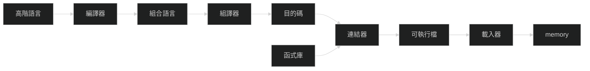
### 程式在cpu中執行的流程
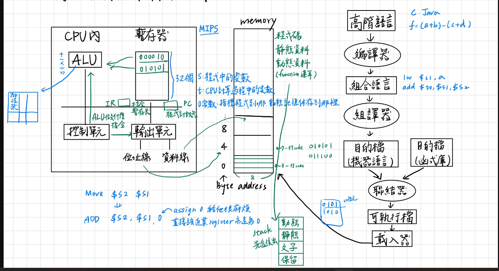


1. 提取
 	```c=
	IR=[PC]//通過cpu中的輸出入單元獲得指令
		//通過位址(PC)線通知memory，通過資料線回傳資料
	PC=PC+4//獲取下一條指令位置
	```
3. 解碼
	解析在IR中存放的指令，並由控制單元指示輸出單元獲取資料，最後ALU計算果
5. 執行
	由ALU計算(資料先進入ALU計算，結束後回到regs)
## MIPS
### MIPs 五大類指令
- 資料傳輸 : lw, sw, lb, lbu, sb,…
	- 資料運輸<font color=ffff>**存儲記憶體regs\&memory**</font>
- 算數: add, sub, addi, …
	- 指示對應單元處理<font color=ffff>**ALU**</font>
- 邏輯: and, or, nor, andi, ori, sll, srl, …
	- 指示對應單元處理<font color=ffff>**ALU**</font>
- 條件式跳躍 : beq, bne, slt, sltu, slti, sltiu, …
	- 跳躍到對應記憶體位置<font color=ffff>**PC\&IR\&memory**</font>
- 非條件式跳躍 : j, jr, jal, …
	- 跳躍到對應記憶體位置<font color=ffff>**PC\&IR\&memory**</font>

### MIPs 的暫存器
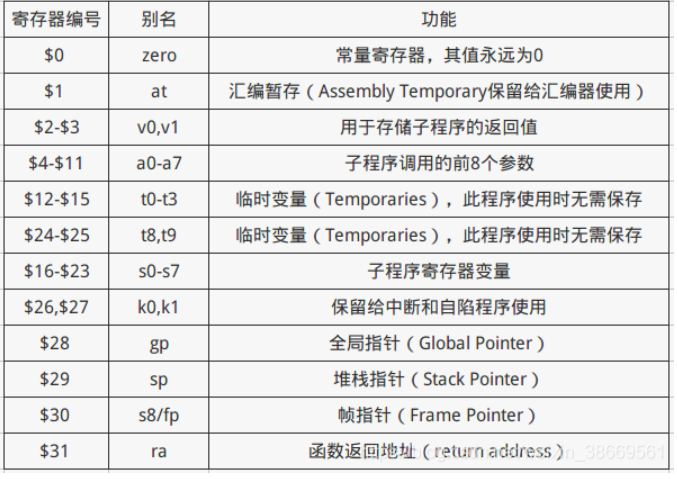


`$zero`由於經常使用，用暫存器特別儲存以提升效率

## 個別指令介紹
### 指令結構介紹
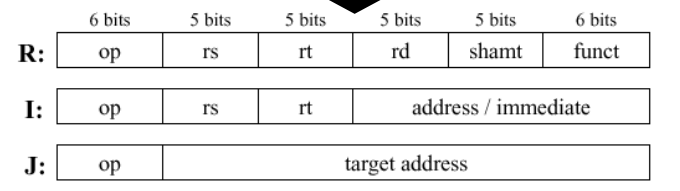
R:`op dest, source1, source2`
I:`op dest, source1, immediate`
J:`j target`
- 立即值
	- 在MIPS 中立即值用16bit 存儲
	- 在運算類中用2'補數到32bit
	- 在邏輯類中17~32bit補0
### 資料傳輸類(l&s開頭系列)

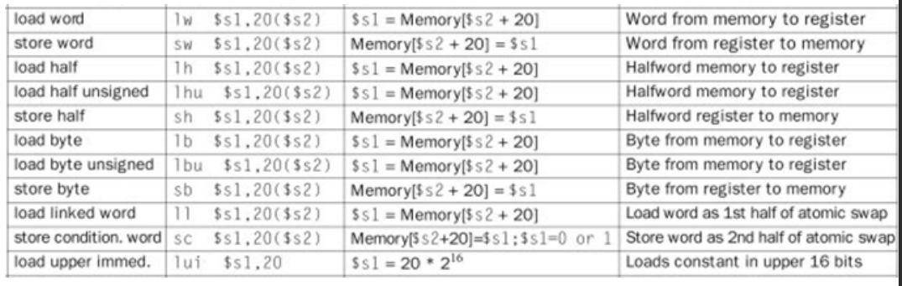
- 開頭
	- l : 將memory中的data移至regs
	- s : 將regs 存進memory
-  型態
	- word : 32bits(regs的固定大小)
	- half : 16bits
	- byte : 8bits
-  signed&unsigned
	-  unsigned的cmd後面會加u
	```assemble=1
	//假設0($s1)為-2
	lb $t1,0($s1)//t1=1.(共有31個bit)..10
	//假設0($s1)為2
	lb $t1,0($s1)//t1=0x10
	//假設0($s1)為2
	lbu $t1,0($s1)//t1=0x10	
	```
- 矩陣(假定基本單位為4 bit)
	- `lb $t1,x($s3)`
	- `x`為矩陣中的位置，單位為bit
	- `$s3`在 registers s3 中存放記憶體位置
- 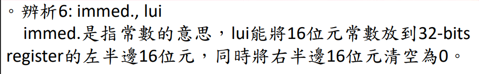
- 一般的常數該如何載入暫存器中呢?
 	- 常數不能直接給CPU使用，必須先載入記憶體，再存到暫存器後，由暫存器載到CPU中使用。
 	- 其他解法:`addi $t1,$zero,144`
- spiling
	- 由於registers的內部空間有限，所以假如空間不夠用，就將部分內容分至memory
- `$zero`
	- 功能1:載入常數
		- `addi $t1,$zero,123`
		- 將`123`載入`$t1`
	- 功能1:載入變數
		- `add $t1,$zero,$s1`
		- 將`$s1`載入`$t1`
	- 優點
		- 可以大幅減少opcode的使用數量
		- 可以使硬體設計簡單化
### 算數類別


<!-- undo   -->
- 資料流動概念
- addi(I型)
	- i 為立即值
	- syntax:`addi dest,source,immediate`
- add(R型)
	- i 為立即值
	- syntax:`addi dest,source1,source2`


### 邏輯類別
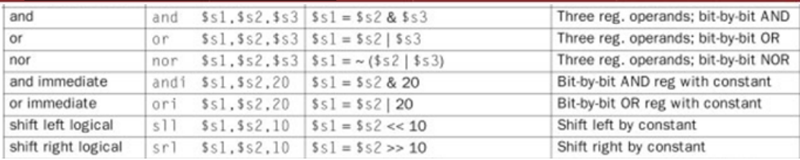
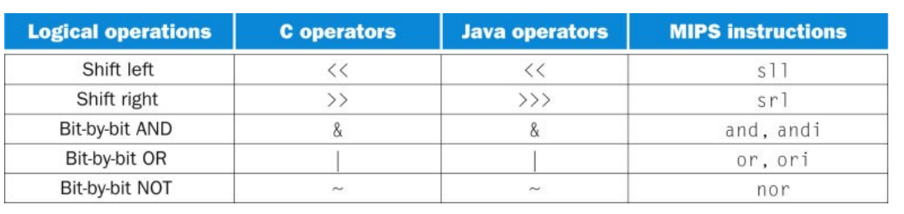
<font color=ffff>**重點:MIPs沒有not**</font>

- shift(I型)
	- sll (向左移)
		- `sll $t1,$s1,4`
		- set: s1 = `1000 0000 0000 0000 0000 0000 0000 1000`
		- ans: t1 = `0000 0000 0000 0000 0000 0000 1000 0000`
		- 出去就消失，空位就補0
	- srl (向右移)
		- `srl $t1,$s1,4`
		- set: s1 = `1000 0000 0000 0000 0000 0000 0000 1000`
		- ans: t1 = `0000 1000 0000 0000 0000 0000 0000 0000`
		- 出去就消失，空位就補0
	- example1
		Ex: 假設變數f, g, h, i, j的數值分別存在\$s0-\$s4；矩陣A, B(假設矩陣型態為byte)的基底位置分別存在\$s6和\$s7，則請問c語言指令f = g – A[B[4]] 翻成MIPS機器學習碼的結果為何呢?
		 ans
		```c=1
		lw $t0,16($s7)//因為byte大小為4→4x4
		sll $t0,$t0,4 //got A index
		add $t0,$s6,$t0//透過offset 位移至A[16]
		lw  $t0,0($t0)// load t0 A[B[4]]
		sub $s0,$s1,$t0//f = g – A[B[4]]
		```
		
- and、or、NOR(R型態)
  | A   | B   | A AND B | A OR B | A NOR B |
  | --- | --- | ------- | ------ | ------- |
  | 0   | 0   | 0       | 0      | 1       |
  | 0   | 1   | 0       | 1      | 0       |
  | 1   | 0   | 0       | 1      | 0       |
  | 1   | 1   | 1       | 1      | 0       |

- NOT
	- MIPs 中並沒有原生not，所以要使用其他方法實現
	- 使用nor+zero實現
	- `nor ans ,$zero,source`即可達成not source的效果
	  | input | 0   | output |
	  | ----- | --- | ------ |
	  | 0     | 0   | 1      |
	  | 1     | 0   | 0      |
<!-- example -->
### 條件式跳躍&非條件跳躍(J/I型??)
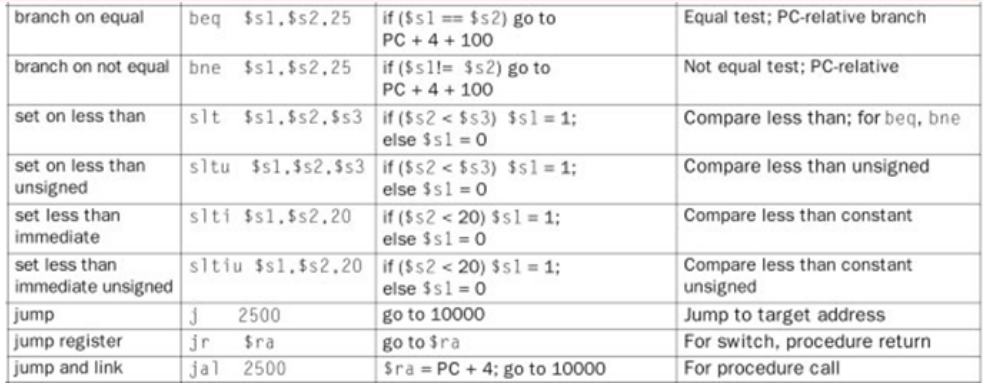
- beq and bne
	- `beq $s1,$s2,offset`
		- if s1==s2 ,jmp offset
	- `beq $s1,$s2,offset`
		- if s1!=s2 jmp offset
- slt、sltu、slti、sltiu
	- `slt $s1,$s2,$s3`
		- if s2<s3,s1=1
		- else s1=0
	- `sltu $s1,$s2,$s3`
		- s2、s3為unisgned
		- if s2<s3,s1=1
		- else s1=0
	- `slti $s1,$s2,im`
		- im:立即值
		- if s2<im,s1=1
		- else s1=0
	- `sltiu $s1,$s2,im`
		- 結合slti&sltu
		- if s2<im,s1=1
		- else s1=0
- j、jr、jal
	- `j im`
		- im為立即值的offset??
	- `jr $ra`
		- jump to $ra(return address register)
	- `jal 2500`
		- jump to 2500
		- store $ra = $PC +4


## Function 撰寫
### function 的六大步驟
1. 將參數置於程序可存取的位置(要將使用空間清空)
2. 將控制權轉移給程序
3. 取得程序所需的儲存資源
4. 執行所需的工作
5. 將結果的值置於呼叫程式可取得的地方
6. 將控制權交回原來呼叫的地方


### registers

<p class="text-center">
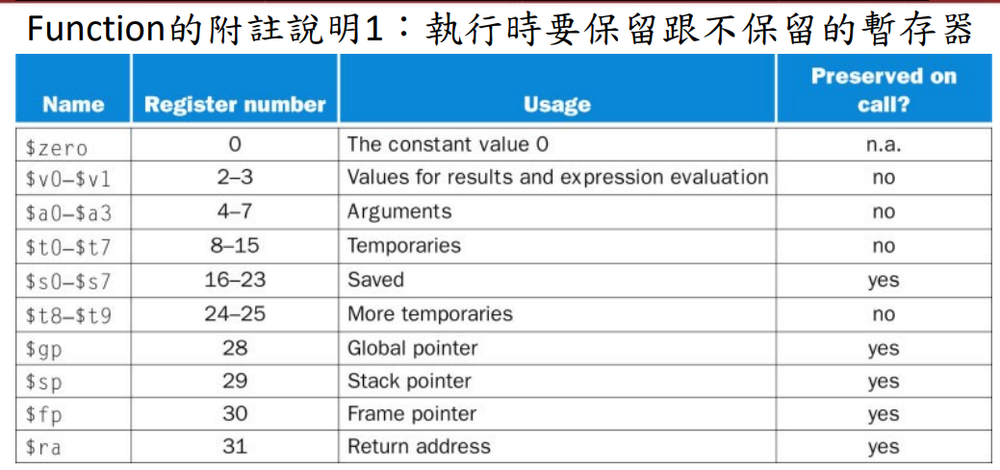
</p>

- \$a0~$a3
	- parameter(傳遞參數用)
- \$t0\~\$t7&\$8~\$t9
	- temporaries and more temporaries
	- 通常用在算式中的暫存值
- \$v0~\$v1
	- 回傳值
- \$ra
	- Return address
- \$sp
	- stack pointer
- \$gp
	- Global pointer
- \$fp
	- Frame Pointer
### gp & fp 的使用??
- 通用暫存器（GP）的使用：
	- 用途： 通用暫存器主要用於儲存暫存資料和執行算術運算。 它們是通用性的寄存器，可以被程式設計師和編譯器靈活使用。
	- 範例： 儲存臨時變數、中間計算結果、傳遞函數參數等。 通用暫存器的內容在程式執行過程中可以頻繁地變化。
- 幀指針（FP）的使用：
	 - 用途： 幀指標主要用於函數呼叫期間的堆疊管理。 它指向當前函數的堆疊幀的起始位置，透過它可以存取局部變數和參數。
	- 範例： 定位和存取目前函數的局部數據，透過幀指標可以有效地存取堆疊幀內的資訊。 在函數呼叫結束後，幀指標的值可能會被還原，以正確管理堆疊幀。

## function 範例
 第一題
### source code
```c=1
int leaf_example(int g, int h, int i, int j){
 int f;
 f=(g+h)-(i+j);
 return f;
}
```
### 分析
parameter : \$a0~$a3
tmp : \$t0(g+h),\$t1(i+j)
f: $s0
return : $v0
### MIPs
```assemble=1
leaf :
	addi $sp,$sp,-12
	sw $s0,0($sp)
	sw $t0,4($sp)
	sw $t1,8($sp)
	addi $t0,$a0,$a1
	addi $t1,$a2,$a3
	sub $s0,$t0,St1
	add $v0,$s0,$zero
	jr $ra;
```


 第二題
### source code
```c=1
int fact (int n){
 if (n<1) return (1);
 else return (n*fact(n-1));
}
```
### 分析
parameter : $a0
tmp : \$t0
return : $v0
### MIPs
```assemble=1
fact :
	addi $sp,$sp,-8   	//sp-8
	sw $ra,0($sp)		
	sw $a0,4($sp)		
	slti $t0,$a0,1		
	beq $t0,$zero,L1  	//if a0<1 
	addi $v0,$zero,1  	// v0=1 
	addi $sp,$sp,8    	// sp +8
	jr $ra				
	L1:					
		addi $a0,$a0,-1	
		jal fact		
	sw $ra,0($sp)	
	sw $a0,4($sp)	
	addi $sp,$sp,8 		//sp+8
	mul $v0,$v0,$a0 	//v0=v0*a0
	jr $ra
```


 第三題
### source code
```c=1
int sum (int n, int acc){
 if (n>0)
 return sum(n-1, acc+n);
 else
 return acc;
}

```
### 分析
parameter : $a0
tmp : \$t0
return : $v0
### MIPs
```assemble=1
sum :
	addi $sp,$sp,-4
	sw $t0,0($sp)
	L1:
		slt $t0,$a0,$zero
		beq $t0,$zero,L2
		add $a1,$a1,$a0
		subi $a0,$a0,1
		j L1
	L2:	
		lw $t0,0($sp)
		addi $sp,$sp,4 
		addi $v0,$zero,$a1
		jr $ra
```

 作業11
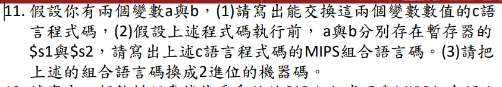

### source code
```c=
int tmp=s0;
s0=s1;
s1=tmp;
```
### 分析
null

### MIPs
```mips=
add $t0,$s0,$zero
add $s0,$s1,$zero
add $s1,$t0,$zero
```

### machine language
`NULL`


 作業12
### source code
```c=
int * vend(int Price,int Input){
	int tmp=Input*50-Price;
	int a[2];
	while(tmp>=10){
		tmp-=10;
		a[0]+=1;
	}
	a[1] =tmp;
	return a;	
}
```

### 分析
a[0] : v0
a[1] : v1
tmp : t0
Price : a0
Input : a1
tmp>=10 : t1(slti)

### MIPs
```mips=
vend :
	addi $sp,$sp,-8
	sw $t0,0($sp)
	sw $t1,4($sp)
	addi $t1,$zero,50
	mul $a1,$a1,$t1
	subi $t0,$a0,$a1
	add $v0,$zero,$zero
	add $v1,$zero,$zero
	add $t1,$zero,$zero
	loop :
		slti $t1,$t0,11
		beq $t1,$zero,exit
		addi $t0,$t0,-10
		addi $v0,$v0,1
	exit :
		addi $sp,$sp,8
		lw $t0,0($sp)
		lw $t1,4($sp)
	jr $ra
```


