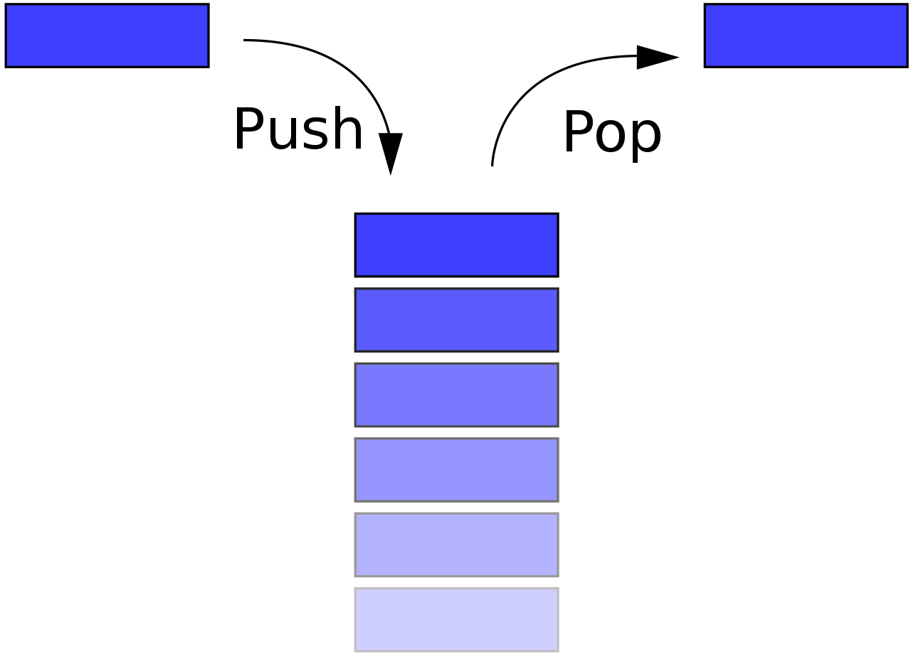
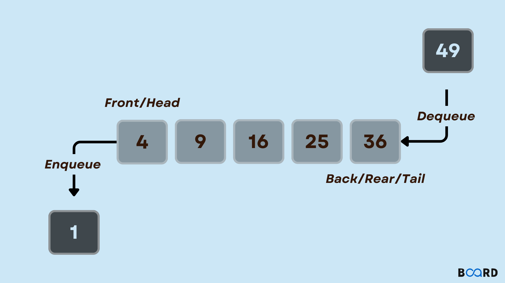

# chap3 for基礎資料結構

## Stack
- 推入：將資料放入堆疊頂端，堆疊頂端移到新放入的資料。
- 彈出：將堆疊頂端資料移除，堆疊頂端移到移除後的下一筆資料。

## 使用動態陣列的stack
```c=
struct Stack {
    int *arr;
    int len;
    int capacity;
};

struct Stack stack1;

void stack_init() {
    stack1.arr = (int *)malloc(INITIAL_SIZE * sizeof(int));
    stack1.len = 0;
    stack1.capacity = INITIAL_SIZE;
}

void resize_stack() {
    stack1.capacity *= 2;
    stack1.arr = (int *)realloc(stack1.arr, stack1.capacity * sizeof(int));
}

void push(int num) {
    if (stack1.len == stack1.capacity) {
        resize_stack();
    }

    stack1.arr[stack1.len++] = num;
}

void shrink_stack() {
    if (stack1.len <= stack1.capacity / 2 && stack1.capacity > INITIAL_SIZE) {
        stack1.capacity /= 2;
        stack1.arr = (int *)realloc(stack1.arr, stack1.capacity * sizeof(int));
    }
}

int pop() {
    if (stack1.len > 0) {
        int poppedElement = stack1.arr[--stack1.len];

        shrink_stack();

        return poppedElement;
    } else {
        printf("Stack underflow. Cannot pop from an empty stack.\n");
        return -1;
    }
}
```

## 佇列(queue)

```clike=
struct Queue {
	int *init;
    int *arr;
    int len;
    int capacity;
};

// 初始化佇列
void Q_init(struct Queue *Q) {
	
    Q->arr = (int *)malloc(sizeof(int) * 20);
    Q->init=Q->arr; 
    Q->len = 0;
    Q->capacity = 20;
}

// 入佇列
void enqueue(struct Queue *Q, int num) {
    if (Q->len >= Q->capacity / 2) {
        Q->capacity *= 2;
        Q->arr = (int *)realloc(Q->arr, Q->capacity * sizeof(int));
    }
    Q->arr[Q->len++] = num;
}

// 出佇列
int deq(struct Queue *Q) {
    int ans = Q->arr[0];
    Q->len -= 1;
    Q->capacity -= 1;
	
    // 將陣列指標移動到下一個位置
    if (Q->len>0){
    	Q->arr += 1;
	}
    return ans;
}


```
## 使用動態陣列的環狀queue
```c=
// 定義佇列結構
struct queue {
    int *arr;   // 儲存元素的陣列
    int head;   // 佇列頭
    int tail;   // 佇列尾
    int count;  // 佇列容量
};

// 初始化佇列，並指定初始容量
void Q_init(struct queue *Q, int capacity) {
    Q->arr = (int *)malloc(capacity * sizeof(int));  // 分配記憶體給陣列
    Q->head = 0;
    Q->tail = 0;
    Q->count = capacity;
}

// 重新配置佇列容量
void Q_resize(struct queue *Q, int new_capacity) {
    Q->arr = (int *)realloc(Q->arr, new_capacity * sizeof(int));  // 重新配置記憶體
    Q->count = new_capacity;
}

// 入佇列
void enQ(struct queue *Q, int num) {
    if ((Q->tail + 1) % Q->count == Q->head) {
        // 佇列已滿，需要擴充容量
        int new_capacity = Q->count * 2;
        Q_resize(Q, new_capacity);
    }

    Q->tail = (Q->tail + 1) % Q->count;
    Q->arr[Q->tail - 1] = num;
}

// 出佇列
int deQ(struct queue *Q) {
    if (Q->head == Q->tail) {
        // 佇列為空，返回特殊值（這裡假設佇列存儲的元素為正整數）
        return -1;
    }

    int re = Q->arr[Q->head];
    Q->head = (Q->head + 1) % Q->count;

    // 檢查是否可以縮減容量
    if (Q->count > 20 && (Q->tail + 1) % Q->count <= Q->head) {
        int new_capacity = Q->count / 2;
        Q_resize(Q, new_capacity);
    }

    return re;
}
```
## 迷宮問題
>  題目

以二進位（0 和 1）來表示迷宮，其中 0 代表通道，1 代表牆壁。迷宮的起點為左上角（0, 0），終點為右下角（n-1, n-1），其中 n 為迷宮的大小。

現在，請你撰寫一個 C 語言程式，找出是否存在一條從起點到達終點的路徑。你可以使用迴圈和條件判斷來遍歷迷宮，判斷每個位置是否為通道，並遞迴地尋找路徑。

以下是迷宮的例子，請將其轉換成 C 語言程式碼：

```plaintext
迷宮地圖：
{1, 0, 1, 0, 0, 0, 0, 0, 0, 0},
{1, 0, 1, 1, 1, 1, 1, 1, 1, 0},
{1, 0, 0, 0, 0, 0, 0, 0, 0, 0},
{1, 1, 1, 1, 1, 1, 1, 1, 0, 0},
{0, 0, 0, 0, 0, 0, 0, 0, 0, 0},
{0, 1, 1, 1, 1, 1, 1, 1, 1, 1},
{0, 0, 0, 0, 0, 0, 0, 0, 0, 1},
{0, 1, 1, 1, 1, 1, 1, 1, 1, 1},
{0, 0, 0, 0, 0, 0, 0, 0, 0, 0}
```

考試題目：請寫一個 C 語言程式，檢查是否存在一條從起點到達終點的路徑。你的程式應該回傳 true 或 false，表示是否有解。请使用迴圈和條件判斷，並註意避免無窮迴圈。

>  解法
[code from me](https://github.com/baiyanchen8/data_structure/blob/main/chap3/Maze.c)
```c=
#include <stdio.h>
#include <stdlib.h>
#include <unistd.h>
# define maxx 10 
# define maxy 10 

int maze[maxx][maxy] = {
    {1, 0, 1, 0, 0, 0, 0, 0, 0, 0},
    {1, 0, 1, 1, 1, 1, 1, 1, 1, 0},
    {1, 0, 0, 0, 0, 0, 0, 0, 0, 0},
    {1, 1, 1, 1, 1, 1, 1, 1, 0, 0},
    {0, 0, 0, 0, 0, 0, 0, 0, 0, 0},
    {0, 1, 1, 1, 1, 1, 1, 1, 1, 1},
    {0, 0, 0, 0, 0, 0, 0, 0, 0, 1},
    {0, 1, 1, 1, 1, 1, 1, 1, 1, 1},
    {0, 0, 0, 0, 0, 0, 0, 0, 0, 0}
};

// 起點和終點坐標
int start[2] = {0, 1};
int end[2] = {9, 9};

int find(int nowx, int nowy) {
    if (nowx < 0 || nowx >= maxx || nowy < 0 || nowy >= maxy || maze[nowx][nowy] == 1||maze[nowx][nowy] == 2)
        return 0;
    if (nowx == start[0] && nowy == start[1]) {
        printf("(%d, %d)\n", nowx, nowy);
        return 1;
    }
    maze[nowx][nowy] = 2;
    if (find(nowx + 0, nowy - 1)||find(nowx - 1, nowy + 0)||find(nowx + 0, nowy + 1)|| find(nowx + 1, nowy + 0)){
    	printf("(%d, %d)\n", nowx, nowy);
    	maze[nowx][nowy] = 0;
    	return 1; 
	}
    maze[nowx][nowy] = 0;
    return 0;
}

int main() {
    printf("找到的路徑：\n");
    find(end[0], end[1]);
    return 0;
}

```

## 運算式的計算
### 運算式
> **Question**
> 電腦(程式語言)是如何看懂 equation 
> example : 
> $A+B \times C+D$
> ⇒ $A+(B \times C)+D$
> ⇒ $(A+B) \times (C+D)$
#### 解法
透過設定運算子的 Priority ，固定順序

### 前置 & 中置 & 後置
| 前置      | 中置     | 後置   |
| --------- | -------- | ------ |
| + a * b c | a+b\*c   | abc*+  |
| \*+1 2 7  | (1+2)\*7 | 1 2+7* |
| - / a b c  | a / b - c    | ab/c-   |

### 計算後置運算式的函式
>  code
[完整程式](https://github.com/baiyanchen8/data_structure/blob/main/chap3/evaluatePostfix.c)
```c=
int evaluatePostfixWithWhitespace(char* exp) {
    int i;
    Stack* stack = createStack(strlen(exp));
    if (!stack)
        return -1;  // 異常狀況

    for (i = 0; exp[i]; ++i) {
        // 如果是空白，跳過
        if (isspace(exp[i]))
            continue;

        // 如果是數字，則壓入堆疊
        if (isdigit(exp[i])) {
            int num = 0;
            while (isdigit(exp[i])) {
                num = num * 10 + (exp[i] - '0');
                ++i;
            }
            --i;  // 回退一格，因為迴圈會再自動加一
            push(stack, num);
        } else {
            // 如果是運算子，則從堆疊中彈出兩個數字進行計算，再將結果壓入堆疊
            int val1 = pop(stack);
            int val2 = pop(stack);
            switch (exp[i]) {
            case '+': push(stack, val2 + val1); break;
            case '-': push(stack, val2 - val1); break;
            case '*': push(stack, val2 * val1); break;
            case '/': push(stack, val2 / val1); break;
            }
        }
    }
    return pop(stack);  // 堆疊頂部的值即為計算結果
}
```


### 中置轉後置

>  code
[完整程式](https://github.com/baiyanchen8/data_structure/blob/main/chap3/infixtoPostfix.c)
```c=
```c= 
char* infixToPostfix(char* infix) {
    int i, j;
    int len = strlen(infix);
    char* postfix = (char*)malloc((len + 1) * sizeof(char));  // 分配記憶體用來存放後序表達式
    Stack* stack = createStack(len);  // 創建一個堆疊，用來處理運算符的順序

    for (i = 0, j = 0; i < len; ++i) {
        if (isalnum(infix[i])) {  // 如果是字母或數字，直接加入後序表達式
            postfix[j++] = infix[i];
        } else if (infix[i] == '(') {  // 如果是左括號，壓入堆疊
            push(stack, infix[i]);
        } else if (infix[i] == ')') {  // 如果是右括號，將堆疊中的運算符彈出直到遇到左括號
            while (!isEmpty(stack) && peek(stack) != '(') {
                postfix[j++] = pop(stack);
            }
            pop(stack);  // 將左括號彈出
        } else {  // 如果是運算符
        	postfix[j++]=' ';  // 加入空格，用來區隔不同的數字
            while (!isEmpty(stack) && getPrecedence(peek(stack)) >= getPrecedence(infix[i])) {
                postfix[j++] = pop(stack);  // 將堆疊中比當前運算符優先級高或相等的運算符彈出
            }
            push(stack, infix[i]);  // 將當前運算符壓入堆疊
        }
    }

    // 將堆疊中剩余的運算符彈出
    while (!isEmpty(stack)) {
        postfix[j++] = pop(stack);
    }

    postfix[j] = '\0';  // 在字符串末尾添加空字符
    return postfix;
}

```

## 多重 stack & queue
pass
<!-- 大概不重要 -->