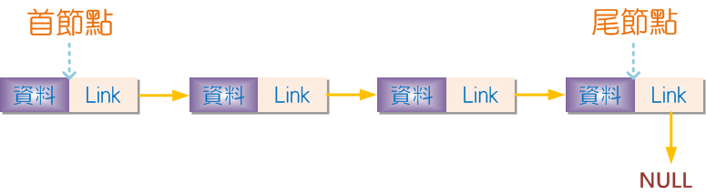
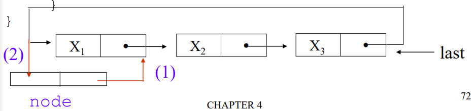

# 4.1 單向 link-list


# 4.2 在 C 實現 link-list
> 使用 self-structure 的方式 實現 link-list 

## link list
### 單向 link list
```c=
struct node{
	struct node *next;
	 // 每個 node 內的其他資料
	int data;
};
```
### 雙向 link list
```c=
struct two_way_node{
	// 紀錄前個&下一個 node 	
	struct two_way_node *pre;
	struct two_way_node *next;
	// 每個 node 內的其他資料
};
```


# 4.3 link-list queue and stack
## link list queue (first-in first-out)
### 結構
通過一個**單向** link list ，加上兩個變數(**head、tail**)紀錄頭尾實現

>  code
```c=
#include <stdio.h>
#include <stdlib.h>

// 節點結構定義
struct node {
    int data;
    struct node *next;
};

struct node *head = NULL;  // 佇列頭部指標
struct node *tail = NULL;  // 佇列尾部指標

// 入佇列操作
void enqueue(int data) {
    struct node *tmp;
    tmp = (struct node *)malloc(sizeof(struct node));
    tmp->data = data;
    tmp->next = NULL;
    
    // 如果佇列為空，設置頭尾指標為新節點
    if (tail == NULL) {
        head = tmp;
        tail = tmp;
    } else {
        // 否則將新節點添加到尾部，並更新尾部指標
        tail->next = tmp;
        tail = tmp;
    }
}

// 出佇列操作
int dequeue() {
    struct node *tmp;
    
    // 如果佇列為空，回傳 -1 表示出錯
    if (head == NULL) {
        return -1;
    } else {
        // 否則取出頭部節點，更新頭部指標
        tmp = head->next;
        int dequeuedValue = head->data;
        free(head);
        head = tmp;
        
        // 如果頭部為空，表示佇列已經空了，同時更新尾部指標為空
        if (head == NULL) {
            tail = NULL;
        }
        
        // 回傳出佇列的值
        return dequeuedValue;
    }
}

// 主程式
int main() {
    // 在這裡可以加入使用 enqueue 和 dequeue 的邏輯
    return 0;
}

```


## link list stack(last-in first -out)
### 結構
透過**單向** link list ，只需要紀錄一個節點即可。
>  code
```c=
#include <stdio.h>
#include <stdlib.h>

// 定義節點結構
struct node {
	struct node *next;
	int data;
};

// 定義全域變數 stack，用來表示堆疊頂端
struct node *stack;

// 函式原型宣告
void push(int data);
int pop();

// 主函式
int main() {
	stack = NULL; // 初始化堆疊，設為空
}

// push 函式，將資料壓入堆疊
void push(int data) {
	if (!stack) {
		// 如果堆疊為空，則建立新節點作為堆疊頂端
		stack = (struct node *)malloc(sizeof(struct node));
		stack->data = data;
		stack->next = NULL;
	} else {
		// 如果堆疊非空，則建立新節點，並將其連接到堆疊頂端
		struct node *tmp;
		tmp = (struct node *)malloc(sizeof(struct node));
		tmp->data = data;
		tmp->next = stack;
		stack = tmp;
	}
}

// pop 函式，從堆疊中彈出資料
int pop() {
	if (!stack) {
		// 如果堆疊為空，回傳 NULL（表示無法彈出）
		return NULL;
	} else {
		// 如果堆疊非空，取得頂端節點的資料，並將頂端節點釋放
		struct node *tmp = stack->next;
		int t1 = stack->data;
		free(stack);
		stack = tmp;
		return t1;
	}
}

```


# 4.4 Polynomial (一元多項式)
## 儲存結構
success
通過 link list 的方式紀錄每一項的係數&指數
```c=
struct PolyNode{
	struct PolyNode * next;
	int expon;
	int coef;
} 
```

## 運算
### 加法
success
透過一一比較每項係數，將指數大的優先加入到結果中

>  code
```c=
struct PolyNode* add(struct PolyNode* A, struct PolyNode* B) {
    // 若A為空，直接返回B
    if (!A) return B;
    // 若B為空，直接返回A
    else if (!B) return A;
    // 宣告三個指標分別指向A、B、以及答案的多項式。
    struct PolyNode* tmpA = A;
    struct PolyNode* tmpB = B;
    struct PolyNode* ans = NULL;

    // 開始遍歷A和B
    while (tmpA || tmpB) {
        // 創建新節點tmp，用來存放相加後的結果
        struct PolyNode* tmp = 
            (struct PolyNode*)malloc(sizeof(struct PolyNode));
        tmp->next = ans;

        // 判斷A和B的狀態
        if (!tmpA) {
            // 若A為空，則將tmp的指數和係數設為B的對應節點，並移動B指標。
            tmp->expon = tmpB->expon;
            tmp->coef = tmpB->coef;
            tmpB = tmpB->next;
        } else if (!tmpB) {
            // 若B為空，則將tmp的指數和係數設為A的對應節點，並移動A指標。
            tmp->expon = tmpA->expon;
            tmp->coef = tmpA->coef;
            tmpA = tmpA->next;
        } else {
            // 若A和B都不為空，則比較它們的指數
            if (tmpA->expon == tmpB->expon) {
                // 若指數相同，則將tmp的指數設為兩者中任意一個
                // 係數為兩者係數相加，並移動A和B指標。
                tmp->expon = tmpA->expon;
                tmp->coef = tmpA->coef + tmpB->coef;
                tmpA = tmpA->next;
                tmpB = tmpB->next;
            } else if (tmpA->expon > tmpB->expon) {
                // 若A的指數較大，則將tmp的指數和係數設為A的對應節點，並移動A指標。
                tmp->expon = tmpA->expon;
                tmp->coef = tmpA->coef;
                tmpA = tmpA->next;
            } else {
                // 若B的指數較大，則將tmp的指數和係數設為B的對應節點，並移動B指標。
                tmp->expon = tmpB->expon;
                tmp->coef = tmpB->coef;
                tmpB = tmpB->next;
            }
        }
        // 更新答案的頭指標
        ans = tmp;
    }
    // 返回相加後的多項式
    return ans;
}
```


### multiple
pass(不太想寫)
## 環狀串列
[[]]
通過將最後一個指向head完成


# 4.5 額外的串列操作
## 清除(erase)
### 正常版本清除
>  code
```c=
void erase(struct node *A){
    struct node *tmp;
    while(A){
        tmp= A;
        A = A -> next;
        free(tmp);
    }
}
```

### node pool
success
通過把需要清除的 node 清除內容後，儲存到特定 link list 中，避免需要大量 malloc 所造成的資源浪費

>  code 
```c=
struct node * pool;
void erase(struct node *A){
    struct node *tmp;
    while(A){
        tmp= A;
        A = A -> next;
        // 清除其中內容
        tmp - > next = pool;
        pool=tmp;
    }
}
struct node * getnode(){
    if (pool){
        struct node *tmp;
        tmp= pool;
        pool = pool -> next;
        tmp -> next =NULL;
        return tmp;
    }else{
        struct node *tmp;
        tmp = (struct node *) malloc(sizeof (struct node ));
        return tmp;
    }
}
```

## 反轉 link list(單向)
```c=
struct node* invert(struct node* AB) {
    struct node* BA = NULL;
    struct node* tmp;

    while (AB) {
        tmp = AB;
        AB = AB->next;
        tmp->next = BA;
        BA = tmp;
    }

    // 返回反轉後的 link list 的頭指標
    return BA;
}
```
## 連接P1&P2
success
假如有 P1 & P2 兩個 link list ，將 P2 接在 P1 後面。
複雜度 : $O(len(P1))$
做法 : 找到 P1 的尾端，將 P2 直接接上


```c=
struct node * connect(struct node *P1 ,struct node *P2){
    if(!P1) return P2;
    if(!P2) return P1;
    struct node * tmp ;
    for (tmp=P1;tmp->next!=NULL;tmp=tmp->next);
    tmp->next=P2;
    return P1;
}
```
## 環狀鍊結的操作
### 計算長度
```c=
int countlength(struct node * A){
    if (!A) return 0;
    struct node * tmp;
    int c=0;
    for(tmp=A->next;tmp!=NULL&&A!=tmp;tmp=tmp->next)
        c++;
    return c;
}
```
### insertion 
success 
問題 : 要將 node 嵌入再環狀 link list 中的 首位 

**solution 1** : input last node of link list
優點 : 實作方便，時間複雜度較低
缺點 : 在引用時不方便
**solution 2** : input first node

>  **solution 1**
```c=
void s1(struct node *last, struct node *new){
    if (last){
        new -> next = last -> next;
        last -> next = new;
    }else{
        last =new;
    }
}
```

>  **solution 2**
```c=
void s2 (struct node * first,struct node *new){
    struct node *last;
    for (last=first->next;last->next!=NULL&&last->next!=first;last=last->next);
    if (last){
        new -> next = first;
        last -> next = new;
    }else{
        last =new;
    }
}
```


# 4.6 等價類 equivalence relation
## Define
- 必要條件
    - reflexive (反射性)
        - $x=x$
        - 即自身必等同於自身
    - symmetric (對稱性)
        - $x=y$ *⇒* $y=x$
    - transitive (遞移性)
        - $x=y$ & $y=z$ *⇒* $x=z$
## 問題 
success
如果我有一串等價關係式，該如何處理並輸出為每個等價集
**example**:
0=4,3=1,6=10,8=9,7=4,6=8,3=5,2=11,11=0 ⇒ {0,2,4,7,11}{1,3,5}{6,8,9,10}

## solution 
success
<!-- 克本來的垃圾解法 -->
**solution 1** : 使用2維 link list 陣列解(複雜且麻煩)
**solution 2** : 使用 union find 演算法

 >  solution 1
還是做出來了，方法類似BFS的變種?
```c=
#include <stdio.h>
#include <stdlib.h>

// 定義節點結構
struct node {
    int data;
    struct node* next;
};

// 建立等價關係
void equivalence(int A[9][2], struct node* A1[]) {
    // 初始化節點陣列
    int i;
    for (i = 0; i < 12; i++) {
        A1[i] = NULL;
    }

    // 創建等價關係的鏈結串列
    for (i = 0; i < 9; i++) {
        struct node *tmp;

        // 將 A[i][0] 與 A[i][1] 加入彼此的鏈結串列中
        tmp = (struct node *)malloc(sizeof(struct node));
        tmp->next = A1[A[i][0]];
        tmp->data = A[i][1];
        A1[A[i][0]] = tmp;

        tmp = (struct node *)malloc(sizeof(struct node));
        tmp->next = A1[A[i][1]];
        tmp->data = A[i][0];
        A1[A[i][1]] = tmp;
    }
}

// 將元素加入陣列，避免重複
int add(int *ans, int *anssize, int addnum) {
    int i;
    for (i = 0; i < *anssize - 1; i++) {
        if (addnum == ans[i]) return -1;
    }
    (*anssize) += 1;
    ans = (int *)realloc(ans, (*anssize) * sizeof(int));
    ans[(*anssize) - 2] = addnum;
    return 0;
}

// 使用深度優先搜尋找尋等價關係中的元素
void find(int findi, struct node *A1[], int *ans, int *anssize) {
    if (!A1[findi]) {
        // 如果節點不存在，直接返回
        return;
    }
    struct node *tmp;
    int i = 1;  // 初始化 i 為 1
    for (tmp = A1[findi]; tmp->next != NULL; tmp = tmp->next) {
        // 遍歷節點串列
        int t = add(ans, anssize, tmp->data);  // 將節點資料加入結果陣列
        if (t == -1) {
            // 如果 t 為 -1，代表該 data 已經搜尋過，不再進行第二次搜尋
            continue;
        }
        find(tmp->data, A1, ans, anssize);  // 遞迴尋找子節點
    }
    if (tmp != NULL) {
        // 將最後一個節點資料加入結果陣列
        int t = add(ans, anssize, tmp->data);
        if (t == -1) {
            // 如果 t 為 -1，代表該 data 已經搜尋過，不再進行第二次搜尋
            return;
        }
        find(tmp->data, A1, ans, anssize);  // 遞迴尋找子節點
    }
    printf("%d finish \n", findi);  // 輸出目前節點完成遞迴
}

int main() {
    // 輸入的等價關係陣列
    int input[12][2] = {{0, 4}, {3, 1}, {6, 10}, {8, 9}, {7, 4}, {6, 8}, {3, 5}, {2, 11}, {11, 0}};
    struct node *seq[12];
    equivalence(input, seq);

    // 動態配置記憶體存放結果
    int *ans = (int *)malloc(sizeof(int));
    int anssize = 1;
    
    // 尋找等價關係中的元素
    find(6, seq, ans, &anssize);
    
    // 輸出結果
    int i;
    for (i = 0; i < anssize - 1; i++) {
        printf("%d ", ans[i]);
    }

    // 釋放動態配置的記憶體
    for (i = 0; i < 12; i++) {
        struct node *current = seq[i];
        while (current != NULL) {
            struct node *temp = current;
            current = current->next;
            free(temp);
        }
    }

    free(ans);

    return 0;
}

```

>  solution 2
```c=
#include <stdio.h>
#include <stdlib.h>

// 建立等價關係
void equivalence(int A[9][2], int A1[12]) {
    int i;
    int class_num = 0;

    // 初始化 A1 陣列
    for (i = 0; i < 12; i++) {
        A1[i] = -1;
    }

    // 遍歷等價關係陣列 A
    for (i = 0; i < 9; i++) {
        
        if (A1[A[i][0]] == -1 && A1[A[i][1]] == -1) {
            // 如果兩個節點都還沒有被分類
            A1[A[i][0]] = class_num;
            A1[A[i][1]] = class_num++;
        } else if (A1[A[i][0]] == -1 && A1[A[i][1]] != -1) {
            // 如果 A[i][0] 還沒有被分類，但 A[i][1] 已經被分類
            A1[A[i][0]] = A1[A[i][1]];
        } else if (A1[A[i][0]] != -1 && A1[A[i][1]] == -1) {
            // 如果 A[i][0] 已經被分類，但 A[i][1] 還沒有被分類
            A1[A[i][1]] = A1[A[i][0]];
        } else if (A1[A[i][0]] != -1 && A1[A[i][1]] != -1) {
            // 如果兩個節點都已經被分類，但分類不同，則統一分類
            if (A1[A[i][0]] != A1[A[i][1]]) {
                int j;
                for (j = 0; j < 12; j++) {
                    if (A1[j] == A1[A[i][0]]) {
                        A1[j] = A1[A[i][1]];
                    }
                }
            }
        }
    }
}

int main() {
    // 輸入的等價關係陣列
    int input[12][2] = {{0, 4}, {3, 1}, {6, 10}, {8, 9}, {7, 4}, {6, 8}, {3, 5}, {2, 11}, {11, 0}};
    int un[12];

    // 呼叫 equivalence 函式
    equivalence(input, un);

    // 輸出結果
    int i;
    for (i = 0; i < 12; i++) {
        printf("%d %d \n", i, un[i]);
    }

    return 0;
}

```

# 4.7 稀疏矩陣


## 資料結構 
###### [完整程式](https://github.com/baiyanchen8/data_structure/blob/main/chap4/SparseMatrix.c)
```c=
struct node {
//    元素節點(內容)
    int row;
    int col;
    int value;
    struct node *down;
    struct node *right;
};
struct outter{
	// imformation of matrix
	int row; 
	int col; 
	int value; //有幾個非0值
	struct node ** colum; 
	struct node ** roww;  
};
```
## create matrix
``` c=
// 建立稀疏矩陣
struct outter createSparseMatrix(int rows, int cols, int data[][3], int size) {
   struct outter ans;
   ans.col=cols;
   ans.row=rows;
   ans.value=size;
   ans.colum =(struct node ** )malloc((ans.col)*sizeof(struct node*));
   ans.roww =(struct node ** )malloc((ans.row)*sizeof(struct node*));

   int i;
    for (i = 0; i < ans.col; ++i) {
        ans.colum[i] = NULL;
    }
    for (i = 0; i < ans.row; ++i) {
        ans.roww[i] = NULL;
    }

    for(i = 0; i < size; i++) {
        // 創建新節點
      struct node* new1 =(struct node * )malloc(sizeof(struct node));
      new1->row = data[i][0];
      new1->col = data[i][1];
      new1->value = data[i][2];
      new1->down = NULL;
      new1->right = NULL;

      // 固定 col 插入 row
      struct node *tmp;
      if (!ans.colum[new1->col]) {
       ans.colum[new1->col] = new1; 
      } else {
       for (tmp = ans.colum[new1->col]; tmp->right != NULL 
           && tmp->right->row < new1->row; tmp = tmp->right);
       new1->right = tmp->right;
       tmp->right = new1;
      } 

      // 固定 row 插入 col
      if (!ans.roww[new1->row]) {
       ans.roww[new1->row] = new1; 
      } else {
       for (tmp = ans.roww[new1->row]; tmp->down != NULL 
           && tmp->down->col < new1->col; tmp = tmp->down);
       new1->down = tmp->down;
       tmp->down = new1;
      } 
     }
	
    return ans;
}
```
## print matrix
```c=
int findi(struct outter matrix,int i,int j){
    // 尋找特定位置的 value
	struct node *tmp =matrix.colum[i];
	if (!tmp){
		return 0;
	}else{
		for(tmp =matrix.colum[i];tmp!=NULL&&tmp->row!=j;tmp=tmp->right);
		 if (!tmp){
		 	return 0;
		 }else{
		 	return tmp->value;
		 }
	}
}
void printmatrix(struct outter matrix ){
	int i,j;
	for (i=0;i<matrix.col;i++){
		for (j=0;j<matrix.row;j++){
			printf("%d ",findi(matrix,i,j));
		}
		printf("\n");
	}
}
```

## free matrix
```c=
void freematrix(struct outter matrix){
	int i,j;
	for (i=0;i<matrix.col;i++){
		struct node *tmppast,*now;
		for (tmppast=matrix.colum[i];tmppast!=NULL;){
			now=tmppast->right;
			free(tmppast);
			tmppast=now;
		}
	}
}
```
# 4.8 雙向 link-list
## 基本結構
```c=
struct node {
    struct node * pre;
    struct node * next;
    // 其他資料型態
}
```
## insert new node

```c=
struct node * insert(struct node *A,int data){
	struct node *tmp=(struct node * )malloc(sizeof (struct node));
	tmp ->pre = tmp;
	tmp ->next = tmp;
	tmp->data=data; 
	if (!A){
		return tmp;
	}{
		tmp->next=A->next;
		tmp->pre=A;
		tmp->next->pre=tmp;

		A->next=tmp;   
	}
	return A;
}
```
## print node 
```c=
void print(struct node *A){
	struct node* tmp;
	for(tmp=A->next;tmp!=A&&tmp!=NULL;tmp=tmp->next){
		printf("%d ",tmp->pre->data);
	}
	printf("%d \n",tmp->pre->data);
}
```
## delete 特定 node
```c=
void deleter(struct node *A,struct node *target){
    if (target == A){
        printf("delete head node is not allowed!!");
        return ;
    }
    struct node *past = target-> pre;
    struct node *nxt = target-> next;
    nxt->pre=past;
    past->next=nxt;
    free(target);
}
```