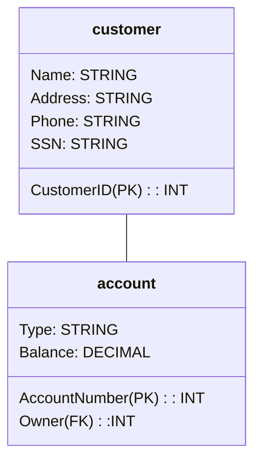
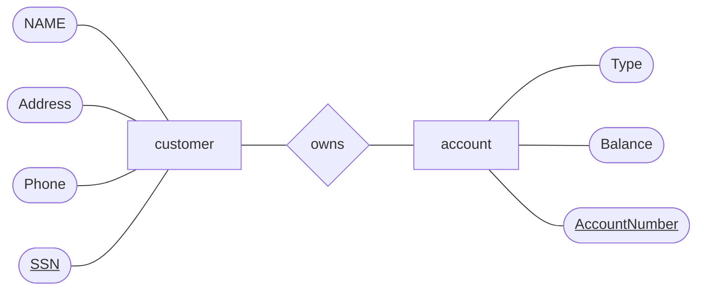

# 資料庫HW4
1. Write the following as triggers. In each case, disallow or undo the modification if it does not satisfy the stated constraint. The database schema is as follows:
    Product(maker, model, type)
    PC(model, speed, ram, hd, price)
    Laptop(model, speed, ram, hd, screen, price)
    Printer(model, color, type, price)
    (a) When making any modification to the Laptop relation, check that the average price of Laptops for each manufacturer is at least $1500. (15%)
    ```sql=1
    CREATE TRIGGER CheckLaptopPrice
    before INSERT OR UPDATE ON Laptop
    FOR EACH ROW
    BEGIN ATMOIC
      DECLARE avg_price DECIMAL(10, 2);
      SELECT AVG(price) INTO avg_price FROM Laptop WHERE maker = NEW.maker;
      IF avg_price < 1500 THEN
        SIGNAL SQLSTATE '45000'
        SET MESSAGE_TEXT = '無法插入或更新筆記型電腦
			，製造商的平均價格必須至少為1500美元';
      END IF;
    END;

    
    ```
    (b) When inserting a new PC, laptop, or printer, make sure that the model number did not previously appear in any of PC, Laptop, or Printer. (15%)
    ```sql=1
    CREATE TRIGGER CheckPCUnique
    BEFORE INSERT ON PC
    FOR EACH ROW
    BEGIN ATMOIC
      DECLARE model_count INT;
      SELECT COUNT(*) INTO model_count
      FROM (
        SELECT model FROM Product WHERE model = NEW.model
        UNION ALL
      ) AS model_union;
      IF model_count > 0 THEN
        SIGNAL SQLSTATE '45000'
        SET MESSAGE_TEXT = '無法插入產品，因為型號已經存在於其他表中';
      END IF;
    END;
	```
	```sql=1
	CREATE TRIGGER CheckPrinterUnique
    BEFORE INSERT ON Printer
    FOR EACH ROW
    BEGIN ATMOIC
      DECLARE model_count INT;
      SELECT COUNT(*) INTO model_count
      FROM (
        SELECT model FROM Product WHERE model = NEW.model
        UNION ALL
      ) AS model_union;
      IF model_count > 0 THEN
        SIGNAL SQLSTATE '45000'
        SET MESSAGE_TEXT = '無法插入產品，因為型號已經存在於其他表中';
      END IF;
    END;
	```
	```sql=
	CREATE TRIGGER CheckLaptopUnique
    BEFORE INSERT ON Laptop
    FOR EACH ROW
    BEGIN ATMOIC
      DECLARE model_count INT;
      SELECT COUNT(*) INTO model_count
      FROM (
        SELECT model FROM Product WHERE model = NEW.model
        UNION ALL
      ) AS model_union;
      IF model_count > 0 THEN
        SIGNAL SQLSTATE '45000'
        SET MESSAGE_TEXT = '無法插入產品，因為型號已經存在於其他表中';
      END IF;
    END;
    ```
2. Design a database for a bank, including information about customers and their account. Information about a customer includes their name, address, phone, and Social Security number. Accounts have numbers, types (e.g., savings, checking) and balances. Also record the customer(s) who own an account. Draw the E/R diagram for this database. Be sure to include arrows where appropriate, to indicate the multiplicity of a relationship. (20%)



3.  For your E/R diagrams of Exercise 2, do the following:
	(a) Change your diagram so an account can have only one customer. (10%)
	```mermaid
	classDiagram 
	class customer {
		CustomerID (PK): INT
		Name: STRING
		Address: STRING
		Phone: STRING
		SSN: STRING
	}
	customer<--account
	class account {
		AccountNumber (PK): INT
		Type: STRING
		Balance: DECIMAL
		Owner (FK) :INT
	}
	
	```
	```mermaid
	graph LR; 
	asd[customer];
	asd---y([NAME]);
	asd---asf([Address]);
	asd---sdf([Phone]);
	asd---ghj([<ins>SSN]);
	cg[account]---sss{owns};
	sss--->asd;
	rte([Type])---cg[account];
	try([Balance])---cg[account];
	cvb2([<ins>AccountNumber</ins>])---cg[account];
	```
	(b) Further change your diagram so a customer can have only one account. (10%)
	```mermaid
	classDiagram 
	class customer {
		CustomerID (PK): INT
		Name: STRING
		Address: STRING
		Phone: STRING
		SSN: STRING
	}
	customer<-->account
	class account {
		AccountNumber (PK): INT
		Type: STRING
		Balance: DECIMAL
		Owner (FK) :INT
	}
	```
	```mermaid
	graph TD; 
	asd[customer];
	asd---y([NAME]);
	asd---asf([Address]);
	asd---sdf([Phone]);
	asd---ghj([<ins>SSN]);
	aa{owns}--->cg[account];
	aa--->asd;
	cg---rte([Type]);
	cg---try([Balance]);
	cg---cvb2([<ins>AccountNumber</ins>]);
	```
4. Convert the E/R diagram of Fig. 3 to a relational database schema. (30%)
	
	```sql=1
	create table Booking{
		seat int,
		row int
	}
	create table Customers{
		phone char(50),
		SSNo char(50),
		name char(50),
		addr char(50),
		PRIMARY KEY(SSNo)
	}
	create table Flights{
		number char(50),
		day  char(50),
		aircraft  char(50),
		PRIMARY KEY(number,day)
		
	}
	```
