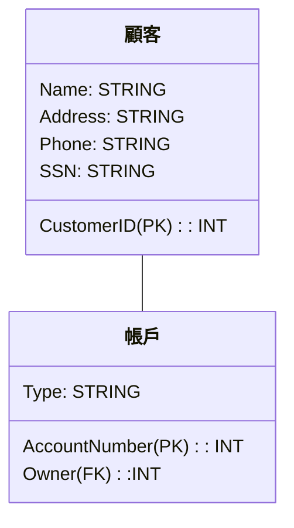

# 換行
1 1
 =>`1 1`
# space
`&emsp;`
# color transformation
`something in here`
:::danger
something in here
something in here
:::
# mermaid

## class diagram

## modify  image big只能靠原始方法

## 位置

我靠左

我置中啦

我在右邊

## latex

### big o
$\mathcal{O}$

| asd | asdzx |     |     |
| --- | ----- | --- | --- |
|     |       |     |     |
|     |       |     |     |
|     |       |     |     |
|     |       |     |     |
|     |       |     |     |
|     |       |     |     |
|     |       |     |     |
|     |       |     |     |
|     |       |     |     |
|     |       |     |     |
|     |       |     |     |
|     |       |     |     |
|     |       |     |     |
|     |       |     |     |
|     |       |     |     |
|     |       |     |     |
|     |       |     |     |
|     |       |     |     |

- [x] 未完成的事項
- [x] 已完成的事項
