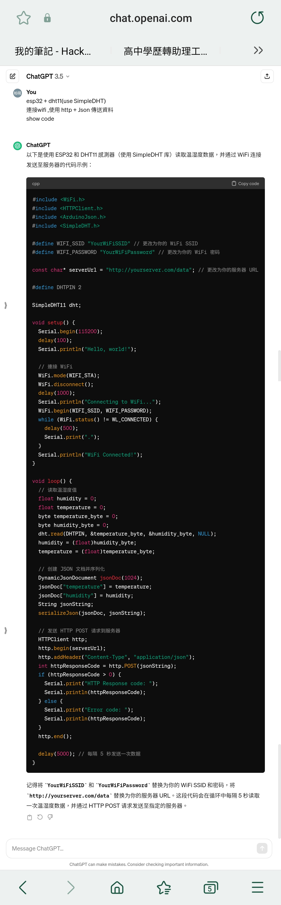
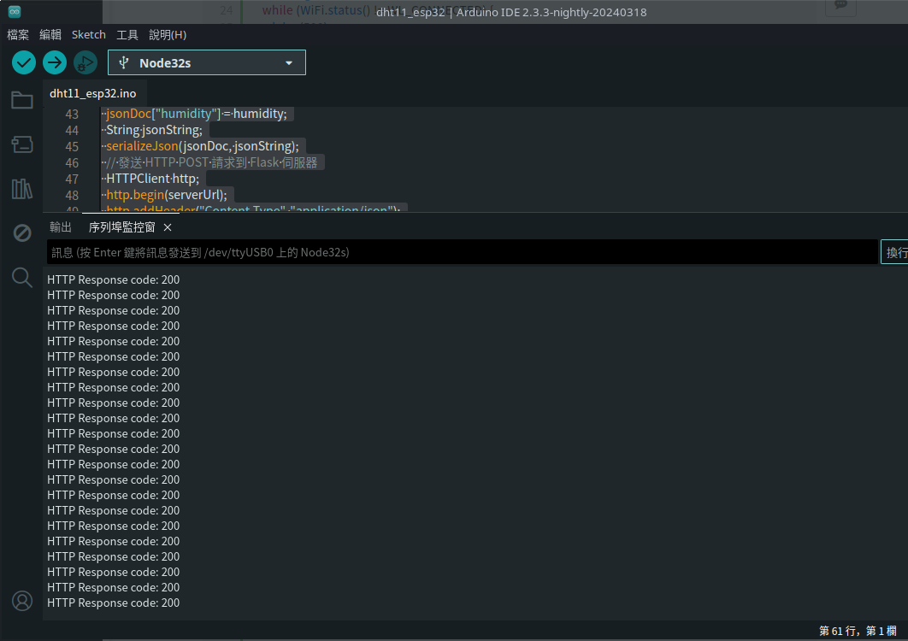

## esp32 

### prompt
esp32 + dht11(use SimpleDHT)
連接wifi ,使用 http + Json 傳送資料



## my code
```clike=
#include <WiFi.h>
#include <HTTPClient.h>
#include <ArduinoJson.h>
#include <SimpleDHT.h>
#define WIFI_SSID "" // 更改為你的 WiFi SSID
#define WIFI_PASSWORD "" // 更改為你的 WiFi 密碼

const char* serverUrl = "";
#define DHTPIN 2

SimpleDHT11 dht(DHTPIN);


void setup() {
  Serial.begin(115200);
  delay(100);
  Serial.println("hello world");
  // 連接 WiFi
  WiFi.mode(WIFI_STA);
  WiFi.disconnect();
  delay(1000);
  Serial.println("Connecting to WiFi...");
  WiFi.begin(WIFI_SSID, WIFI_PASSWORD);
  while (WiFi.status() != WL_CONNECTED) {
    delay(500);
    Serial.print(".");
  }
  Serial.println("WiFi Connected!");
}

void loop() {
  // 讀取溫濕度值
  float humidity = 0;
  float temperature = 0;
  byte temperature_byte = 0;
  byte humidity_byte = 0;
  dht.read(DHTPIN, &temperature_byte, &humidity_byte, NULL);
  humidity = (float)humidity_byte;
  temperature = (float)temperature_byte;
  
  DynamicJsonDocument jsonDoc(1024);
  jsonDoc["temperature"] = temperature;
  jsonDoc["humidity"] = humidity;
  String jsonString;
  serializeJson(jsonDoc, jsonString);
  // 發送 HTTP POST 請求到 Flask 伺服器
  HTTPClient http;
  http.begin(serverUrl);
  http.addHeader("Content-Type", "application/json");
  int httpResponseCode = http.POST(jsonString);
  if (httpResponseCode > 0) {
    Serial.print("HTTP Response code: ");
    Serial.println(httpResponseCode);
  } else {
    Serial.print("Error code: ");
    Serial.println(httpResponseCode);
  }
  http.end();
  delay(5000); // 每隔 5 秒傳送一次資料
}
onDocument jsonDoc(1024);
  jsonDoc["temperature"] = temperature;
  jsonDoc["humidity"] = humidity;
  String jsonString;
  serializeJson(jsonDoc, jsonString);

  // 发送 HTTP POST 请求到服务器
  HTTPClient http;
  http.begin(serverUrl);
  http.addHeader("Content-Type", "application/json");
  int httpResponseCode = http.POST(jsonString);
  if (httpResponseCode > 0) {
    Serial.print("HTTP Response code: ");
    Serial.println(httpResponseCode);
  } else {
    Serial.print("Error code: ");
    Serial.println(httpResponseCode);
  }
  http.end();

  delay(5000); // 每隔 5 秒发送一次数据
}

//记得将 YourWiFiSSID 和 YourWiFiPassword 替换为你的 WiFi SSID 和密码，将 http:yourserver.com/data 替换为你的服务器 URL。这段代码会在循环中每隔 5 秒读取一次温湿度数据，并通过 HTTP POST 请求发送至指定的服务器。

```


### flask web (backend)
