## Monoalphabetic Cipher 單字母加密法
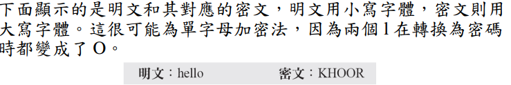

- 最簡單的單字母加密法就是加法加密法 (Additive Cipher)。此加密法有時稱為位移加密法 (Shift Cipher)。
- 因為 Julius Ceasar 以 3 當成金鑰，利用加法加密法與他的下屬聯繫，因此加法加密法有時亦稱為凱撒加密法 (Caesar Cipher)，但加法加密法比較能顯示出其數學意涵。

## Caesar Cipher
加1減1 分配法(Shift Cipher)。
### Brute-Force Cryptanalysis（暴力分析法）
對於凱薩而言非常危險，因為只要尋找25次就能找出答案
### Statistical Cryptanalysis(統計分析)
透過對密文進行統計，加上英文字母本身就有不同的出現頻率，就能推測出可能組合，這也是為什麼擴散性很重要

## Multiplicative Cipher

就 ... 乘法
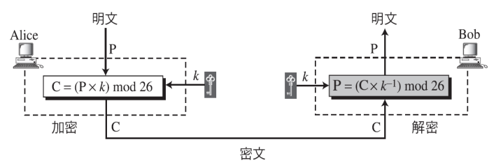
但問題是最多只有 12 組 密碼

## Affine Cipher

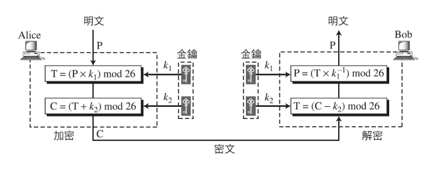

## Monoalphabetic Substitution Cipher 
單字母取代加密法的金鑰範例
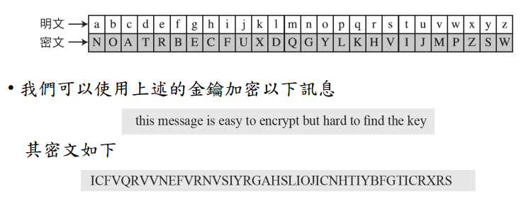

這種加密方式容易被破解，因為它反映了原始字母的頻率數據。攻擊者可以利用英文的雙字母組（Bigram）和三字母組（Trigram）的頻率來進行破解。為了對抗這種攻擊，一種對策是為單個字母提供多個替代字（同音異譯字）。

## Polyalphabetic Ciphers

在多字母加密法 (Polyalphabetic Cipher) 中，每一個字元的出現都可能有不同的代換，明文裡的一個字元和密文裡的一個字元之間的關係是**一對多**

## Autokey Cipher(用於串流加密)

前一個 block 加密後的密文是後一個 block 的 key 

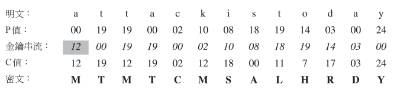

## Playfair Cipher
- Best-known multiple-letter encryption cipher
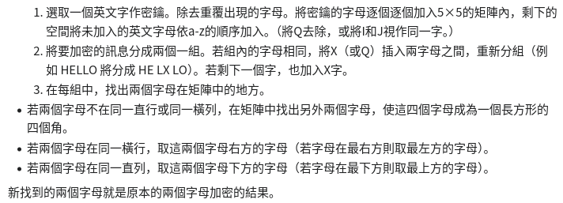

傑森的作法是將I\J放在一起
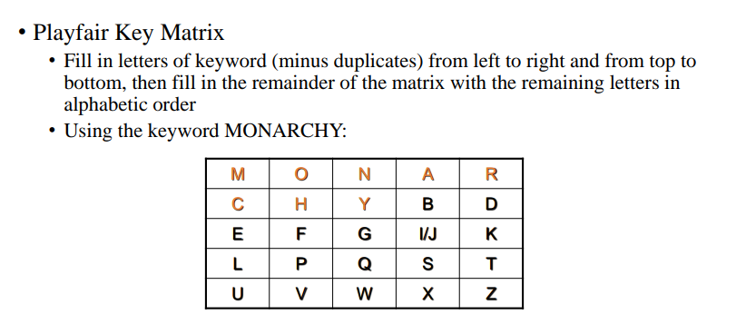

## Vigenère Cipher 
- Best known and one of the simplest polyalphabetic(one/明文 to Many/密文) substitution ciphers.

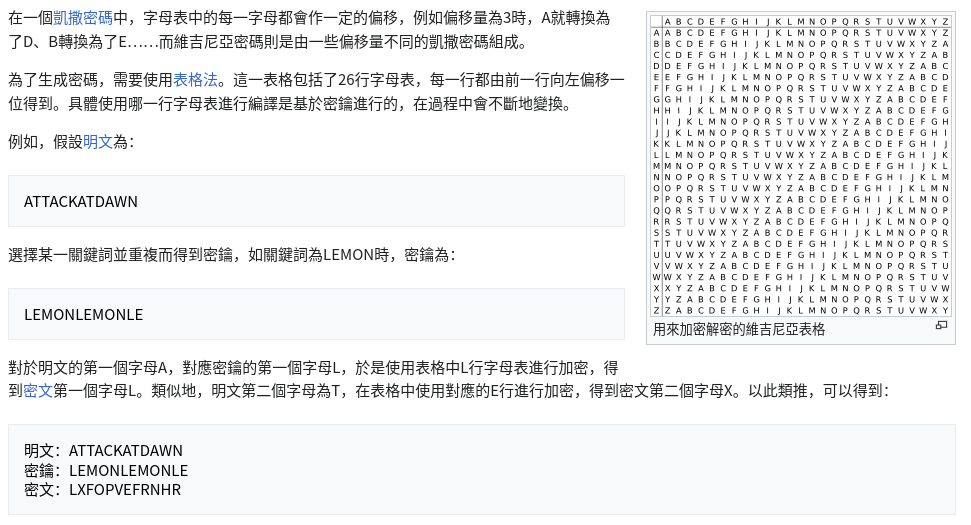
### 破密分析
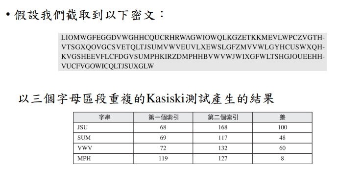
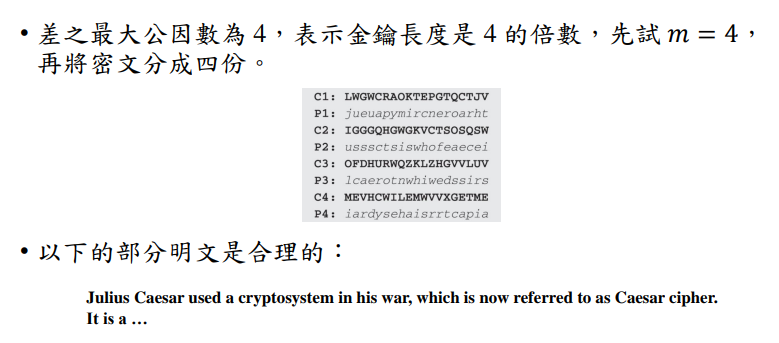

## Hill Cipher
- 由 Lester Hill 在 1929 開發
- 優點 ：　完全隱藏單字母頻率
    - 不只能隱藏單字母頻率，還能隱藏雙字母頻率
- 能有效抵擋已知密文攻擊，不過防不住已知明文攻擊
- 金鑰為一個矩陣
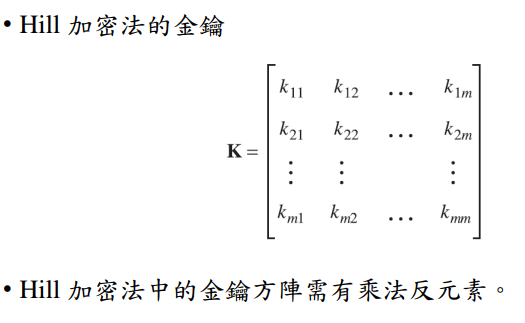

### 流程
***加密***
1. 將plaintext 轉換為矩陣　P(mxn)
2. 將P 乘上　K(nxn) 就可得到　C（mxn）

***解密***
1. 將C(mxn) 乘上　$K^{-1}$(nxn) 就可得到　P（mxn）
2. 將 P 以特定規則還原就可得 plaintext

## One-Time Pad (OTP)

- 密碼學的目標之一就是能完全保密。Shannon 的研究表示，若每個明文的符號都由一個金鑰範圍隨機挑出的一把金鑰加密，就能達到完全保密。
- 此概念用於 Gilbert Vernam 在貝爾實驗室所發明的一次性密碼本（One-Time Pad，簡稱 OTP）。
- 但問題是很難實現

一次性密鑰提供了完全的安全性，但實際應用上存在兩個基本困難：

1. 生成大量隨機密鑰的實際問題：
   - 任何大量使用的系統可能需要定期產生數百萬個隨機字符。
   - 這涉及到隨機數生成的問題，以確保密鑰的真正隨機性，這在實際操作中可能會很困難。

2. 龐大的密鑰分發問題：
   - 每個要發送的消息都需要發送者和接收者使用相同長度的密鑰。
   - 分發這麼多的密鑰，尤其是在安全的方式下，是一個極大的挑戰。

因為這些困難，一次性密鑰的實用性受到了限制，主要適用於需要極高安全性的低頻寬通道。

儘管如此，一次性密鑰是唯一展現完美保密性的加密系統，這意味著即使攻擊者擁有所有可能的資訊，也無法推斷出密文的內容。

## Transposition Ciphers
- 換位加密法 (Transposition Ciphers) 並不是更換符號，而是改變符號的位置。
- Two method
    - 無金鑰的換位加密法 (Transposition Ciphers without Key)
    - 有金鑰的換位加密法 (Transposition Ciphers with Key

1. 翻轉法
    - abc $\rightarrow$ cba
2. 軌道加密法
    - 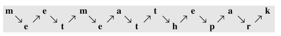
    - 可以根據需求調整長度
3. 行列翻轉法？
    - 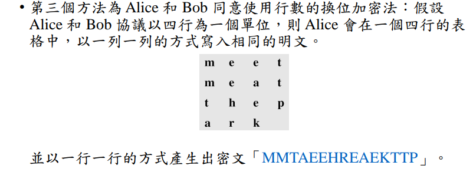

### Columnar Transposition Cipher
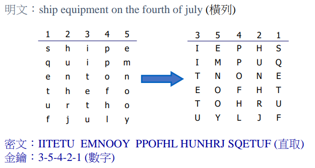

### Double Transposition Cipher
就只是比上個方法多做一次？
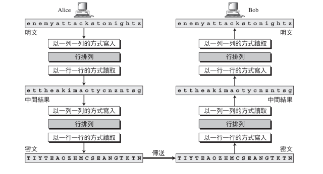

### Rotor Machines

## Block and Stream Ciphers
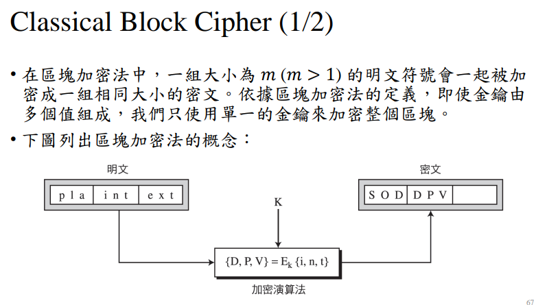
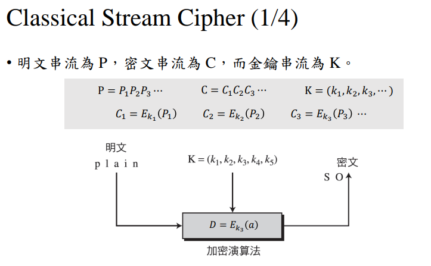

