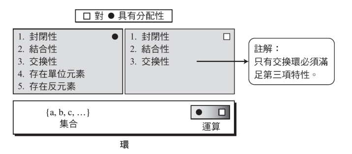

## 4.1 代數結構
### 群 （Group）
- Group 是由 Set 加二元運算子 「 * 」的結合
    - 封閉性（Closure）：對於集合中的任意兩個元素 a 和 b，它們的組合 a ∗ b 也在這個集合中。
    - 結合律（Associativity）：對於集合中的任意三個元素 a、b 和 c，(a ∗ b) ∗ c = a ∗ (b ∗ c)。
    - 存在單位元素（Identity Element）：存在一個特定的元素 e，對於任意集合中的元素 a，有 e ∗ a = a ∗ e = a。
    - 存在逆元素（Inverse Element）：對於集合中的每個元素 a，都存在一個元素 b，使得 a ∗ b = b ∗ a = e，其中 e 為單位元素。

- 一個交換群（Commutative Group，或稱為 Abelian Group），除了滿足群的四個特性之外，還有以下一個額外的特性。
    - 交換性 (Commutative)：對於集合 G 中所有的元素 a 和 b，皆滿足等式a • b = b • a

>  ans
這裡的記號 G=<Zn,+> 代表一個特定的群，其中：
- $Z_n$ 是模 n 的整數集合，也就是 $\{0, 1, 2, ..., n-1\}$，這裡 n 是一個正整數。
- "+" 代表整數的加法運算。

這個群稱為模 n 整數加法群。讓我們來看一下這個群的特性：

1. **集合：** $Z_n$，即模 n 的整數集合。
2. **二元運算：** 加法。對於任意兩個整數 $a, b \in Z_n$，定義 $a + b \equiv c \pmod{n}$，其中 c 是 a 和 b 的和模 n 的餘數。
3. **封閉性：** 對於任意 $a, b \in Z_n$，$a + b$ 也屬於 $Z_n$，因為加法的結果仍然是模 n 的整數。
4. **結合律：** 加法在整數上滿足結合律，所以 $Z_n$ 上的加法也滿足結合律。
5. **存在單位元素：** 0 是加法的單位元素，因為對於任意 $a \in Z_n$，$a + 0 = a$。
6. **存在逆元素：** 對於任意 $a \in Z_n$，其逆元素為 $-a$，因為 $a + (-a) = 0$。

總之，$G = <Z_n, +>$ 是一個模 n 整數加法群，是一個典型的群的例子，其中整數加法構成了群的二元運算。

### 交換環

### 體

### 有限體
有限體 ： 有限元素的 GROUP
- 其中必會有 $p^n$ 個元素， p 為質數 n 為正整數

ord(k)的計算就是計算 $k^n$ 在這個群中有多少等價

like 在 $G=<Z_6,+>$ 中 ord(1)
$1 \equiv 1\ mod\ 6$
$2 \equiv 2\ mod\ 6$
$3 \equiv 3\ mod\ 6$
$4 \equiv 4\ mod\ 6$
$5 \equiv 5\ mod\ 6$
$6 \equiv 0\ mod\ 6$

Modulo Polynomial 的加法相當於是xor
Modulo Polynomial 的乘法就是 相乘取餘數

