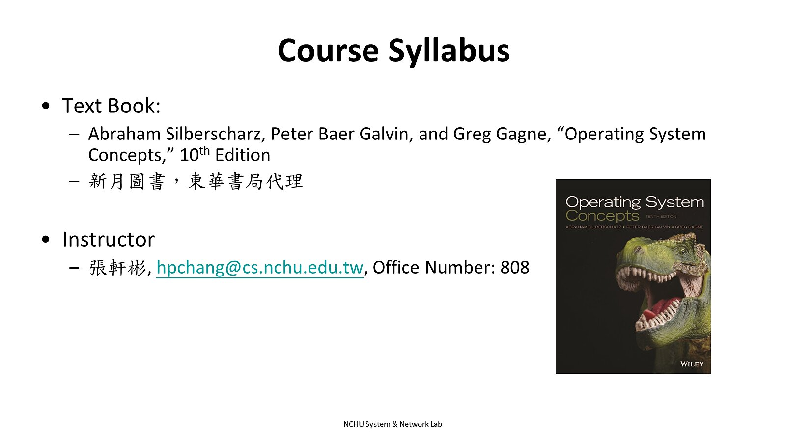

# os

## 課程概要
This course introduces the operating system to facilitate students to understand how things really work inside an operating system. First, we begin an overview of an operating system. Then, various components in an operating system are presented, including process management, process coordination, memory management, storage management. After the completion of this course, students will have a complete knowledge of internal operating of an operating system.
## 課程資訊
- **課程編號/代碼**: 3171
- **學分數**: 3
- **上課地點**: AT242
- **授課教師**: 張軒彬[youtube](https://www.youtube.com/@user-zt2jb8cg2d)
- **聯絡方式**: None
- **課程時間**: [周2 34 and 周4 2](/NzV-a9tGRX-__mPE58OdLQ)(腦子有洞)

## 目標
1. 瞭解作業系統的組成架構與分類
2. 瞭解作業系統內部各個模組的運作方式

## 課程內容
### HW 
1. [pid manager](/pid%20manager.md)
2. [simple shell](/simple%20shell.md)
3. [HW3 Thread & Concurrency](/HW3%20Thread%20&%20Concurrency.md)
4. [HW4 Mutex](/HW4%20Mutex.md)
### CHAP
1. [CHAP1 introduction ](/chap1%20introduction.md)
2. [CHAP2 Operation System Structure](/CHAP2%20FOR%20OS.md)
3. [CHAP3 FOR OS](/CHAP3%20FOR%20OS.md)
4. [chap 4 thread and process](/chap%20%204%20FOR%20OS.md)
5. [chap 5 for os ](/chap%205%20for%20os_.md)
6. [chap 6 Process Synchronization](/chap%206%20Process%20Synchronizatio.md)
7. [chap 7 Synchronization Examples](/chap%207%20for%20Os.md)
8. [chap 8 for Deadlock](/chap%208%20Deadlock.md)
9. [chap 9 Memory Management ](/chap%209%20for%20os_.md)
10. [chap 10 Vitural Memory ](/chap%2010%20for%20os_.md)
### oslab
1. tmp
2. tmp
3. tmp
4. tmp
5. tmp
6. tmp
7. tmp
8. tmp
9. [oslab期中](/oslab期中.md)
10. [oslab-9](/oslab-9.md)
11. [oslab10](/oslab10.md)
12. [oslab11](/oslab11.md)
13. [oslab12](/oslab12.md)
14. [oslab13](/oslab13.md)
15. [oslab14](/oslab14.md)
16. [oslab15](/oslab15.md)
17. [oslab16](/oslab16.md)

## 評估
- 期中考 :40 
- 期末考 : 40
- 程式作業 :20 
## 學習資源
- 主要教材: 
