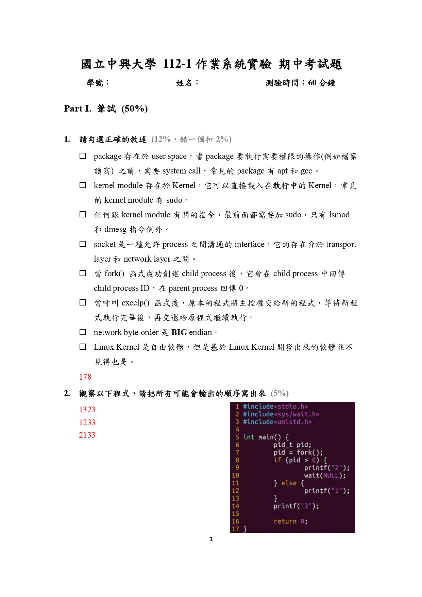
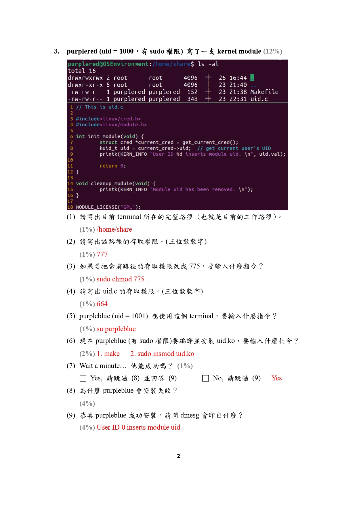
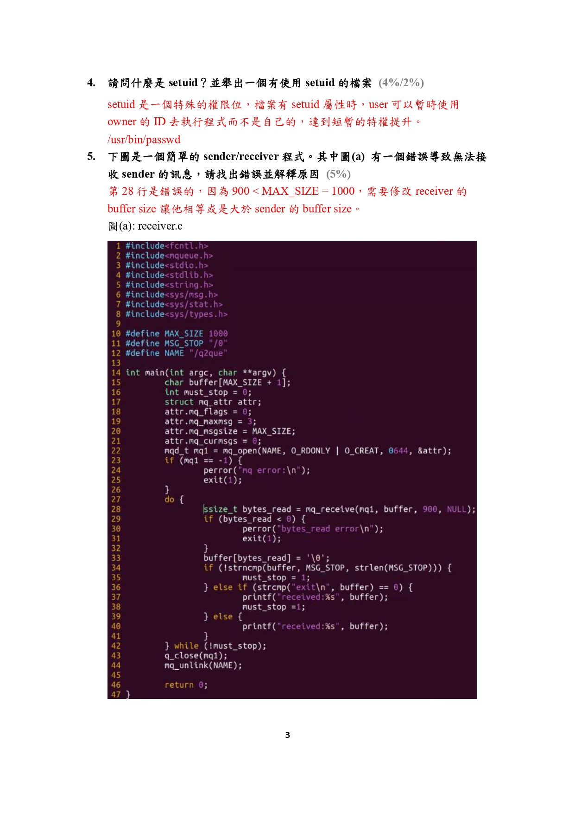
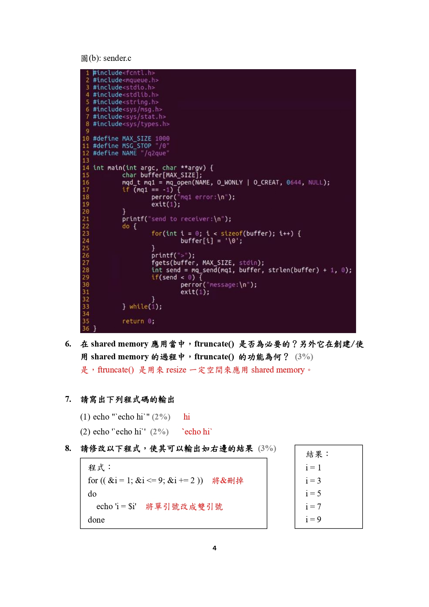

# oslab期中

>  筆試ans





### 上機q1
>  上機q1
``` bash=1
echo "請輸入起始數字:"
read start
echo "請輸入結束數字:"
read end


for ((i=$start;i<=$end;i+=1));do
	p2=0
	wrong=0
	for ((j=2;j<$i;j+=1)) ; do
		a=`expr $i % $j`
		if test $a = $p2;then
			wrong=`expr $wrong + 1`
		fi
	done
	if [ $wrong = $p2 ]; then 
		echo $i
	fi
done


```


### 上機q2 
>  client
```c=1
#include<arpa/inet.h>
#include<netinet/in.h>
#include<stdio.h>
#include<string.h>
#include<sys/socket.h>
#include<sys/types.h>
#include<unistd.h>

#define PORT 12345
#define MSG "exit from client"
#define MAX_SIZE 1000

int main() {
	int socket_fd;
	int msg=0;
	struct sockaddr_in server_addr, client_addr;
	socklen_t addr_len;
	ssize_t bytes_send, bytes_recv;
	char buffer[MAX_SIZE];
	char ss[MAX_SIZE];
	int piid =getpid();
	socket_fd = socket(AF_INET, SOCK_DGRAM, 0);
	if (socket_fd == -1) {
		perror("Failed to create the socket");
		return 1;
	}
	
	memset(&buffer, '\0', sizeof(buffer));
	memset(&server_addr, 0, sizeof(server_addr));
	/*memset(&ss, '\0', sizeof(ss));*/
	
	server_addr.sin_family = AF_INET;
	server_addr.sin_port = htons(PORT);
	if (inet_pton(AF_INET, "127.0.0.1", &(server_addr.sin_addr)) <= 0) {
		perror("Failed to convert the address");
		return 1;
	}
	addr_len=sizeof(server_addr);
	printf("pid =%d\n",piid);
	memset(&buffer, '\0', sizeof(buffer));
	sprintf(ss, "%d", piid);
	bytes_send = sendto(socket_fd, ss, strlen(ss), 0, (struct sockaddr *)&server_addr, sizeof(server_addr));
	printf("waiting .....\n");
	bytes_recv = recvfrom(socket_fd, buffer, MAX_SIZE, 0, (struct sockaddr *)&server_addr, &addr_len);
	if (bytes_send == -1) {
		perror("Failed to send the socket");
		return 1;
	}else{
		
	}
	buffer[bytes_recv] = '\0';
	printf("ser:%s\n",buffer);

	
	close(socket_fd);
	return 0;
}

```

>  server
```c=1
#include<arpa/inet.h>
#include<netinet/in.h>
#include<stdio.h>
#include<stdlib.h>
#include<string.h>
#include<sys/socket.h>
#include<sys/types.h>
#include<unistd.h>

#define PORT 12345
#define MSG "exit from server"
#define MAX_SIZE 1000

int main(int k,char *argv[]) {
	int socket_fd;
	int num=7;
	k =atoi(argv[1]);
	struct sockaddr_in server_addr, client_addr,client_arr[k];
	socklen_t addr_len;
	ssize_t bytes_send, bytes_recv;
	char buffer[MAX_SIZE];
	printf("%s\n",argv[2]);
	socket_fd = socket(AF_INET, SOCK_DGRAM, 0);
	if (socket_fd == -1) {
		perror("Failed to create the socket");
		return 1;
	}
	
	memset(&buffer, '\0', sizeof(buffer));
	memset(&server_addr, 0, sizeof(server_addr));
	memset(&client_addr, 0, sizeof(client_addr));

	server_addr.sin_family = AF_INET;
	server_addr.sin_port = htons(PORT);
	server_addr.sin_addr.s_addr = INADDR_ANY;
	
	if (bind(socket_fd, (struct sockaddr *)&server_addr, sizeof(server_addr)) == -1) {
		perror("Failed to bind the socket");
		return 1;
	}

	printf("%d\n",k);

	int i=0;
	while(i<k) {
		client_arr[i]=client_addr;
		addr_len=sizeof(client_addr);
		bytes_recv = recvfrom(socket_fd, buffer, MAX_SIZE, 0, (struct sockaddr *)&client_addr, &addr_len);
		client_arr[i]=client_addr;
		if (bytes_recv == -1) {
			printf("Failed to receive the socket");
			return 1;
		}
		
		buffer[bytes_recv] = '\0';
		printf("Client%d:  %s\n", i, buffer);
		client_arr[i]=client_addr;
		i+=1;
	}
	client_arr[i]=client_addr;
	printf("all client are already\n");
	for(i=0;i<k;i++){
		bytes_send = sendto(socket_fd,argv[2], strlen(argv[2]), 0, (struct sockaddr *)&client_arr[i], sizeof(client_arr[i]));
	}
	k=0;
	close(socket_fd);
	return 0;
}

```

