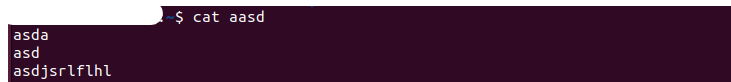
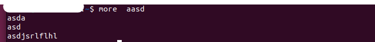
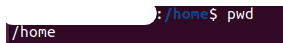

# unix chap2

## intro 
### structure of command

🧑‍💻 \$ [command] [option(s)] [option arguments] [command argument]
- \[command]：這是指要執行的命令的名稱或識別符號。
- \[option(s)]：這是一個或多個選項，它們修改命令的行為。
- \[option arguments]：這是與選項相關聯的參數或值。
- \[command argument]：這是命令操作的主要參數或目標。
- \[在這之中的表示為非必要
## command
### cat
---
**command:** \$cat\[option] file
**info:** show file inside ，通常會與 `>` 一起用

| option | mean                        |
|:------:|:--------------------------- |
|   -n   | show count of line          |
|   -E   | make `$` at end of all line |

### more
---
**command:** \$ more \[option] filename
**info:** show file context

| option | meaning                                           |
|:------:|:------------------------------------------------- |
|  none  | can see everything in file                        |
| +/str  | display line before the first line containing str |
|   -N   | adding number-list to display line                |
|  -nN   | per N line in a page                              |

### cp
---
**command:** \$ cp [option] src dest
**info:** copy src to des

| option | meaning                        |
|:------:| ------------------------------ |
|   -i   | if destination exists,then pop |
|   -p   | see man                        |
|   -r   | see man                        |

### mv
---
**command:** \$ mv [option] src dest
**info:** move src to des

| option | meaning                       |
|:------:|:----------------------------- |
|   -i   | if destatioon exists,then pop |
|   -f   | 無視destination存在與否,move  |

### rm 
---

**command:**\$ rm [option] f1
**info:** remove
| option | meaning               |
|:------:|:--------------------- |
|   -f   | 無視acess mode of f1  |
|   -i   | list what your remove |
|   -r   | recursive             |
### mkdir
---
**command:**\$ mkdir [option] f1
**info:** make direction
| option | meaning                      |
|:------:|:---------------------------- |
|   -m   | given dir access mode        |
|   -p   | create parent dir not exists |
### rmdir
---
**command:**\$ rmdir [option] f1
**info:** remove direction
| option | meaning                         |
|:------:|:------------------------------- |
|   -p   | remove empty parent dir as well |
|   -r   | recursive                       |
### cd 
---
**command:**\$ cd dir
**info:** goto direction、[unix path 介紹](/WO8NwQkvT4O4EM8LqpMJSA)

### pwd
--- 
**command:**\$ pwd 
**Introduction:** display current dir from root

### whoami
---
**command:**\$ whoami 
**Introduction:** display which user is used now
### hostname
--- 
**command:**\$ hostname 
**Introduction:** display which machine is used now
### 
