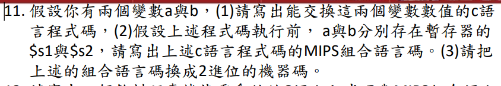
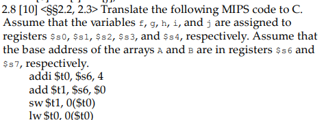

# 作業2 for 祭祖


  > ans 1 
10 to 16 : 1000000 ⇒ 000f4240
- big_endian
  | 80  | 81  | 82  | 83  |
  | --- | --- | --- | --- |
  | 00  | 0f  | 42  | 40  |
- little_endian
	| 80    |    81 | 82    |  83   |
	| --- | --- | --- | --- |
	|  40   |   42  |  0f   |   00  |
 


  > ans 2
- make common case fast
- 減少指令數
- 簡易硬體設計
 


  > ans 3

| 2048 | 1024 | 512 | 256 | 128 | 64  | 32  | 16  | 8   | 4   | 2   | 1   |
| ---- | ---- | --- | --- | --- | --- | --- | --- | --- | --- | --- |:--- |
|  0    |  0    | 1    |     1|1     |  1   |1    |  1   |   1  |    1 |  1   |  1   |

```
0000 0000 0000 0000
0000 0011 1111 1111 ⇒1023
1111 1100 0000 0001 ⇒ -1023
```
 


  > ans 4

| type | 6      | 5      | 5      | 5      | 6      |
| ---- | ------ | ------ | ------ | ------ |:------ |
| R    | rs     | rt     | rd     | shmat  | funct  |
| I    | rs     | rt     | im/adr | im/adr | im/adr |
| J    | im/adr | im/adr | im/adr | im/adr | im/adr |
 


  > ans 5
```
123456789abcdef

a)
eca8 6420
1110 1100 1010 1000 0110 0100 0001 0000

b )
0001 0011 1010 0111 1001 1011 1101 1111
1	 3 	  a(10)7    9    b(11)d(13)f(15)
13a7 9bdf
```
 


  > ans 1 
`A[12]=A[1]+A[2]-A[3]+4`
```
Lw $t1, 4($s2)
Lw $t2, 8($s2)
Lw $t3, 12($s2)
add $t0,$zero,$t1
add $t0,$t0,$t2
sub $t0,$t0,$t3
addi $t0,$t0,4
sw $t0,48($s2)
```
 


  > asn 2 
```
add $t0,$s1,$s2
add $t0,$t0,$s3
sub $t0,$t0,$s4
```
 


  > ans3
還不會
 


  > ans4 
4,2
 

  > ans 5
```
nor $t1, $t3, $zero   # $t1 = NOT $t3
and $t1, $t1, $t2     # $t1 = $t2 AND NOT $t3
$t1 = 0x00005FC0

xor $t1, $t2, $t3     # $t1 = $t2 XOR $t3
nor $t1, $t1, $zero   # $t1 = NOT ($t2 XOR $t3)
$t1 = 0xFF000384
```
 


   > ans 6
```
add $v0,$a0,$a1
sub $v0,$v0,$a2
sub $v0,$v0,$a3
```
 


  > asn 7
沒教
 


  > ans 8
`add $s1,$zero,$t0`
 


  > ans 9
```
lw $t0,32($s1)
add $t0,$s0,$t0
sw $t0,48($s1)
```
 


  > ans 10
- a
	```
	if (s2<s3)
		s1=1
	else
		s1=0
	``` 
- b
	```
	if (s2<100)
		s1=1
	else
		s1-=0
	```
- c
	```
	if(s1!=s2){
		goto PC+25
	}else{
		nothing
	}
	```
 

  > 作業11

### source code
```c=
int tmp=s0;
s0=s1;
s1=tmp;
```
### 分析
null

### MIPs
```mips=
add $t0,$s0,$zero
add $s0,$s1,$zero
add $s1,$t0,$zero
```

### machine language
`NULL`
 


  > 作業12

### source code
```c=
int * vend(int Price,int Input){
	int tmp=Input*50-Price;
	int a[2];
	while(tmp>=10){
		tmp-=10;
		a[0]+=1;
	}
	a[1] =tmp;
	return a;	
}
```

### 分析
a[0] : v0
a[1] : v1
tmp : t0
Price : a0
Input : a1
tmp>=10 : t1(slti)

### MIPs
```mips=
vend :
	addi $sp,$sp,-8
	sw $t0,0($sp)
	sw $t1,4($sp)
	addi $t1,$zero,50
	mul $a1,$a1,$t1
	sub $t0,$a1,$a0
	add $v0,$zero,$zero
	add $v1,$zero,$zero
	add $t1,$zero,$zero
	loop :
		slti $t1,$t0,10
		beq $t1,$zero,exit
		addi $t0,$t0,-10
		addi $v0,$v0,1
	exit :
		
		lw $t0,0($sp)
		lw $t1,4($sp)
		addi $sp,$sp,8
	jr $ra
```

 

   > 課本 2.3
```
sub $t0,$s3,$s4
sll $t0,$t0,2  #t0=t0*4
add $t0,$t0,$s6
lw $t0,0($t0)
sw $t0,32($s7)
```
 


  > 課本 2.4
```
sll $t0, $s0, 2 	#t0=f*4
add $t0, $s6, $t0	#t0=&A[f]
sll $t1, $s1, 2		#t1=g*4
add $t1, $s7, $tl	#t1=&B[g]
lw $s0, 0($t0)		#f=A[f]
addi $t2, $t0, 4	#t2=&A[f]+4=&A[f+1]
lw $t0, 0($t2)		#t0=A[f+1]
add $t0, $t0, $s0	#t0=A[f+1]+A[f]
SW $t0, 0($t1)		#t1=B[g]=A[f+1]+A[f]
```
 

  > 課本 2.6
```
0000 0000 0000 0000 0000 0000 0000 0000
1010 1011 1100 1101 1110 1111 0001 0010
```
 



  > 課本 2.8
```
addi $to, $s6, 4	#t0=A+4=&A[1]
add $t1, $s6, $0	#t1=A=&A[0]
sw $t1, 0($t0)		#0(t0)=A[1]=&A[0]
lw $t0, 0($t0)		#t0=&A[0]
add $s0, $t1, $t0	#s0=2*&A[0]
```
 


  > 課本 2.11
1. $-2^{31}<x+128<2^31-1$
2. $-2^{31}<128-x<2^31-1$
3. $-2^{31}<x-128<2^31-1$
 

  > 課本 2.16
| op  | rs  | rt  | rd  | s   | f   |
| --- | --- | --- | --- | --- | --- |
| 6+2 | 5+2 | 5+2 | 5+2 | 5   | 6   |

| op  | rs  | rt  | im  |
| --- | --- | --- | --- |
| 6+2 | 5+2 | 5+2 | 16  |

reg↑ ⇒ instruction size↑ ⇒ program size ↑
reg↑ ⇒ memory ascess(registers spills)↓ ⇒ program size ↓
instructions↑ ⇒ more fit instructions ⇒ instructions nums↓
instructions↑ ⇒ instruction size↑ ⇒ program size ↑
 

  > 課本 2.18


 


  > 課本 2.23
I - type(1存1取)


 

  >  課本 2.25
```
add t0,$0,$0
loop1: 	  
	slti t2,t0,s0 
	beq  t2,0,else1
	add t1,0,0
	loop2 :
		slti t2,t1,s1
		beq  t2,0,else2
		sll t3,t1,4
		add t4,t1,t0
		add t5,s2,t3
		sw t4,0(t5)
		addi t1,t1,1
		j loop2
	else2:
	addi t0,t0,1
	j loop1
	
else1:
```
 

```c=
int fib_rec(int n) {
    if (n == 0) {
        return 0;
     } 
     if (n == 1) {
           return 1;
     }
     return fib_rec(n - 1) + fib_rec(n - 2);
}
```
  > 課本 2.29(找不到題目但應該是這個)

 
