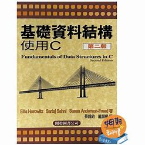

# 課程名稱

## 課程概要
這個課程提供了關於基礎資料結構的深入介紹。
## 課程內容
1. [chap1 introduction](/chap1%20introduction.md)
2. [chap2 陣列&結構](/WGo3v1SHQZuADXqWYpChhg)
3. [chap3 stack and queue](/8e_TiUgoQoyMKs3ULgHjSw)
4. [chap4 link-lsit](/cjkVgsODT-S0DPRgsvibxw)
5. [chap5 tree](/pFxrXKOpQj-MihEEef_lpA)
6. [chap6 graph](/1LMCroO-Qxiy1ib16RofJg)
7. [chap7 for基礎資料結構](/4aKgk08xQJ6Y0aO3Lncvww)
8. [chap8 for基礎資料結構](/0w6KlNwjQ4mvAEDke6jZnA)
9. [chap9 for基礎資料結構](/RkKAUwgqQKiz9LbFSX3a6g)
10. [chap10 for基礎資料結構](/KfaXbTSRQuG_OFds8oi8DQ)
11. [chap11 for基礎資料結構](/chap11%20for基礎資料結構.md)

## 學習資源

