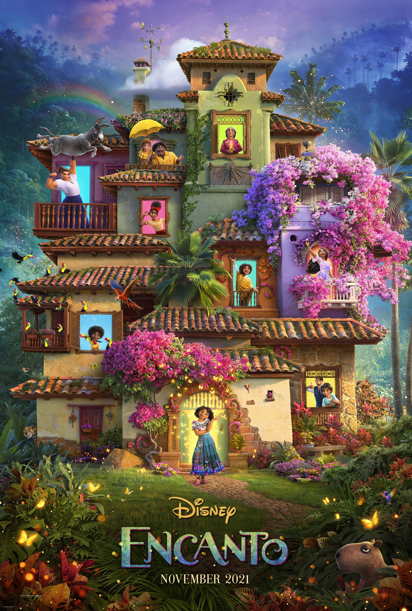

# 電影評分：魔法滿屋(Encanto)
- **發行商：** [Disneys](/Disneys.md)
- **導演：** 拜倫·霍華 and 傑瑞·布希
- **演員：** 
    史蒂芬妮·碧翠絲
    黛安·格雷羅
    潔西卡·達羅
    安琪·塞佩達
    威爾默·瓦德拉瑪
    卡蘿萊娜·蓋坦
    毛羅·卡斯蒂略
    愛達莎
    蘭斯·菲利斯
- **上映日期：** 2021年11月26日（台灣）
- **片長：** 102分鐘

## 簡介
 &emsp;&emsp;這是一個擁有魔法的神奇家庭，每當有人5歲時就會被賦予魔法，而就是在這麼一個神奇的家庭中，有一位沒有被賦予魔法的成員米拉貝兒·馬瑞格（Mirabel Madrigal）。

&emsp;&emsp;在這個人人都有魔法的馬瑞格家中，只有主角米拉貝兒沒有魔法，而她也因此跟家人之間有著難以言喻的距離感；在安東尼奧五歲生日那天，當大家都在忙著慶祝安東尼奧獲得天賦，失落的米拉貝兒突然看到家中滿佈裂痕、魔法蠟燭的火焰正在閃爍。

## 我的評價
**評分[標準](/標準.md)：** 7.5/10\
**記憶點：** 很酷的設定\
**評論：**\
&emsp;缺點很明顯，衝突醞釀太久，衝突真的爆發時又潦草的和解，我也不是要什麼驚天大和解，但是，太隨便了，以至於我只能給到7分。
## 連結
**IMDb頁面：** https://www.imdb.com/title/tt2953050/ \
**海報：** 
